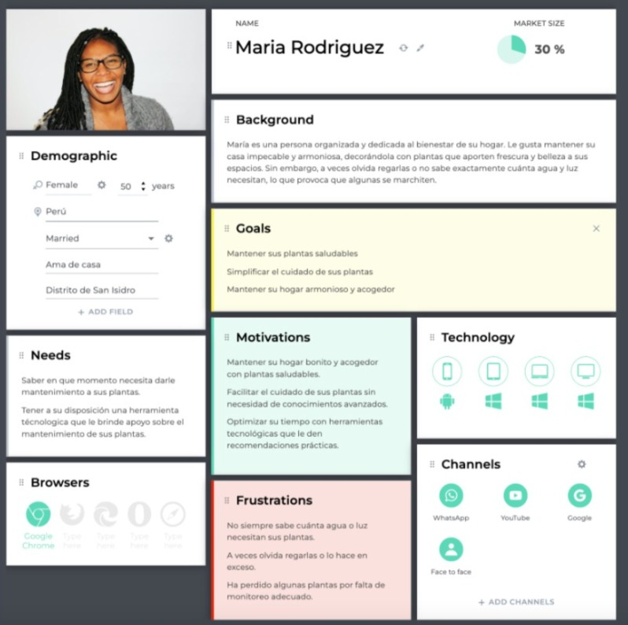
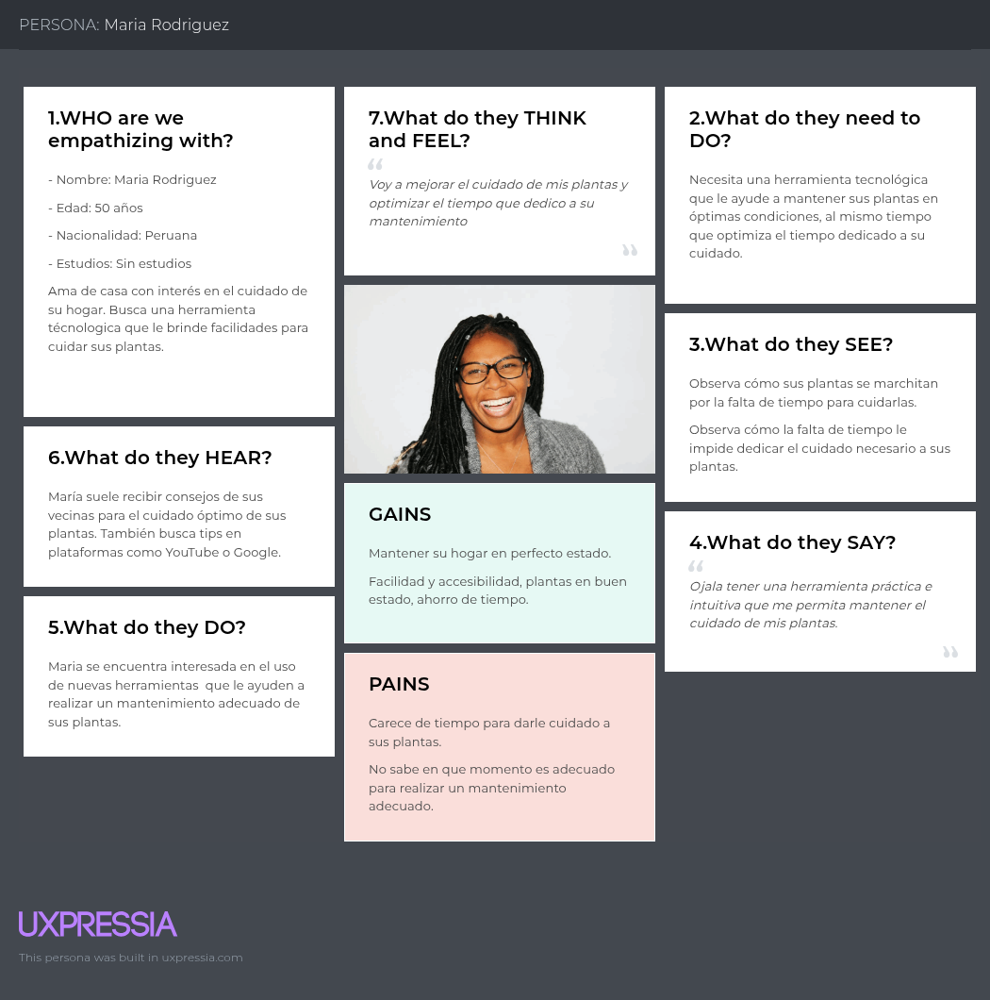

# <center>COURSE PROJECT</center>

<p align="center">
    <strong>Universidad Peruana de Ciencias Aplicadas</strong><br>
    <br>
    <strong>Ingeniería de Software</strong><br>
    <strong>Desarrollo de Soluciones IOT - 2971</strong><br>
    <strong>Profesor: Angel Augusto Velasquez Nuñez </strong><br>
    <br>INFORME
</p>


<center>

#### Startup: **WeMade**

#### Product: **EcoGuardian**

</center>
# Team  Members:

<div align="center">

|             Member             |    Code    |
|:------------------------------:|:----------:|
| Nicolas Sebastian Esteban Garcia      |    u202217485     |
|   Sebastian Ramirez Hoffmann          |    U202211894     |
| Gustavo Huilca Chipana                | u202213983 |
|  Manuel Sebastian Peña Rivera         | u202210138 |
|    Mathias Alejandro Jave Diaz        | u202212721 |
|    Mathias Tsuneo Kunimoto Watanabe   |    u202210148     |
|    Italo D'alessandro Luna Capuñay    |    ...     |

</div>

# Registro de Versiones del Informe

<div align="center">


| Version |   Fecha    | Autor  | Descripcion de Modificacion |
|---------|------------|--------|-----------------------------|
| 0.0     | 24/03/2024 | Nombre |      Crea documento         |

</div>

# Project Report Collaboration Insights

Repositorios:

Proyecto: (...)

Landing Page: (...)

Web Page del Proyecto: (...)

Mobile App del Proyecto (...)

Back End del Proyecto: (...)

### TB1

Para la entrega del TB1 se han hecho ...

Se muestran evidencias de los commits realizados en la entrega de la TB1 en el informe

  

[Colaboraciones del repositorio]

  
[Registro de los commits donde se realizaron la mayor cantidad]

En ambos casos se puede observar el incremento de modificaciones y revisiones en la primera semana de abril.

---

# Contenido

[Registro de Versiones del Informe](#registro-de-versiones-del-informe)

[Project Report Collaboration Insights](#project-report-collaboration-insights)

[Student Outcome](#student-outcome)

[Capítulo I: Introducción](#capítulo-i-introducción)

[1.1 Startup Profile](#11-startup-profile)  
[1.1.1. Descripción de la Startup](#111-descripción-de-la-startup)  
[1.1.2. Perfiles de integrantes del equipo](#112-perfiles-de-integrantes-del-equipo)

[1.2. Solution Profile](#12-solution-profile)  
[1.2.1 Antecedentes y problemática](#121-antecedentes-y-problemática)  
[1.2.2 Lean UX Process.](#122-lean-ux-process)  
[1.2.2.1. Lean UX Problem Statements.](#1221-lean-ux-problem-statements)  
[1.2.2.2. Lean UX Assumptions.](#1222-lean-ux-assumptions)  
[1.2.2.3. Lean UX Hypothesis Statements.](#1223-lean-ux-hypothesis-statements)  
[1.2.2.4. Lean UX Canvas.](#1224-lean-ux-canvas)

[1.3. Segmentos objetivo.](#13-segmentos-objetivo)

[Capítulo II: Requirements Elicitation & Analysis](#capítulo-ii-requirements-elicitation--analysis)

[2.1. Competidores](#21-competidores)  
[2.1.1. Análisis competitivo](#211-análisis-competitivo)  
[2.1.2. Estrategias y tácticas frente a competidores](#212-estrategias-y-tácticas-frente-a-competidores)

[2.2. Entrevistas](#22-entrevistas)  
[2.2.1. Diseño de entrevistas](#221-diseño-de-entrevistas)    
[2.2.3. Análisis de entrevistas](#223-análisis-de-entrevistas)

[2.3. Needfinding](#23-needfinding)  
[2.3.1. User Personas](#231-user-personas)  
[2.3.2. User Task Matrix](#232-user-task-matrix)  
[2.3.3. User Journey Mapping](#233-user-journey-mapping)  
[2.3.4. Empathy Mapping](#234-empathy-mapping)  
[2.3.5. As-is Scenario Mapping](#235-as-is-scenario-mapping)

[2.4. Ubiquitous Language](#24-ubiquitous-language)

[Capítulo III: Requirements Specifications](#capítulo-iii-requirements-specification)

[3.1. To-Be Scenario Mapping](#31-to-be-scenario-mapping)

[3.2. User Stories](#32-user-stories)

[3.3. Impact Mapping](#33-impact-mapping)

[3.4. Product Backlog](#34-product-backlog)

[Capítulo IV: Solution Software Design](#capítulo-iv-solution-software-design)

[4.1. Strategic-Level Domain-Driven Design](#41-strategic-level-domain-driven-design)  
[4.1.1. Event Storming](#411-event-storming)  
[4.1.1.1 Candidate Context Discovery](#4111-candidate-context-discovery)
[4.1.1.2 Domain Message Flows Modeling](#4112-domain-message-flows-modeling)
[4.1.1.3 Bounded Context Canvases](#4113-bounded-context-canvases)
[4.1.2. Context Mapping](#412-context-mapping)
[4.1.3. Software Architecture](#413-software-architecture)
[4.1.3.1. Software Architecture System Landscape Diagram](#4131-software-architecture-system-landscape-diagram)
[4.1.3.2. Software Architecture Context Level Diagrams](#4132-software-architecture-container-level-diagrams)
[4.1.3.3. Software Architecture Deployment Diagrams](#4133-software-architecture-deployment-diagrams)
[4.2. Tactical-Level Domain-Driven Desig](#42-tactical-level-domain-driven-design)

[4.2.X. Bounded Context: <Bounded Context Name](#)
[4.2.X.1. Domain Layer](#)
[4.2.X.2. Interface Layer](#)
[4.2.X.3. Application Layer](#)
[4.2.X.4. Infrastructure Layer](#)
[4.2.X.5. Bounded Context Software Architecture Component Level Diagrams](#)
[4.2.X.6. Bounded Context Software Architecture Code Level Diagrams](#)
[4.2.X.6.1. Bounded Context Domain Layer Class Diagrams](#)
[4.2.X.6.2. Bounded Context Database Design Diagram](#)

[Conclusiones](#conclusiones)

[Conclusiones y recomendaciones](#conclusiones-y-recomendaciones)

[Video About-the-Team](#video-about-the-team)

[Bibliografía](#bibliografía)

[Anexos](#anexos)

# Student Outcome


| Criterio Especifico| Acciones Realizadas| Conclusiones|
|--------------------|--------------------|-------------|
| **///** |...|...|
|**///**|...|...| 


# Capítulo I: Introducción

## 1.1. Startup Profile

### 1.1.1. Descripción de la Startup

EcoGuardian es una solución IoT que ayuda a cuidar plantas mediante sensores de humedad, temperatura, luz, entre otros. La solución multiplataforma envía alertas inmediatas y recopila información para generar recomendaciones personalizadas. Ideal para hogares, oficinas, pequeños agricultores y empresas del sector agrícola cada uno con distintos planes de pago. Algunas de las funciones principales se enfocan en el monitorización,  estadísticas, recomendaciones y seguimiento de crecimiento.

#### 1.1.2. Perfiles de integrantes del equipo

|                                                                                                                                                                                                                                                | Miembros del equipo    | Código Estudiante | Carrera                | Conocimientos / Habilidades                                                                                                                                                                                                                                         |
|------------------------------------------------------------------------------------------------------------------------------------------------------------------------------------------------------------------------------------------------|------------------------|-------------------|------------------------|---------------------------------------------------------------------------------------------------------------------------------------------------------------------------------------------------------------------------------------------------------------------|
|  | Gustavo Huilca Chipana | u202213983        | Ingeniería de software | Cuento con conocimientos en UI/UX design, desarrollo de aplicaciones web y móvil y SCRUM, así como habilidades blandas que me permiten a mí y a mis compañeros trabajar de forma organizada y eficiente, priorizando la comunicación y la participación permanente. |
|  | Mathias Alejandro Jave Diaz | u202212721        | Ingeniería de software | Cuento con experiencia en el desarrollo web y móvil, trabajando con frameworks como ASP.NET Core, NestJS y Spring Boot en el backend, así como React, Vue y Angular en el frontend, y Flutter para aplicaciones móviles. Además, tengo conocimientos en Arquitectura de Software y en la implementación de marcos de trabajo ágiles, especialmente Scrum. Me destaco por mi capacidad de autoorganización y aprendizaje autónomo. |
|  | Mathias Kunimoto | u202210148        | Ingeniería de software | Tengo experiencia en el desarrollo frontend, trabajando con tecnologías como Tailwind CSS, React y JavaScript. Me considero una persona sociable, organizada y con gran capacidad de adaptación, lo que me permite integrarme fácilmente en equipos de trabajo y aportar al cumplimiento de los objetivos. Siempre busco sacar mi mayor potencial, aprendiendo constantemente y contribuyendo con una actitud proactiva y comprometida. |
|  | Manuel Peña | u202210138        | Ingeniería de software | Cuento con experiencia en programación en C++, así como en desarrollo frontend con Vue, Angular y backend con tecnologías como JavaScript, Java, Spring Boot, C# y .NET. Me considero una persona responsable, flexible e innovadora, siempre abierta a escuchar activamente y mejorar en cada proyecto. Me esfuerzo por aprender constantemente y aportar soluciones efectivas, trabajando de manera colaborativa y con una actitud proactiva para lograr los objetivos del equipo. |
|  | Nicolas Esteban | u202217485 | Ingeniería de software | Tengo experiencia en frameworks como Astro, Vue y React, y actualmente estoy aprendiendo Next.js y Express. Me apasiona el desarrollo frontend, siempre enfocado en ofrecer una experiencia de usuario fluida y cómoda. Me considero una persona sociable, responsable y proactiva, además, disfruto participar en proyectos multidisciplinarios y apoyar a comunidades que promueven el desarrollo web. Siempre busco dar lo mejor de mí para asegurar un rendimiento óptimo en cada aplicación. |
|  | Sebastian Ramirez Hoffmann | U202211894 | Ingeniería de software | Me dedico a realizar soluciones de software utilizando distintas tecnologías y frameworks de desarrollo como .NetCore, SpringBoot, Angular y Vue. Asimismo cuento con experiencia implementando tecnologías mas actuales como Large Learning Models asi como modelos de cyber seguridad. Personalmente me considero una persona proactiva con vision y dispuesto a trabajar eficientemente en proyectos colaborativos. |

## 1.2. Solution Profile

### 1.2.1 Antecedentes y problemática

Para la elaboración de la descripción de la problemática y antecedentes de la solución, se ha utilizado el método de las 5 'W's y 2 'H's.

|                                             |                                                                                                                                                           |
|---------------------------------------------|-----------------------------------------------------------------------------------------------------------------------------------------------------------|
| ¿What? - ¿Cuál es el problema?              | Pérdida de plantas/cultivos debido a un monitoreo ineficiente de condiciones ambientales (humedad, luz, temperatura).                                     |
| ¿Who? - ¿Quienes son los beneficiarios?     | Personas sin conocimientos técnicos o profesionales con necesidad de precisión.                                                                           |
| ¿When? - ¿Cuando se origina el problema?    | El problema ocurre en momentos críticos como cambios climáticos, durante ausencias del usuario o en etapas clave de crecimiento (floración, germinación). |
| ¿Why? - ¿Por qué se origina el problema?    | Se origina por la falta de herramientas accesibles para controlar el crecimiento de las plantas o por recomendaciones erróneas o genéricas.               |
| ¿Where? - ¿Dónde ocurre el problema?        | Espacios con plantas/cultivos: hogares, jardines, oficinas, invernaderos, campos abiertos.                                                                |
| ¿How? - ¿Como se origina el problema?       | Las plantas muestran signos de deterioro (hojas amarillas, baja producción) de forma gradual, pero el usuario lo nota demasiado tarde.                    |
| ¿How much? - ¿Cuánto dinero está implicado? | Costo emocional y monetario: entre 20-200 soles por mes para casos domésticos y entre 500-5000 soles por mes en casos de empresas agrícolas (FAO, 2023).  |

### 1.2.2 Lean UX Process.

#### 1.2.2.1. Lean UX Problem Statement.


En el estado actual de la industria Agricola y en la comunidad de horticultura se observan desafíos significativos en la continua monitorización del estado de las plantas especialmente cuando se tienen en cuenta otras tareas administrativas o no se cuenta con el tiempo necesario. La falta de un seguimiento continuo puede resultar en perdidas significativas o irreparables para las plantas bajo cuidado.

Otros productos han fallado en ...

Nuestro producto se enfocara en proporcionar un seguimiento a los cultivos y plantas domesticas, esto ofrece una mejor calidad de vida para la planta.

Nuestro enfoque principal se basa en la monitorización de plantas y la recopilación de datos relevantes para asegurar su crecimiento saludable en el area domestica.

Como resultado, nos enfrentamos al siguiente problema: ¿Como podemos proveer una plataforma de monitorización de plantas aumentando su crecimiento y/o cosecha en un 40%?

Nuestro producto se encargara de esta tarea al ofrecer un servicio de monitorización que pueda recopilar, visualizar y optimizar el cuidado de las plantas en entornos empresariales y domésticos para ambos interesados en el hobby del cuidado de plantas como las empresas agrícolas.

Sabremos que tuvimos éxito cuando podamos observar un 45% de satisfacción en las futuras encuestas de control donde las plantas haya logrado un crecimiento y/o cosecha en un 40%.


#### 1.2.2.2. Lean UX Assumptions.

**Business Outcome**  
En esta sección vamos a usar las métricas de Montaña de Jeff Gothelf e implementaremos algunas de las pirate metrics para poder definir los niveles de la montaña para llegar poder analizar los comportamientos de nuestros usuarios y analizar que parte del User Journey es relevante para nosotros y hacer un assumption de como actuaran nuestros usuarios en base al producto.

Acquisition: (Base): [1200 visitantes]
El usuario se percatara de nuestra solución por medio de las redes sociales como medios de comunicación asimismo promocionando nuestra landing page, de misma manera intentaremos ofrecer el servicio a los usuarios mas formales con métodos de comunicación directa como por ejemplo ofrecerle el servicio a la las empresas agrícolas.

Activation: (Plateau):[450 users : 100% users]
En esta sección el usuario crea su cuenta registrando su correo ya sea personal o de la empresa, métodos de pago, las dimensiones del negocio es decir la el tipo de uso que le dará a la solución. finalmente un código de autenticación para los empleados que deban de generar una cuenta.
De los usuarios que se percatan del producto esperamos que el 45% se anime a utilizarlo.

Retention: (Plateau + 1 level):[60% users]
De los usuarios que se animaran a utilizarlo esperamos que el 60% de estos continue utilizando nuestro producto diariamente para la monitorización de plantas y/o cultivos. En esta sección el usuario observa la data recolectada por nuestra solución para la optimización en el cuidado de las plantas, ya tiene registros previos y puede visualizar un cambio notorio en las variables de entorno.

Revenue: (Plateau + 2 levels):[10% users]
Los usuarios que utilizan nuestro producto son usuarios estrictamente de paga a base de planes, no obstante si es que llegara la cantidad de plantas individuales excedieran el limite que le proporcionamos en su plan inicial se podría mejorar a una mayor cantidad. De esta manera se espera que un 10% de los usuarios retenidos que lleguen a este limite estarán dispuestos a mejorar su plan generado un mayor ingreso.

Referral:(top) [5% users]
Finalmente de los usuarios que retuvimos esperamos que un 5% de estos nos referencien en sus comunidades o a nuevos emprendedores, indirectamente proporcionándonos y aumentando el flujo de usuarios potenciales que podemos obtener.

**Users**  
En esta sección creamos un Proto-Persona como un assumption de como son nuestros usuarios enfocándonos mas en el aspecto de actitud.

|Demográfica|Comportamiento|Necesidades / Obstáculos|
|-|-|-|
|Alex:<br>35 años <br> Gestor de hotel/hostal| - Trabaja en un hotel/hostal <br> -Gana lo suficiente <br> - Enfocado en la gestion de tareas <br> - Busca que todo este en orden | - Necesita aumentar el area de gestion <br> -Necesita mejorar la asignacion de tareas <br> - Requiere de una mejor comunicacion con los demas empleados a quienes asigna las tareas <br> - Obstaculo: El hotel utiliza herramientas obsoletas o no tiene alguna para asignar tareas <br> - Obstaculo: Utilizan medios no formales como whatsapp para comunicarse lo que complica la comunicacion eficiente. <br> - Busca mejorar la organizacion del hotel/hostal |
|Carla:<br> 27 años <br> Empleada de limpieza | -Gana lo minimo <br> -Enfocada en el cumplimiento de tareas <br> -busca terminar su trabajo de manera rapida|- Necesita un medio de comunicación directo con su gestor <br> -Necesita una manera de notificar la falta de algun objeto que necesite <br> -Necesita notificar que cuartos ya estan listos y saber cuales debe de preparar <br> -Obstaculo: Todos hablan en el mismo grupo de whatsapp y se pierden tareas <br> - Obstaculo: No hay un registro seguro de las tareas que se les fueron asignadas <br> - Busca comunicar de inmediato a su supervisor el estado de una habitacion <br> -Busca avisar si falta algun objeto necesario para la preparación de la habitación |

Esta tabla refleja los dos principales usuarios que tenemos como assumption junto con sus necesidades y comportamientos en el area laboral.

**User Outcomes & Benefits**

En esta sección se busca el lado mas emocional y empatizar con el usuario para darles los outcomes correctos.


Que busca lograr el usuario?
Mantener sanas sus plantas con facilidad y sin depender de conocimientos avanzados en jardinería.

Como se quiere sentir el usuario en este proceso?
Seguro y sin estrés, sabiendo que sus plantas están bien cuidadas con información clara y accesible.

Como nuestro producto acerca al usuario a un logro personal?
La plataforma le permite ver visualmente el progreso de sus plantas, generando satisfacción y motivación para continuar el cuidado.

Porque nuestro usuario buscaría nuestro producto?
Para evitar que sus plantas mueran por descuido o falta de información y sentirse más confiado en su habilidad para cuidarlas.

Que cambio de comportamiento podemos observar que nos cuenta que lograron su objetivo?
El usuario revisa la app regularmente, ajusta su rutina de riego/cuidados según las recomendaciones y expresa satisfacción en encuestas.

Continuamos con los assumptions para el segundo segmento:

Que busca lograr el usuario?
Optimizar la producción de cultivos con información precisa y accesible para maximizar la cosecha.

Como se quiere sentir el usuario en este proceso?
Confiado y en control, sabiendo que la plataforma le brinda información confiable sin necesidad de monitorización manual constante.

Como nuestro producto acerca al usuario a un logro personal?
Al aumentar la eficiencia del cultivo, logra mejorar la producción y rentabilidad, generando un impacto positivo en su negocio.

Porque nuestro usuario buscaría nuestro producto?
Para reducir riesgos en la cosecha, evitar pérdidas económicas y mejorar su toma de decisiones basada en datos.

Que cambio de comportamiento podemos observar que nos cuenta que lograron su objetivo?
El usuario consulta datos regularmente, ajusta riegos y fertilización según la plataforma y ve mejoras en producción.
---


Este análisis de user Outcomes sirve para ambos segmentos en ciertos casos ya que tienen un objetivo similar y se puede comprender el contexto desde ambas perspectivas.

**Solutions**

Si bien Jeff Gothelf menciona en su libro LeanUX 3rd Edition que debemos utilizar elementos físicos como post its y demás para esta entrega realizamos una llamada para definir nuestras soluciones supuestas.

Tomando en cuenta las restricciones anteriormente seleccionadas realizamos las siguiente soluciones:

Desarrollar una solución con tecnologías IoT(internet of things) orientada a realizar el monitoreo de plantas con funciones principales siendo:

- Monitoreo de acidez del suelo:
* Problema: Los usuarios no pueden evaluar fácilmente el pH del suelo, lo que afecta la salud de las plantas.
* Solución: Sensores de acidez que recopilan datos en tiempo real y envían alertas si el nivel es sub óptimo.
* Resultado: El usuario puede ajustar el pH del suelo de manera informada, evitando daños en sus cultivos.

- Sensores de humedad del suelo:
* Problema: Los usuarios no saben cuándo regar sus plantas correctamente, lo que genera exceso o falta de agua.
* Solución: Sensores de humedad que notifican al usuario cuando es el momento óptimo para regar.
* Resultado: Reducción del desperdicio de agua y mejora en la salud de las plantas con menor esfuerzo.

- Dashboard interactivo con visualización de datos:
* Problema: Los usuarios necesitan interpretar datos sobre el estado de sus plantas de forma rápida y sencilla.
* Solución: Plataforma con gráficos y análisis en tiempo real sobre los niveles de humedad, pH y otros factores ambientales.
* Resultado: El usuario puede tomar decisiones informadas sin necesidad de conocimientos técnicos avanzados.

- Recomendaciones inteligentes basadas en los datos recolectados:
* Problema: Los usuarios no saben qué acciones tomar para mejorar el crecimiento de sus plantas.
* Solución: Sistema que sugiere medidas correctivas basadas en datos históricos y condiciones actuales.
* Resultado: Aumento en la tasa de éxito en el crecimiento de cultivos y reducción de errores en el cuidado de plantas.

#### 1.2.2.3. Lean UX Hipotesis Statements.

**Hipótesis**

Siguiendo el formato de las Hipótesis usaremos la tabla ya proporcionada.
Tomar en cuenta que cada hipótesis empieza con "Creemos que.." Estas hipótesis se basan en los 450 usuarios que proyectamos tener.

|Business Outcome|Persona|User Outcome|Feature/Solution|
|----------------|-------|------------|----------------|
|        Aumentar el tráfico a la landing page en un 1200 visitantes mensuales.        | Dueños de plantas y empresas agrícolas    |    Descubrir la plataforma y entender su valor.        |      Campañas en redes sociales y contenido educativo sobre monitoreo de cultivos.          |


**Que es lo mas importante que debemos aprender**

Debemos de analizar que es lo que debemos aprender de nuestras Hipotesis, entonces llegamos a nuestra siguiente conclusion respecto a lo mas importante que debemos aprender:

...

**Minimum viable product**

Los MVP nos sirven para aprender cosas a corto plazo. para realizar esto se hace la pregunta: 
What’s the most important thing we need to learn first?
...


#### 1.2.2.4. Lean UX Canvas.

Finalmente juntamos todo lo que hemos hecho en este proceso y lo agregamos en un Lean UX Canvas (V2) guiandonos del ejemplo que nos proporciona Jeff Gothelf [Anexo 1.1]

<image src =" " alt ="LeanUX Canvas (V2) [implementando lean UX 3]">


## 1.3. Segmentos objetivo.

|   | Segmento 1| Segmento 2|
|---|-----------|-----------|
| Variables     | Doméstico | Negocios |
| Geográfica    | Depende de la ubicación del hogar del usuario | Ubicación cercana al servicio y/o ubicados en áreas donde las industrias agrícolas, la agricultura urbana o sectores relacionados con las plantas están activos. |
| Demográfica   | Diversidad en edad y género | Edad adulta, posiblemente con formación universitaria en áreas relacionadas con las industrias agrícolas y afines. |
| Psicológica   | Actitud hacia la adopción de herramientas técnologicas para el cuidado de sus plantas | Una fuerte inclinación hacia la innovación y la eficiencia en el sector agricola. Las empresas de este segmento son propensas a adoptar nuevas tecnologías, especialmente soluciones IoT que mejoren la eficiencia operativa, reduzcan costos y aseguren sostenibilidad. |
| Función de comportamiento | Necesidad de herramientas para el cuidado de sus plantas | Necesidad de herramientas que optimicen las operaciones, especialmente aquellas que ayudan a monitorear el estado de las plantas y/o sus cultivos y gestionar recursos de manera más efectiva. |

---

# Capítulo II: Requirements Elicitation & Analysis

## 2.1. Competidores.

### 2.1.1. Análisis Competitivo

**Competitive Analysis Landscape**

| ¿Por qué llevar a cabo este análisis? | Nosotros | competidor1 | competidor2 |
|---------------------------------------|----------|-----------|------------|
| **Overview**                          | ... | ... | ... |
| **Ventaja Competitiva**               | ... | ... | ... |
| **Mercado Objetivo**                  | ... | ... | ... |
| **Perfil de Marketing**               | ... | ... | ... |
| **Perfil del Producto**               | ... | ... | ... | 
| **Precios**                           | ... | ... | ... |


### 2.1.2. Estrategias y Tácticas Frente a Competidores

 **Análisis SWOT** | Nosotros| competidor1| competidor2
-------------------|-------|----------|------------------
 **Fortalezas**    | ...                                                                                                                                                                      
 **Debilidades**   | ...                                                                                                                                                                                                       
 **Oportunidades** | ...                                                                                                                                                                    
 **Amenazas**      | ...

## 2.2. Entrevistas.

### 2.2.1. Diseño de entrevistas.

**Preguntas generales:**

1. ¿Cuál es su nombre? 
2. ¿Qué edad tiene? 
3. ¿A qué se dedica? 
4. ¿Que navegador y dispositivos usa?


**Entrevistas usuario segmento (Doméstico)**

1. ¿Qué dificultades encuentras al cuidar tus plantas? 
2. ¿Cuánto tiempo dedicas semanalmente al cuidado de tus plantas?
3. ¿Actualmente utilizas algún dispositivo o herramienta para cuidar tus plantas?
4. ¿Cómo gestionas las necesidades de riego, luz y temperatura de tus plantas?
5. ¿Alguna vez has perdido una planta debido a que no pudiste monitorearla correctamente?
6. ¿Qué tan interesado/a estarías en una solución tecnológica que te ayude a cuidar tus plantas?
7. ¿Te gustaría recibir alertas personalizadas sobre el cuidado de tus plantas? ¿Qué tipo de alertas?
8. ¿Qué características serían más útiles para ti en una plataforma que te ayude a monitorear tus plantas?

**Entrevistas usuario segmento (...)**


...

### 2.2.2. Registro de entrevistas.

Las entrevistas estan en un video en el siguiente URL: ... [Anexo 2.2.1.1]


**Segmento 1**  
Nombre: ...
<br>
Edad: ...
<br>
Ocupación: ...
<br>
Browser: ...
<br>
Device: ...
<br>
Distrito: ...
<br>
Timing: ...
<br>


...

---

**Segmento 2**  
Nombre: ...
<br>
Edad: ...
<br>
Ocupación: ...
<br>
Browser Preferido: ...
<br>
Dispositivos: ...
<br>
Distritos: ...
<br>
Timing: ...
<br>

  

...

---

### 2.2.3. Análisis de entrevistas.


**Segmento 1: (...):**

Estadisticas y Aspectos comunes:


Caracteristicas Objetivas:

Caracteristicas Subjetivas:


**Segmento 2: (...)**
Estadisticas y Aspectos comunes:

Caracteristicas Objetivas:

Caracteristicas Subjetivas:


## 2.3. Needfinding.

### 2.3.1. User Personas.

Los user personas nos sirven para poder identificar como seran los comportamientos y caracteristicas de nuestros usuarios segmento. Para cada segmento se realiza un user persona para identificar las caracteristicas tecnicas y tener una idea general de lo que busca el usuario.

**Segmento 1:** ...



**Segmento 2:**: ...

---

### 2.3.2. User Task Matrix.

El user task matrix nos sirve para identificar los procesos que realizan ambos segmentos donde se pueden observar las similitudes respecto a la importancia y frecuencias de estos procesos.

|| Segmento 1 | Empleado | Segmento 2 | Gestor |
|-------------|-----------|-----------|-----------|--------|
| Titulo      | Importancia | Frecuencia | Importancia | Frecuencia |
| ... | Alta | Media | Alta | Baja |


Con este user task matrix entendemos las actividades que realizan nuestros usuarios segmento y la importancia que estas acciones tienen.

De las tareas principales que identificamos se observa ...


### 2.3.3. User Journey Mapping.

En esta seccion hacemos un journey mapping para comprender el camino que recorren nuestros segmentos en un escenario comun en su area laboral

**Segmento 1**

...
**Segmento 2**

...

### 2.3.4. Empathy Mapping.

**Segmento 1:** : 



**Segmento 2:** : 

### 2.3.5. As-is Scenario Mapping.

As Is representa las fases donde aun no se esta implementando nuestra solucion nos sirve para poder plantear escenarios de los cuales abarcaremos en el To Be donde utilizaremos la solucion.

Miro con el As-Is To-Be: (Link Miro)

**Segmento 1**  


**Segmento 2**  


## 2.4. Ubiquitous Language.

```
Vacant: Se refiere al estado de la habitacion cuando esta se encuentra libre para utilizar.
 
...

```

---

# Capítulo III: Requirements Specification

## 3.1. To-Be Scenario Mapping.

En la seccion To-Be se utilizan los mismos escenarios pero implementando la solucion que proporciona nuestro proyecto.

Miro con el As-Is To-Be:
(Link)

Segmento 1:


Segmento 2:


Segmento 3:
...

## 3.2. User Stories.

La seccion de User Stories sirve para saber las distintas situaciones y puntos clave que tiene el usuario al realizar operaciones en los distintos aspectos del proyecto, desde la landing page hasta los aspectos tecnicos que realizan los desarolladores. Es importante debido a que nos ayuda a poder realizar un product backlog y con los criterios de aceptacion sabremos como verificar que estas historias de usuario estan siendo satisfechas.

| HUX/EPX | Historia de Usuario / Épica                                   | Descripción                                                                                                                                            | Criterios de Aceptación                                                                                                                                                                                                                                                                                                                          | Relacionado con (Epic ID) |
|---------|---------------------------------------------------------------|--------------------------------------------------------------------------------------------------------------------------------------------------------|--------------------------------------------------------------------------------------------------------------------------------------------------------------------------------------------------------------------------------------------------------------------------------------------------------------------------------------------------|---------------------------|
| EP01    | Información del producto                                      | Como visitante del sitio web, quiero obtener información relacionada al producto que se ofrece.                                                        | Given el visitante está en la landing page <br> When observa la informacion del producto que se esta ofreciendo <br> Then obtiene una mejor visión de qué ofrece la empresa. <br> And se registra o considera registrarse como usuario.                                                                                                            |                           | 
| HU01    | Conseguir información de la empresa                           | Como visitante del sitio web, quiero obtener más información sobre la empresa a cargo del producto.                                                    | Given el visitante se encuentra en la seccion de about us <br> When  observa la información relevante sobre la empresa <br> Then se interesa en saber más del producto <br> And Se registra como usuario.                                                                                                                    | EP01                      | 

## 3.3. Impact Mapping.

Impact Mapping **

## 3.4. Product Backlog.

Link Trello:

| #Orden | User Story ID | Titulo                                                        | Descripción                                                                                                                                            | Story Points (1/2/3/5/8) |
|--------|---------------|---------------------------------------------------------------|--------------------------------------------------------------------------------------------------------------------------------------------------------|--------------------------|
| 1      | EP01          | Información del producto                                      | Como visitante del sitio web, quiero obtener información relacionada al producto que se ofrece.                                                        | 3                        |
                                                                   | 3                        |


# Capítulo IV:  Solution Software Design
-
## 4.1. Style Guidelines.
-
### 4.1.1. Event Storming.
-

#### 4.1.1.1 Candidate Context Discovery.
-
#### 4.1.1.2 Domain Message Flows Modeling.
-
#### 4.1.1.3 Bounded Context Canvases. 
-
### 4.1.2. Context Mapping.
-
### 4.1.3. Software Architecture.
-
#### 4.1.3.1. Software Architecture System Landscape Diagram.
-
#### 4.1.3.2. Software Architecture Context Level Diagrams.
-
#### 4.1.3.2. Software Architecture Container Level Diagrams.
-
#### 4.1.3.3. Software Architecture Deployment Diagrams.
-
## 4.2. Tactical-Level Domain-Driven Design
-
### 4.2.X. Bounded Context: BoundedContext
-
#### 4.2.X.1. Domain Layer.
-
#### 4.2.X.2. Interface Layer.
-
#### 4.2.X.3. Application Layer.
-
#### 4.2.X.4. Infrastructure Layer.
-
#### 4.2.X.5. Bounded Context Software Architecture Component Level Diagrams.
-
#### 4.2.X.6. Bounded Context Software Architecture Code Level Diagrams.
-
##### 4.2.X.6.1. Bounded Context Domain Layer Class Diagrams.
-
##### 4.2.X.6.2. Bounded Context Database Design Diagram.
-

# Conclusiones

<br>**TB1**: ...

# Conclusiones y recomendaciones.

Como una conclusion general ...

Como recomendaciones ...

# Video About-the-Team.

En el video about the team se muestran testimonios del trabajo realizado.

[https://youtu.be/2mOrsvJKwC8](https://youtu.be/2mOrsvJKwC8)

Microsoft Share:
"https://upcedupe-my.sharepoint.com/:v:/g/personal/u202211894_upc_edu_pe/EZ8haON2Cs1Psmnw6Wo4E8ABnPYPXoNlPr1Vs4OlwC4jzw?nav=eyJyZWZlcnJhbEluZm8iOnsicmVmZXJyYWxBcHAiOiJPbmVEcml2ZUZvckJ1c2luZXNzIiwicmVmZXJyYWxBcHBQbGF0Zm9ybSI6IldlYiIsInJlZmVycmFsTW9kZSI6InZpZXciLCJyZWZlcnJhbFZpZXciOiJNeUZpbGVzTGlua0NvcHkifX0&e=hzhCXD"

# Bibliografía


``` 
Organización de las Naciones Unidas para la Alimentación y la Agricultura (FAO) (2023). Repercusiones de las Catástrofes en la Agricultura y la Seguridad Alimentaria.
        FAO. Recuperado el 2 de abril del 2025 de URL https://openknowledge.fao.org/server/api/core/bitstreams/3f35b839-87cb-442a-b264-1edb49c5da22/content


Ostelea (2021, 10 de febrero). ¿Qué es la gestión hotelera y cuál es su importancia en el sector hotelero?.
        Ostelea. Recuperado el 6 de abril del 2024 de URL https://www.ostelea.com/actualidad/blog-turismo/direccion-hotelera/que-es-la-gestion-hotelera-y-cual-es-su-importancia-en-el-sector-hotelero

Raigoza, V. (s.f). LA IMPORTANCIA DEL SOFTWARE DE GESTIÓN HOTELERA.
        Soho Apps. Recuperado el 3 de abril del 2024 de URL https://sohoapps.co/importancia-del-software-de-gestion-hotelera/#:~:text=La%20gestión%20de%20reservas%20esmayor%20rentabilidad%20para%20el%20hotel

BIMnD (2024, 25 de enero). El impacto de la Digitalización en la sostenibilidad hotelera.
        BIMnD. Recuperado el 4 de abril del 2024 de URL https://www.bimnd.es/el-impacto-de-la-digitalizacion-en-la-sostenibilidad-hotelera/

Lacalle, E. (2023, 4 de octubre). El rol fundamental que desempeña la tecnología en la gestión hotelera.
        Mews. Recuperado el 4 de abril del 2024 de URL https://www.mews.com/es/blog/tecnologia-en-operaciones-hoteleras

Gonzales, M. (2023, 28 de octubre). Asociación de hoteles y restaurantes alertaron que ventas de su sector han caído un 40%: “No hay incentivos”.
        infobae. https://www.infobae.com/peru/2023/10/29/asociacion-de-hoteles-y-restaurantes-alertaron-que-ventas-de-su-sector-han-caido-un-40-no-hay-incentivos/

Gothelf, J. (2022, 29 de agosto). FAQ: WHAT DOES A COMPLETE LEAN UX CANVAS LOOK LIKE?.
        jeff Gothelf. Recuperado el 24 de abril del 2024 de URL https://jeffgothelf.com/blog/faq-what-does-a-complete-lean-ux-canvas-look-like/

Gothelf, J. Seiden, J. (2021). Lean UX, 3rd Edition. O'Reilly Media, inc. https://www.oreilly.com/library/view/lean-ux-3rd/9781098116293/.
```

# Anexos

datos, gráficos, imágenes, esquemas, mapas de otros autores


<p>Lean UX Canvas hecho por Jeff Gothelf [Anexo 1.1]</p>

---

Link de entrevistas [Anexo 2.2.1.1] 
<a>https://upcedupe-my.sharepoint.com/:v:/g/personal/u202211894_upc_edu_pe/ESxD6TAhfylMgJTLWMsn4F8BaCVSmqQuYn7hVIwYosnpvw?e=Wjhd8e&nav=eyJyZWZlcnJhbEluZm8iOnsicmVmZXJyYWxBcHAiOiJTdHJlYW1XZWJBcHAiLCJyZWZlcnJhbFZpZXciOiJTaGFyZURpYWxvZy1MaW5rIiwicmVmZXJyYWxBcHBQbGF0Zm9ybSI6IldlYiIsInJlZmVycmFsTW9kZSI6InZpZXcifX0%3D</a>


Link entrevistas Heuristicas [Anexo 5.3.2]
<a> https://upcedupe-my.sharepoint.com/:v:/g/personal/u202211894_upc_edu_pe/Echosh-Q4yVOhOpOr5K74ukBRVTHjBVTjUICzn35RqF6hw?nav=eyJyZWZlcnJhbEluZm8iOnsicmVmZXJyYWxBcHAiOiJPbmVEcml2ZUZvckJ1c2luZXNzIiwicmVmZXJyYWxBcHBQbGF0Zm9ybSI6IldlYiIsInJlZmVycmFsTW9kZSI6InZpZXciLCJyZWZlcnJhbFZpZXciOiJNeUZpbGVzTGlua0NvcHkifX0&e=PYqtch</a>

Importante! 

Hay links que tienen :v: para solucionar esto se debe de poner [": v :"] junto.
Esto sucede por un error en la conversion a pdf

---

