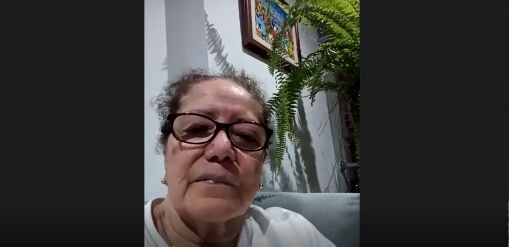
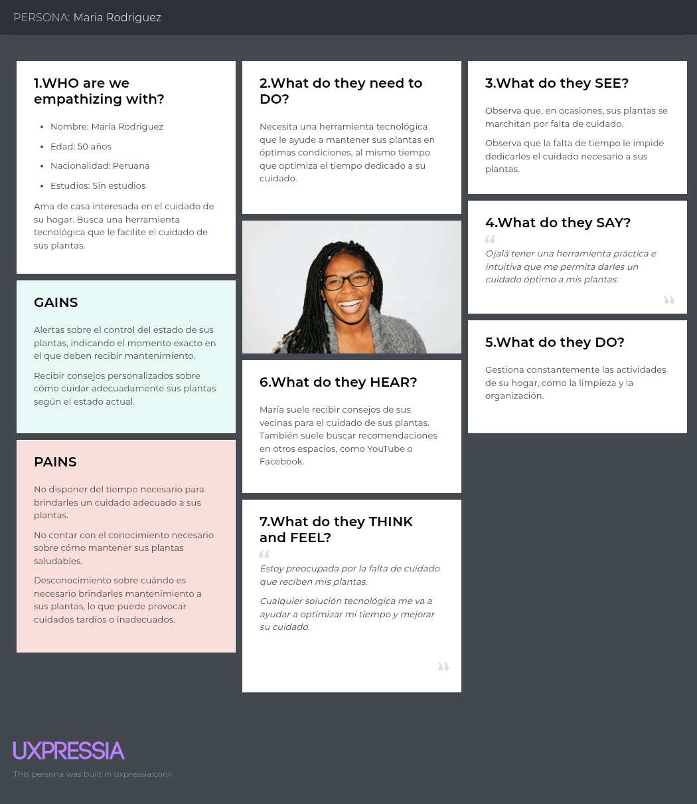

# <center>COURSE PROJECT</center>

<p align="center">
    <strong>Universidad Peruana de Ciencias Aplicadas</strong><br>
    <br>
    <strong>Ingeniería de Software</strong><br>
    <strong>Desarrollo de Soluciones IOT - 2971</strong><br>
    <strong>Profesor: Angel Augusto Velasquez Nuñez </strong><br>
    <br>INFORME
</p>


<center>

#### Startup: **WeMade**

#### Product: **EcoGuardian**

</center>
# Team  Members:

<div align="center">

|             Member             |    Code    |
|:------------------------------:|:----------:|
| Nicolas Sebastian Esteban Garcia      |    u202217485     |
|   Sebastian Ramirez Hoffmann          |    U202211894     |
| Gustavo Huilca Chipana                | u202213983 |
|  Manuel Sebastian Peña Rivera         | u202210138 |
|    Mathias Alejandro Jave Diaz        | u202212721 |
|    Mathias Tsuneo Kunimoto Watanabe   |    u202210148     |
|    Italo D'alessandro Luna Capuñay    |    u202213375     |

</div>

# Registro de Versiones del Informe

<div align="center">


| Version |   Fecha    | Autor  | Descripcion de Modificacion |
|---------|------------|--------|-----------------------------|
| 0.0     | 24/03/2024 | Nombre |      Crea documento         |

</div>

# Project Report Collaboration Insights

Repositorios:

Proyecto: (...)

Landing Page: (...)

Web Page del Proyecto: (...)

Mobile App del Proyecto (...)

Back End del Proyecto: (...)

### TB1

Para la entrega del TB1 se han hecho ...

Se muestran evidencias de los commits realizados en la entrega de la TB1 en el informe

  

[Colaboraciones del repositorio]

  
[Registro de los commits donde se realizaron la mayor cantidad]

En ambos casos se puede observar el incremento de modificaciones y revisiones en la primera semana de abril.

---

# Contenido

[Registro de Versiones del Informe](#registro-de-versiones-del-informe)

[Project Report Collaboration Insights](#project-report-collaboration-insights)

[Student Outcome](#student-outcome)

[Capítulo I: Introducción](#capítulo-i-introducción)

[1.1 Startup Profile](#11-startup-profile)  
[1.1.1. Descripción de la Startup](#111-descripción-de-la-startup)  
[1.1.2. Perfiles de integrantes del equipo](#112-perfiles-de-integrantes-del-equipo)

[1.2. Solution Profile](#12-solution-profile)  
[1.2.1 Antecedentes y problemática](#121-antecedentes-y-problemática)  
[1.2.2 Lean UX Process.](#122-lean-ux-process)  
[1.2.2.1. Lean UX Problem Statements.](#1221-lean-ux-problem-statements)  
[1.2.2.2. Lean UX Assumptions.](#1222-lean-ux-assumptions)  
[1.2.2.3. Lean UX Hypothesis Statements.](#1223-lean-ux-hypothesis-statements)  
[1.2.2.4. Lean UX Canvas.](#1224-lean-ux-canvas)

[1.3. Segmentos objetivo.](#13-segmentos-objetivo)

[Capítulo II: Requirements Elicitation & Analysis](#capítulo-ii-requirements-elicitation--analysis)

[2.1. Competidores](#21-competidores)  
[2.1.1. Análisis competitivo](#211-análisis-competitivo)  
[2.1.2. Estrategias y tácticas frente a competidores](#212-estrategias-y-tácticas-frente-a-competidores)

[2.2. Entrevistas](#22-entrevistas)  
[2.2.1. Diseño de entrevistas](#221-diseño-de-entrevistas)    
[2.2.3. Análisis de entrevistas](#223-análisis-de-entrevistas)

[2.3. Needfinding](#23-needfinding)  
[2.3.1. User Personas](#231-user-personas)  
[2.3.2. User Task Matrix](#232-user-task-matrix)  
[2.3.3. User Journey Mapping](#233-user-journey-mapping)  
[2.3.4. Empathy Mapping](#234-empathy-mapping)  
[2.3.5. As-is Scenario Mapping](#235-as-is-scenario-mapping)

[2.4. Ubiquitous Language](#24-ubiquitous-language)

[Capítulo III: Requirements Specifications](#capítulo-iii-requirements-specification)

[3.1. To-Be Scenario Mapping](#31-to-be-scenario-mapping)

[3.2. User Stories](#32-user-stories)

[3.3. Impact Mapping](#33-impact-mapping)

[3.4. Product Backlog](#34-product-backlog)

[Capítulo IV: Solution Software Design](#capítulo-iv-solution-software-design)

[4.1. Strategic-Level Domain-Driven Design](#41-strategic-level-domain-driven-design)  
[4.1.1. Event Storming](#411-event-storming)  
[4.1.1.1 Candidate Context Discovery](#4111-candidate-context-discovery)
[4.1.1.2 Domain Message Flows Modeling](#4112-domain-message-flows-modeling)
[4.1.1.3 Bounded Context Canvases](#4113-bounded-context-canvases)
[4.1.2. Context Mapping](#412-context-mapping)
[4.1.3. Software Architecture](#413-software-architecture)
[4.1.3.1. Software Architecture System Landscape Diagram](#4131-software-architecture-system-landscape-diagram)
[4.1.3.2. Software Architecture Context Level Diagrams](#4132-software-architecture-container-level-diagrams)
[4.1.3.3. Software Architecture Deployment Diagrams](#4133-software-architecture-deployment-diagrams)
[4.2. Tactical-Level Domain-Driven Desig](#42-tactical-level-domain-driven-design)

[4.2.X. Bounded Context: <Bounded Context Name](#)
[4.2.X.1. Domain Layer](#)
[4.2.X.2. Interface Layer](#)
[4.2.X.3. Application Layer](#)
[4.2.X.4. Infrastructure Layer](#)
[4.2.X.5. Bounded Context Software Architecture Component Level Diagrams](#)
[4.2.X.6. Bounded Context Software Architecture Code Level Diagrams](#)
[4.2.X.6.1. Bounded Context Domain Layer Class Diagrams](#)
[4.2.X.6.2. Bounded Context Database Design Diagram](#)

[Conclusiones](#conclusiones)

[Conclusiones y recomendaciones](#conclusiones-y-recomendaciones)

[Video About-the-Team](#video-about-the-team)

[Bibliografía](#bibliografía)

[Anexos](#anexos)

# Student Outcome


| Criterio Especifico| Acciones Realizadas| Conclusiones|
|--------------------|--------------------|-------------|
| **///** |...|...|
|**///**|...|...| 


# Capítulo I: Introducción

## 1.1. Startup Profile

### 1.1.1. Descripción de la Startup

EcoGuardian es una solución IoT que ayuda a cuidar plantas mediante sensores de humedad, temperatura, luz, entre otros. La solución multiplataforma envía alertas inmediatas y recopila información para generar recomendaciones personalizadas. Ideal para hogares, oficinas, pequeños agricultores y empresas del sector agrícola cada uno con distintos planes de pago. Algunas de las funciones principales se enfocan en el monitorización,  estadísticas, recomendaciones y seguimiento de crecimiento.

#### 1.1.2. Perfiles de integrantes del equipo

|                                                                                                                                                                                                                                                | Miembros del equipo    | Código Estudiante | Carrera                | Conocimientos / Habilidades                                                                                                                                                                                                                                         |
|------------------------------------------------------------------------------------------------------------------------------------------------------------------------------------------------------------------------------------------------|------------------------|-------------------|------------------------|---------------------------------------------------------------------------------------------------------------------------------------------------------------------------------------------------------------------------------------------------------------------|
|  | Gustavo Huilca Chipana | u202213983        | Ingeniería de software | Cuento con conocimientos en UI/UX design, desarrollo de aplicaciones web y móvil y SCRUM, así como habilidades blandas que me permiten a mí y a mis compañeros trabajar de forma organizada y eficiente, priorizando la comunicación y la participación permanente. |
|  | Mathias Alejandro Jave Diaz | u202212721        | Ingeniería de software | Cuento con experiencia en el desarrollo web y móvil, trabajando con frameworks como ASP.NET Core, NestJS y Spring Boot en el backend, así como React, Vue y Angular en el frontend, y Flutter para aplicaciones móviles. Además, tengo conocimientos en Arquitectura de Software y en la implementación de marcos de trabajo ágiles, especialmente Scrum. Me destaco por mi capacidad de autoorganización y aprendizaje autónomo. |
|  | Mathias Kunimoto | u202210148        | Ingeniería de software | Tengo experiencia en el desarrollo frontend, trabajando con tecnologías como Tailwind CSS, React y JavaScript. Me considero una persona sociable, organizada y con gran capacidad de adaptación, lo que me permite integrarme fácilmente en equipos de trabajo y aportar al cumplimiento de los objetivos. Siempre busco sacar mi mayor potencial, aprendiendo constantemente y contribuyendo con una actitud proactiva y comprometida. |
|  | Italo Luna | u202213375        | Ingeniería de software | Soy estudiante de Ingeniería de Software con perfil Full Stack, y experiencia en desarrollo frontend y backend. Manejo tecnologías como Vue.js, Angular, Flutter, Tailwind CSS, y del lado del backend Node.js, Spring Boot, Ruby on Rails, Python y C++, además de bases de datos SQL y NoSQL. Tengo un buen manejo de Git para control de versiones y colaboración en equipo.|
|  | Manuel Peña | u202210138        | Ingeniería de software | Cuento con experiencia en programación en C++, así como en desarrollo frontend con Vue, Angular y backend con tecnologías como JavaScript, Java, Spring Boot, C# y .NET. Me considero una persona responsable, flexible e innovadora, siempre abierta a escuchar activamente y mejorar en cada proyecto. Me esfuerzo por aprender constantemente y aportar soluciones efectivas, trabajando de manera colaborativa y con una actitud proactiva para lograr los objetivos del equipo. |
|  | Nicolas Esteban | u202217485 | Ingeniería de software | Tengo experiencia en frameworks como Astro, Vue y React, y actualmente estoy aprendiendo Next.js y Express. Me apasiona el desarrollo frontend, siempre enfocado en ofrecer una experiencia de usuario fluida y cómoda. Me considero una persona sociable, responsable y proactiva, además, disfruto participar en proyectos multidisciplinarios y apoyar a comunidades que promueven el desarrollo web. Siempre busco dar lo mejor de mí para asegurar un rendimiento óptimo en cada aplicación. |
|  | Sebastian Ramirez Hoffmann | U202211894 | Ingeniería de software | Me dedico a realizar soluciones de software utilizando distintas tecnologías y frameworks de desarrollo como .NetCore, SpringBoot, Angular y Vue. Asimismo cuento con experiencia implementando tecnologías mas actuales como Large Learning Models asi como modelos de cyber seguridad. Personalmente me considero una persona proactiva con vision y dispuesto a trabajar eficientemente en proyectos colaborativos. |

## 1.2. Solution Profile

### 1.2.1 Antecedentes y problemática

Para la elaboración de la descripción de la problemática y antecedentes de la solución, se ha utilizado el método de las 5 'W's y 2 'H's.

|                                             |                                                                                                                                                           |
|---------------------------------------------|-----------------------------------------------------------------------------------------------------------------------------------------------------------|
| ¿What? - ¿Cuál es el problema?              | Pérdida de plantas/cultivos debido a un monitoreo ineficiente de condiciones ambientales (humedad, luz, temperatura).                                     |
| ¿Who? - ¿Quienes son los beneficiarios?     | Personas sin conocimientos técnicos o profesionales con necesidad de precisión.                                                                           |
| ¿When? - ¿Cuando se origina el problema?    | El problema ocurre en momentos críticos como cambios climáticos, durante ausencias del usuario o en etapas clave de crecimiento (floración, germinación). |
| ¿Why? - ¿Por qué se origina el problema?    | Se origina por la falta de herramientas accesibles para controlar el crecimiento de las plantas o por recomendaciones erróneas o genéricas.               |
| ¿Where? - ¿Dónde ocurre el problema?        | Espacios con plantas/cultivos: hogares, jardines, oficinas, invernaderos, campos abiertos.                                                                |
| ¿How? - ¿Como se origina el problema?       | Las plantas muestran signos de deterioro (hojas amarillas, baja producción) de forma gradual, pero el usuario lo nota demasiado tarde.                    |
| ¿How much? - ¿Cuánto dinero está implicado? | Costo emocional y monetario: entre 20-200 soles por mes para casos domésticos y entre 500-5000 soles por mes en casos de empresas agrícolas (FAO, 2023).  |

### 1.2.2 Lean UX Process.

#### 1.2.2.1. Lean UX Problem Statement.


En el estado actual de la industria Agricola y en la comunidad de horticultura se observan desafíos significativos en la continua monitorización del estado de las plantas especialmente cuando se tienen en cuenta otras tareas administrativas o no se cuenta con el tiempo necesario. La falta de un seguimiento continuo puede resultar en perdidas significativas o irreparables para las plantas bajo cuidado.

Otros productos han fallado en ...

Nuestro producto se enfocara en proporcionar un seguimiento a los cultivos y plantas domesticas, esto ofrece una mejor calidad de vida para la planta.

Nuestro enfoque principal se basa en la monitorización de plantas y la recopilación de datos relevantes para asegurar su crecimiento saludable en el area domestica.

Como resultado, nos enfrentamos al siguiente problema: ¿Como podemos proveer una plataforma de monitorización de plantas aumentando su crecimiento y/o cosecha en un 40%?

Nuestro producto se encargara de esta tarea al ofrecer un servicio de monitorización que pueda recopilar, visualizar y optimizar el cuidado de las plantas en entornos empresariales y domésticos para ambos interesados en el hobby del cuidado de plantas como las empresas agrícolas.

Sabremos que tuvimos éxito cuando podamos observar un 45% de satisfacción en las futuras encuestas de control donde las plantas haya logrado un crecimiento y/o cosecha en un 40%.


#### 1.2.2.2. Lean UX Assumptions

**Business Outcome**  
En esta sección vamos a usar las métricas de Montaña de Jeff Gothelf e implementaremos algunas de las Pirate Metrics para poder definir los niveles de la montaña, analizar los comportamientos de nuestros usuarios y evaluar qué parte del User Journey es relevante para nosotros, realizando un assumption de cómo actuarán nuestros usuarios en base al producto.

**Acquisition (Base): [1200 visitantes]**  
El usuario se percatará de nuestra solución por medio de redes sociales y otros medios de comunicación, además de promocionar nuestra landing page. De la misma manera, intentaremos ofrecer el servicio a usuarios más formales mediante métodos de comunicación directa, como por ejemplo presentarlo a empresas agrícolas.

**Activation (Plateau): [450 usuarios : 100% usuarios]**  
En esta sección el usuario crea su cuenta registrando su correo, ya sea personal o de la empresa, sus métodos de pago, las dimensiones del negocio, es decir, el tipo de uso que le dará a la solución, y finalmente un código de autenticación para los empleados que deban generar una cuenta.  
De los usuarios que se percatan del producto, esperamos que el 45% se anime a utilizarlo.

**Retention (Plateau + 1 level): [60% usuarios]**  
De los usuarios que se animen a utilizarlo, esperamos que el 60% continúe utilizando nuestro producto diariamente para la monitorización de plantas y/o cultivos. En esta sección el usuario observa la data recolectada por nuestra solución para optimizar el cuidado de las plantas, ya cuenta con registros previos y puede visualizar un cambio notorio en las variables de entorno.

**Revenue (Plateau + 2 levels): [10% usuarios]**  
Los usuarios que utilizan nuestro producto son estrictamente de paga, a base de planes. No obstante, si la cantidad de plantas individuales excede el límite proporcionado en su plan inicial, se les ofrecerá la opción de mejorar a un plan superior. De esta manera, se espera que un 10% de los usuarios retenidos que lleguen a este límite estén dispuestos a mejorar su plan, generando un mayor ingreso.

**Referral (Top): [5% usuarios]**  
Finalmente, de los usuarios que retuvimos, esperamos que un 5% nos referencien en sus comunidades o a nuevos emprendedores, proporcionándonos indirectamente un mayor flujo de usuarios potenciales.

---

**Users**  
En esta sección creamos un Proto-Persona como una suposición de cómo son nuestros usuarios, enfocándonos más en el aspecto de actitud.

| Demográfica | Comportamiento | Necesidades / Obstáculos |
|------------|----------------|---------------------------|
| Alberto:<br>22 años<br>Entusiasta de botánica | - Tiene trabajo regular que lo mantiene lejos de casa<br> - Gana lo suficiente<br> - Aficionado o interesado en la botánica<br> - Tiene un jardín o plantas que cuida | - Quiere cuidar de sus plantas<br> - No cuenta con el tiempo para mantenerlas<br> - Busca saber si las está cuidando correctamente<br> - Quiere saber lo necesario para asegurar su crecimiento saludable |
| Valentina:<br>32 años<br>Ingeniera Agrícola | - Gana lo esperado<br> - Trabaja en una empresa agrícola<br> - Busca optimizar la producción de su empresa | - Necesita saber el estado actual de una gran cantidad de plantaciones<br> - Requiere detectar cualquier problema en las plantaciones<br> - Requiere métricas cuantificables de la producción<br> - La gran cantidad de cultivos produce resultados poco homogéneos |

Esta tabla refleja los dos principales usuarios que tenemos como suposición, junto con sus necesidades y comportamientos en el área laboral.

---

**User Outcomes & Benefits**

En esta sección se busca el lado más emocional y empatizar con el usuario para darles los outcomes correctos.

**¿Qué busca lograr el usuario?**  
Mantener sanas sus plantas con facilidad y sin depender de conocimientos avanzados en jardinería.

**¿Cómo se quiere sentir el usuario en este proceso?**  
Seguro y sin estrés, sabiendo que sus plantas están bien cuidadas con información clara y accesible.

**¿Cómo nuestro producto acerca al usuario a un logro personal?**  
La plataforma le permite ver visualmente el progreso de sus plantas, generando satisfacción y motivación para continuar con el cuidado.

**¿Por qué nuestro usuario buscaría nuestro producto?**  
Para evitar que sus plantas mueran por descuido o falta de información y sentirse más confiado en su habilidad para cuidarlas.

**¿Qué cambio de comportamiento podemos observar que nos cuente que lograron su objetivo?**  
El usuario revisa la app regularmente, ajusta su rutina de riego/cuidados según las recomendaciones y expresa satisfacción en encuestas.

---

**Continuamos con los assumptions para el segundo segmento:**

**¿Qué busca lograr el usuario?**  
Optimizar la producción de cultivos con información precisa y accesible para maximizar la cosecha.

**¿Cómo se quiere sentir el usuario en este proceso?**  
Confiado y en control, sabiendo que la plataforma le brinda información confiable sin necesidad de monitorización manual constante.

**¿Cómo nuestro producto acerca al usuario a un logro personal?**  
Al aumentar la eficiencia del cultivo, logra mejorar la producción y rentabilidad, generando un impacto positivo en su negocio.

**¿Por qué nuestro usuario buscaría nuestro producto?**  
Para reducir riesgos en la cosecha, evitar pérdidas económicas y mejorar su toma de decisiones basada en datos.

**¿Qué cambio de comportamiento podemos observar que nos cuente que lograron su objetivo?**  
El usuario consulta datos regularmente, ajusta riegos y fertilización según la plataforma y ve mejoras en producción.

Este análisis de *User Outcomes* sirve para ambos segmentos en ciertos casos, ya que tienen un objetivo similar y se puede comprender el contexto desde ambas perspectivas.

---

**Solutions**

Si bien Jeff Gothelf menciona en su libro *Lean UX 3rd Edition* que debemos utilizar elementos físicos como post-its, para esta entrega realizamos una llamada para definir nuestras soluciones supuestas.

Tomando en cuenta las restricciones anteriormente seleccionadas, planteamos las siguientes soluciones:

Desarrollar una solución con tecnologías IoT (*Internet of Things*) orientada a realizar el monitoreo de plantas, con funciones principales como:

- **Monitoreo de acidez del suelo:**  
  *Problema:* Los usuarios no pueden evaluar fácilmente el pH del suelo, lo que afecta la salud de las plantas.  
  *Solución:* Sensores de acidez que recopilan datos en tiempo real y envían alertas si el nivel es subóptimo.  
  *Resultado:* El usuario puede ajustar el pH del suelo de manera informada, evitando daños en sus cultivos.

- **Sensores de humedad del suelo:**  
  *Problema:* Los usuarios no saben cuándo regar sus plantas correctamente, lo que genera exceso o falta de agua.  
  *Solución:* Sensores de humedad que notifican al usuario cuándo es el momento óptimo para regar.  
  *Resultado:* Reducción del desperdicio de agua y mejora en la salud de las plantas con menor esfuerzo.

- **Dashboard interactivo con visualización de datos:**  
  *Problema:* Los usuarios necesitan interpretar datos sobre el estado de sus plantas de forma rápida y sencilla.  
  *Solución:* Plataforma con gráficos y análisis en tiempo real sobre los niveles de humedad, pH y otros factores ambientales.  
  *Resultado:* El usuario puede tomar decisiones informadas sin necesidad de conocimientos técnicos avanzados.

- **Recomendaciones inteligentes basadas en los datos recolectados:**  
  *Problema:* Los usuarios no saben qué acciones tomar para mejorar el crecimiento de sus plantas.  
  *Solución:* Sistema que sugiere medidas correctivas basadas en datos históricos y condiciones actuales.  
  *Resultado:* Aumento en la tasa de éxito en el crecimiento de cultivos y reducción de errores en el cuidado de plantas.


#### 1.2.2.3. Lean UX Hypothesis Statements.

**Hipótesis**

Siguiendo el formato de las Hipótesis usaremos la tabla ya proporcionada.
Tomar en cuenta que cada hipótesis empieza con "Creemos que.." Estas hipótesis se basan en los 450 usuarios que proyectamos tener.

|Business Outcome|Persona|User Outcome|Feature/Solution|
|----------------|-------|------------|----------------|
|Aumentar el tráfico a la landing page en un 1200 visitantes mensuales.| Dueños de plantas y empresas agrícolas.|Descubrir la plataforma y entender su valor.|Campañas en redes sociales y contenido educativo sobre monitoreo de cultivos.|
|Convertir al menos un 45% de visitantes en usuarios registrados.| Usuarios interesados en optimizar el crecimiento de sus cultivos.|Registrarse en la plataforma y configurar su cuenta.|Proceso de onboarding simplificado con guía paso a paso y beneficios claros.|
|Mantener al 60% de los usuarios activos diariamente en la plataforma.| Usuarios que buscan mejorar la eficiencia del cuidado de sus cultivos.|Consultar métricas y alertas en la plataforma para optimizar su producción.|Dashboard interactivo con reportes detallados sobre el estado de las plantas.|
|Generar ingresos con un 10% de conversión a planes pagos.|Usuarios que necesitan monitorear más plantas de las incluidas en el plan inicial.|Contratar un plan premium para acceder a funciones avanzadas.|Modelo de precios escalable con límites flexibles y herramientas avanzadas.|
|Lograr que al menos un 5% de los usuarios refieran la plataforma.|Usuarios satisfechos con la solución.|Compartir la plataforma con su red de contactos.|Programa de referidos con incentivos como descuentos o beneficios adicionales.|


**Que es lo mas importante que debemos aprender**

Debemos de analizar que es lo que debemos aprender de nuestras Hipótesis, entonces llegamos a nuestra siguiente conclusion respecto a lo mas importante que debemos aprender:

- Si los usuarios (domésticos y empresariales) realmente tienen problemas monitorizando el estado de sus plantas.
- Si están dispuestos a usar sensores o plataformas tecnológicas para solucionarlo.
- Si confiarían en las recomendaciones generadas por un sistema automatizado.
- Si pagarían por una versión avanzada del sistema cuando se supere cierto límite de plantas.
- Qué tan seguido están dispuestos a interactuar con una app de monitoreo.

De estos posibles riesgos escogemos el mas critico que seria averiguar si los usuarios están dispuestos a usar sensores o plataformas tecnológicas para solucionar sus problemas.

**Minimum viable product**

Los MVP nos sirven para aprender cosas a corto plazo. para realizar esto se hace la pregunta: 
What’s the most important thing we need to learn first?

Nuestro MVP debe estar orientado a demostrar lo que ofrece nuestra solución como concepto para validar que el usuario este interesado en nuestros features principales.
En este caso seria desarrollar un prototipo parcialmente funcional donde lo que debe observarse sera la simulación de datos.

#### 1.2.2.4. Lean UX Canvas.

Finalmente juntamos todo lo que hemos hecho en este proceso y lo agregamos en un Lean UX Canvas (V2) guiandonos del ejemplo que nos proporciona Jeff Gothelf [Anexo 1.1]

<image src ="../assets/lean-ux-canvas/lean-ux-canva.jpeg" alt ="LeanUX Canvas (V2) [implementando lean UX 3]">


## 1.3. Segmentos objetivo.

|   | Segmento 1| Segmento 2|
|---|-----------|-----------|
| Variables     | Doméstico | Negocios |
| Geográfica    | Depende de la ubicación del hogar del usuario | Ubicación cercana al servicio y/o ubicados en áreas donde las industrias agrícolas, la agricultura urbana o sectores relacionados con las plantas están activos. |
| Demográfica   | Diversidad en edad y género | Edad adulta, posiblemente con formación universitaria en áreas relacionadas con las industrias agrícolas y afines. |
| Psicológica   | Actitud hacia la adopción de herramientas técnologicas para el cuidado de sus plantas | Una fuerte inclinación hacia la innovación y la eficiencia en el sector agricola. Las empresas de este segmento son propensas a adoptar nuevas tecnologías, especialmente soluciones IoT que mejoren la eficiencia operativa, reduzcan costos y aseguren sostenibilidad. |
| Función de comportamiento | Necesidad de herramientas para el cuidado de sus plantas | Necesidad de herramientas que optimicen las operaciones, especialmente aquellas que ayudan a monitorear el estado de las plantas y/o sus cultivos y gestionar recursos de manera más efectiva. |
---

# Capítulo II: Requirements Elicitation & Analysis

## 2.1. Competidores.

### 2.1.1. Análisis Competitivo

**Competitive Analysis Landscape**

| ¿Por qué llevar a cabo este análisis? | Nosotros | competidor1 | Xiaomi Mi Flora | Rachio|
|:---------------------------------------:|:----------:|:-----------:|:------------:|:-------------------------:|
| **Overview**                          | EcoGuardian es una solución IoT que ayuda a cuidar plantas mediante sensores de humedad, temperatura y luz. Envía alertas inmediatas y genera recomendaciones personalizadas. Se adapta tanto a hogares como a empresas agrícolas. | ... | Xiaomi ofrece sensores para plantas que miden humedad del suelo, luz, fertilidad y temperatura. Se conectan vía Bluetooth a una app móvil para mostrar el estado de la planta. | Rachio es una empresa especializada en productos inteligentes para cultivos y jardinería, sus productos son controladores de riego y sensores de humedad, los cuales optimizan el uso del agua y mejoran el cuidado de las plantas a través de su app móvil. |
| **Ventaja Competitiva**               | Plataforma multiplataforma (web y móvil), sistema de recomendaciones basadas en datos, enfoque en experiencia de usuario, escalabilidad por planes, y orientación tanto al hobby como a la agricultura técnica. | ... | Producto de bajo costo, fácil de usar, respaldado por una marca reconocida globalmente. Buen diseño y app intuitiva para usuarios domésticos. | Empresa posicionada en el rubro, cuenta con diversos dispositivos enfocados en la tecnología de riego inteligente, integración solida con dispositivos smart home, y optimización del uso del agua. |
| **Mercado Objetivo**                  | 	Hogares, oficinas, pequeños agricultores y empresas del sector agrícola interesados en cuidar plantas, automatizar tareas y recibir sugerencias personalizadas. | ... | Usuarios domésticos y aficionados al cuidado de plantas de interior que buscan un sensor simple para monitoreo básico. | Hogares, cultivos, parques, y jardines de usuarios interesados en la optimización del riego, control de humedad y estado de las plantas. |
| **Perfil de Marketing**               | Contenido educativo en redes sociales, campañas de concienciación ambiental, y alianzas con viveros y comunidades de jardinería/agricultura urbana. | ... | 	Promocionado a través de tiendas online (Amazon, AliExpress), y posicionamiento mediante influencers de tecnología y hogar inteligente. | Rachio utiliza marketing digital a través de redes sociales y participación en eventos de la industria para promocionar sus productos. |
| **Perfil del Producto**               | 	Sensores inteligentes que miden humedad, temperatura y luz, conectados a una plataforma que ofrece estadísticas, alertas y recomendaciones personalizadas. | ... | Sensor compacto que mide 4 variables y se conecta vía Bluetooth. No tiene alertas en tiempo real ni integración IoT avanzada. |  Controladores de riego inteligentes, sensores de humedad, y sistemas para mejorar el cuidado de plantas en jardines, cultivos y exteriores. |
| **Precios**                           | Modelo freemium con planes accesibles por número de plantas/áreas monitoreadas. Opciones económicas para el hogar y versiones premium para uso agrícola.| ... | Alta relación calidad-precio para el usuario. | Precios competitivos, con productos accesibles para el hogar y más avanzados para empresas. |


| **Análisis SWOT** | EcoGuardian                                                                                                                                                                                                  | competidor1 | Xiaomi Mi Flora | Rachio |
|-------------------|--------------------------------------------------------------------------------------------------------------------------------------------------------------------------------------------------------------|-------------|-----------------|--------|
| **Fortalezas**    | - Aplicación multiplataforma (web + móvil).<br/> - Recomendaciones personalizadas basadas en datos.<br/>- Escalabilidad por planes (hobby/empresarial).<br/>- Enfoque en experiencia de usuario y educación. |             |                 |        |
| **Debilidades**   | - Marca menos reconocida vs. Xiaomi/Rachio.<br/> - Requiere mayor inversión inicial en sensores y suscripciones.<br/>- Dependencia de infraestructura IoT y una conectividad estable.<br/>                   |             |                 |        |
| **Oportunidades** | - Alianzas con viveros y agricultura urbana.<br/> - Expansión a mercados emergentes con agricultura tecnológica.<br/>  - Integración con smart home (ej: Alexa, Google Home).                                                                                                                                                         |             |                 |        |
| **Amenazas**      | ...                                                                                                                                                                                                          |             |                 |        |


### 2.1.2. Estrategias y Tácticas Frente a Competidores

Para competir con Xiaomi y Rachio, teniendo en cuenta sus fortalezas y debilidades, EcoGuardian puede realizar las siguientes estrategias y tácticas:

-**Hacer uso de recomendaciones de cuidado personalizadas**:  
  A diferencia de Xiaomi, que solo ofrece datos de monitoreo básico, EcoGuardian puede diferenciarse recomendando acciones 
específicas para el cuidado de las plantas, basadas en datos históricos y condiciones actuales, así como el tipo de planta.

-**Integración con dispositivos de smart home y APIs empresariales**:
    EcoGuardian puede ofrecer integración con dispositivos de smart home como Alexa y Google Home, permitiendo a los usuarios controlar sus plantas mediante comandos de voz. 
Además, se pueden implementar el soporte con APIs para empresas agrícolas que faciliten la integración con sistemas existentes.

-**Enfoque multiplataforma**:
    EcoGuardian ofrece una experiencia integrada en web, móvil y dispositivos IoT, permitiendo a los usuarios acceder a la información desde cualquier lugar y en cualquier momento, así como configurar automatizaciones en el sistema.

## 2.2. Entrevistas.

### 2.2.1. Diseño de entrevistas.

**Preguntas generales:**

1. ¿Cuál es su nombre? 
2. ¿Qué edad tiene? 
3. ¿A qué se dedica? 
4. ¿Que navegador usa?
5. ¿Que dispositivo usa con mas frecuencia y de que marca es?
6. ¿En que distrito se encuentra?


**Entrevistas usuario segmento (Doméstico)**

1. ¿Qué dificultades encuentras al cuidar tus plantas? 
2. ¿Cuánto tiempo dedicas semanalmente al cuidado de tus plantas?
3. ¿Actualmente utilizas algún dispositivo o herramienta para cuidar tus plantas?
4. ¿Cómo gestionas las necesidades de riego, luz y temperatura de tus plantas?
5. ¿Alguna vez has perdido una planta debido a que no pudiste monitorearla correctamente?
6. ¿Qué tan interesado/a estarías en una solución tecnológica que te ayude a cuidar tus plantas?
7. ¿Te gustaría recibir alertas personalizadas sobre el cuidado de tus plantas? ¿Qué tipo de alertas?
8. ¿Qué características serían más útiles para ti en una plataforma que te ayude a monitorear tus plantas?

**Entrevistas usuario segmento (Negocios)**

1. ¿Qué herramientas utilizan actualmente para monitorear y gestionar tus cultivos?
2. ¿Cuáles son los principales desafíos que enfrentan en la gestión de tus cultivos?
3. ¿Qué importancia le dan a la adopción de nuevas tecnologías para mejorar la eficiencia en tu negocio agrícola?
4. ¿Les interesaría usar una plataforma que te ayude a monitorear y gestionar todos los aspectos de tus cultivos?
5. ¿Qué funcionalidades específicas te gustaría que tuviera una plataforma de monitoreo agrícola?
6. ¿Qué tipo de datos consideras más importantes para optimizar las operaciones de tus cultivos?
7. ¿Estarías dispuesto/a a invertir en una solución tecnológica para mejorar la eficiencia de tus cultivos?
8. ¿Qué mejoras específicas te gustaría lograr en tu negocio mediante la adopción de nuevas tecnologías en el cuidado de tus cultivos?

### 2.2.2. Registro de entrevistas.

Las entrevistas estan en un video en el siguiente URL: ... [Anexo 2.2.1.1]


**Segmento Doméstico**  
Nombre: Andrea Milagros Cabanillas Gora
<br>
Edad: 20
<br>
Ocupación: Ingeniera de Software
<br>
Browser: Google Chrome
<br>
Device: Teléfono Samsung y Laptop Asus
<br>
Distrito: Santiago de Surco, Lima 
<br>
Timing: 0:00
<br>


Andrea es una ingeniera de software de profesión con 20 años de edad con pasión por el cuidado de sus plantas como hobby.
En su experiencia personal nos menciona que al enfocarse en sus actividades diarias en ocasiones descuida el cuidado de sus plantas. Aunque les dedica entre 2 y 3 horas a la semana, considera que este tiempo no siempre es suficiente, lo que en ocasiones provoca cierto descuido en su mantenimiento. También nos menciona que actualmente consulta a especialistas en el tema para saber como gestionar el mantenimiento de sus plantas. Asimismo, nos menciona que utiliza google calendario como herramienta para saber en que ocasiones debe darles mantenimiento. Por otro lado, comentó el interes en una solución que le permita saber el estado de sus plantas mediante el uso de alertas personalizadas. Finalmente menciona que le gustaría disponer de un calendario donde pueda gestionar las actividades que debe realizar en la semana para el correcto mantenimiento de sus plantas.

**Segmento Doméstico**  
Nombre: Paquita Soto Camacho
<br>
Edad: 71
<br>
Ocupación: Jubilada
<br>
Browser: Google Chrome
<br>
Device: Teléfono Samsung
<br>
Distrito: Trujillo, La libertad
<br>
Timing: 0:00
<br>


La señora Paquita es jubilada y como hobby cuida de su helecho, cuenta con 71 años de edad y reside en la provincia de Trujillo.
En la entrevista se nos comenta como sus principales dificultades resultan ser el clima en el cuidado de sus plantas,
cuida de estas mismas de manera inter diaria y no cuenta con ningún dispositivos o herramienta para el cuidado de sus plantas, 
respecto a la frecuencia de riego de la planta comenta de que lo hace dependiendo del clima y que actualmente lo hace de manera inter-diaria
menciona que cada planta cuenta con un cuidado distinto y que hay características visuales que sirven de indicador para saber que requiere su planta.
Menciona igualmente la importancia de saber las necesidades de la planta en especial el agua la tierra y el musgo de este.

---

**Segmento Negocios**  
Nombre: Julio Enrique Chipana Barrientos
<br>
Edad: 48 años
<br>
Ocupación: Docente, Ingeniero Agrónomo
<br>
Browser Preferido: Google Chrome
<br>
Dispositivos: Teléfono Samsung Galaxy A52 Y Laptop Lenovo
<br>
Distritos: Carmen Alto, Ayacucho
<br>
Timing: 0:00
<br>


El señor Julio Chipana Barrientos es un ingeniero agrónomo con 48 años de edad, actualmente trabaja como docente en la ciudad de Ayacucho. 
En su experiencia laboral nos menciona que las herramientas que utiliza para monitorear sus cultivos son principalmente aplicaciones móviles que les permiten
registrar datos de campo de sus cultivos como las condiciones en las que se desarrolla la etapa fenológica de la planta, así como sensores
que se usan en la producción de lechugas en la hidroponía, aunque considera que la aplicación resulta muy básica y a veces no le brinda la información correcta a tiempo, además de que la información 
de cada cultivo se debe colocar de manera manual. El principal desafío que enfrenta en su trabajo son las temperaturas extremas de la sierra que afectan el crecimiento de sus cultivos.
Sobre la importancia de la adopción de nuevas tecnologías en su trabajo, menciona que desde hace poco han implementado el uso de drones que les permiten manejar el control
de plagas. El uso de una plataforma que le ayude a monitorear y gestionar todos los aspectos de sus cultivos desde una aplicación web y móvil le parece una buena idea, ya que nos explica que les permitiría tener un manejo
más eficiente de los pocos recursos que tienen como el agua o la calidad del suelo.
Sobre las funcionalidades que le gustaría que tuviera una plataforma de monitoreo agrícola, menciona que es de suma importancia que la plataforma pueda avisarles de forma inmediata la presencia de plagas o la
falta de recursos. Además, dice que la calidad del suelo es un factor muy importante para el crecimiento de los cultivos y que siempre analizan la textura y las características biológicas del suelo.
Seguidamente, habla sobre que, para que pueda decidir invertir en una solución tecnológica para mejorar la eficiencia de sus cultivos, tendría que evaluar el costo de la inversión, así como la calidad de la información que le brinda la plataforma.
Finalmente, menciona que las mejoras que le gustaría lograr en su negocio son la mejora de la productividad y la reducción de costos y del tiempo que se invierte en el monitoreo de los cultivos, y complementa
diciendo que una plataforma completa ya implementada les permitiría reducir costos en personal y el tiempo que manejan en el monitoreo de aspectos que su actualmente son manuales.

Nombre: Alonso Renzo Chuctaya Leyva
<br>
Edad: 40 años
<br>
Ocupación: Productor Agrícola
<br>
Browser Preferido: Google Chrome
<br>
Dispositivos: Teléfono Samsung Galaxy Y Laptop Asus
<br>
Distritos: La Victoria, Chiclayo
<br>
Timing: 0:00
<br>


Alonso Chuctaya, productor agrícola de 40 años en Chiclayo, es gerente de una empresa familiar que cultiva papa nativa y quinua orgánica. Actualmente monitorea sus cultivos con Excel, cuadernos de campo y sensores de humedad, aunque reconoce limitaciones en las apps que usa. Sus principales desafíos son el clima variable, el control de insumos y la falta de personal capacitado. Considera clave la adopción de nuevas tecnologías para mejorar la eficiencia. Le interesa una plataforma que centralice datos de clima, riego y plagas, con alertas automáticas y registro de insumos. Prioriza datos como estado del suelo, clima y rendimiento por cultivo. Estaría dispuesto a invertir en tecnología si es confiable, fácil de usar y ofrece ahorro de tiempo, recursos y mejor planificación.


---

### 2.2.3. Análisis de entrevistas.


**Segmento 1: (...):**

Estadisticas y Aspectos comunes:


Caracteristicas Objetivas:

Caracteristicas Subjetivas:


**Segmento 2: (...)**
Estadisticas y Aspectos comunes:

Caracteristicas Objetivas:

Caracteristicas Subjetivas:


## 2.3. Needfinding.

### 2.3.1. User Personas.

Los user personas nos sirven para poder identificar como seran los comportamientos y caracteristicas de nuestros usuarios segmento. Para cada segmento se realiza un user persona para identificar las caracteristicas tecnicas y tener una idea general de lo que busca el usuario.

**Segmento 1:** ...


**Segmento 2:** 

---

### 2.3.2. User Task Matrix.

El user task matrix nos sirve para identificar los procesos que realizan ambos segmentos donde se pueden observar las similitudes respecto a la importancia y frecuencias de estos procesos.

|| Segmento 1 | Doméstico | Segmento 2 | Empresa |
|-------------|------------------|------------------|------------------|------------------|
| **Necesidad / Función**                     | **Importancia** | **Frecuencia** | **Importancia** | **Frecuencia** |
| Ver estado actual de plantas/cultivos       | Alta            | Media          | Alta            | Alta           |
| Recibir alertas sobre humedad, luz o acidez | Alta            | Alta           | Alta            | Alta           |
| Acceder a recomendaciones automáticas       | Alta            | Alta           | Media           | Media          |
| Consultar historial de datos                | Media           | Baja           | Alta            | Alta           |
| Optimizar riego según sensores              | Alta            | Alta           | Alta            | Alta           |
| Configurar múltiples sensores               | Baja            | Baja           | Alta            | Media          |
| Medir impacto económico/productivo          | Baja            | Nula           | Alta            | Alta           |
| Compartir información o reportes            | Media           | Baja           | Alta            | Media          |
| Acceso desde app móvil                      | Alta            | Alta           | Media           | Media          |
| Revisar recomendaciones de fertilización    | Media           | Baja           | Alta            | Alta           |


Con este user task matrix entendemos las actividades que realizan nuestros usuarios segmento y la importancia que estas acciones tienen.

De las tareas principales que identificamos se observa.


### 2.3.3. User Journey Mapping.

En esta seccion hacemos un journey mapping para comprender el camino que recorren nuestros segmentos en un escenario comun en su area laboral

**Segmento 1**

...
**Segmento 2**


### 2.3.4. Empathy Mapping.

**Segmento 1:** : 



**Segmento 2:** 

### 2.3.5. As-is Scenario Mapping.

As Is representa las fases donde aun no se esta implementando nuestra solución nos sirve para poder plantear escenarios de los cuales abarcaremos en el To Be donde utilizaremos la solución.

Link del Miro: https://miro.com/welcomeonboard/dGx3dm9LMGlsYkhBdmpWUzhFVkxrdGJHbkE2RzdrTk9iVEhXZXZjUlhYR3UyZFQ3LzJFQVlLeGdYM0RTclFzZFFubUQ2TmJPWCsrUThVRTJhRDhTL29uWG1rS3dVdW10WUhnSlBIQ2lNK3pNYnJmZU5zUnlLcHNSWXd5OXZwQXJBd044SHFHaVlWYWk0d3NxeHNmeG9BPT0hdjE=?share_link_id=64624328710

**Segmento Domestico**


**Segmento Negocio**  


## 2.4. Ubiquitous Language.

```
Plant Guardian:	dispositivo IoT con sensores que monitorea condiciones ambientales de plantas.
 
Care Threshold:	valor límite (ej: 30% humedad) que activa alertas cuando se supera o no se alcanza.

Growth Phase: etapa de la planta (ej: germinación, florecimiento) que determina recomendaciones.

Plant Parent: usuario doméstico que gestiona pocas plantas en hogar/oficina.

Crop Manager: usuario empresarial que supervisa múltiples plantas/cultivos.

Care Plan: suscripción con niveles de servicio (ej: Basic, Pro).

```

---

# Capítulo III: Requirements Specification

## 3.1. To-Be Scenario Mapping.

En la seccion To-Be se utilizan los mismos escenarios pero implementando la solucion que proporciona nuestro proyecto.

Miro con el As-Is To-Be:
(Link)

Segmento 1:


Segmento 2:


Segmento 3:
...

## 3.2. User Stories.

La seccion de User Stories sirve para saber las distintas situaciones y puntos clave que tiene el usuario al realizar operaciones en los distintos aspectos del proyecto, desde la landing page hasta los aspectos tecnicos que realizan los desarolladores. Es importante debido a que nos ayuda a poder realizar un product backlog y con los criterios de aceptacion sabremos como verificar que estas historias de usuario estan siendo satisfechas.

| HUX/EPX | Historia de Usuario / Épica                                   | Descripción                                                                                                                                            | Criterios de Aceptación                                                                                                                                                                                                                                                                                                                          | Relacionado con (Epic ID) |
|---------|---------------------------------------------------------------|--------------------------------------------------------------------------------------------------------------------------------------------------------|--------------------------------------------------------------------------------------------------------------------------------------------------------------------------------------------------------------------------------------------------------------------------------------------------------------------------------------------------|---------------------------|
| EP01   | Información del producto                               | Como visitante del sitio web, quiero obtener información relacionada al producto que se ofrece.                                 | Given el visitante está en la landing page <br> When observa la información del producto que se está ofreciendo <br> Then obtiene una mejor visión de qué ofrece la empresa. <br> And se registra o considera registrarse como usuario.         |               |
| HU01   | Conseguir información de la empresa                    | Como visitante del sitio web, quiero obtener más información sobre la empresa a cargo del producto.                             | Given el visitante se encuentra en la sección de about us <br> When observa la información relevante sobre la empresa <br> Then se interesa en saber más del producto <br> And se registra como usuario.                                          | EP01          |
| HU02   | Conocer los medios oficiales de la empresa               | Como visitante del sitio web, quiero conocer los medios oficiales de la empresa para mantenerme actualizado de las últimas noticias.             | Given el visitante se encuentra en la sección de footer <br> When se encuentra interesado en conocer los medios oficiales <br> Then visita los medios oficiales de la empresa.                                                                        | EP01          |
| HU03   | Contactar a la empresa desde la sección Contáctanos      | Como visitante del sitio web, quiero tener la posibilidad de contactar a la empresa para resolver dudas sobre la información del servicio.        | Given el visitante se encuentra en la sección de "Contact Us" <br> When se encuentra interesado en contactar a la empresa <br> Then envía la consulta mediante un formulario <br> And la consulta es recibida por la empresa.                         | EP01          |
| HU04   | Conocer la misión y visión de la empresa                 | Como visitante del sitio web, quiero conocer la misión y visión de la empresa para comprender mejor sus valores y la proyección del producto.     | Given el visitante se encuentra en la sección "About Us" <br> When observa la información sobre la misión y visión de la empresa <br> Then obtiene una mejor perspectiva sobre los valores y la proyección del producto.                              | EP01          | 

## 3.3. Impact Mapping.

Impact Mapping **

## 3.4. Product Backlog.

Link Trello:

| #Orden | User Story ID | Titulo                                                        | Descripción                                                                                                                                            | Story Points (1/2/3/5/8) |
|--------|---------------|---------------------------------------------------------------|--------------------------------------------------------------------------------------------------------------------------------------------------------|--------------------------|
| 1      | EP01          | Información del producto                                      | Como visitante del sitio web, quiero obtener información relacionada al producto que se ofrece.                                                        | 3                        |
                                                                   | 3                        |


# Capítulo IV:  Solution Software Design
-
## 4.1. Style Guidelines.
-
### 4.1.1. Event Storming.
-

#### 4.1.1.1 Candidate Context Discovery.
-
#### 4.1.1.2 Domain Message Flows Modeling.
-
#### 4.1.1.3 Bounded Context Canvases. 
-
### 4.1.2. Context Mapping.
-
### 4.1.3. Software Architecture.
-
#### 4.1.3.1. Software Architecture System Landscape Diagram.
-
#### 4.1.3.2. Software Architecture Context Level Diagrams.
-
#### 4.1.3.2. Software Architecture Container Level Diagrams.
-
#### 4.1.3.3. Software Architecture Deployment Diagrams.
-
## 4.2. Tactical-Level Domain-Driven Design
-
### 4.2.X. Bounded Context: BoundedContext
-
#### 4.2.X.1. Domain Layer.
-
#### 4.2.X.2. Interface Layer.
-
#### 4.2.X.3. Application Layer.
-
#### 4.2.X.4. Infrastructure Layer.
-
#### 4.2.X.5. Bounded Context Software Architecture Component Level Diagrams.
-
#### 4.2.X.6. Bounded Context Software Architecture Code Level Diagrams.
-
##### 4.2.X.6.1. Bounded Context Domain Layer Class Diagrams.
-
##### 4.2.X.6.2. Bounded Context Database Design Diagram.
-

# Conclusiones

<br>**TB1**: ...

# Conclusiones y recomendaciones.

Como una conclusion general ...

Como recomendaciones ...

# Video About-the-Team.

En el video about the team se muestran testimonios del trabajo realizado.

[https://youtu.be/2mOrsvJKwC8](https://youtu.be/2mOrsvJKwC8)

Microsoft Share:
"https://upcedupe-my.sharepoint.com/:v:/g/personal/u202211894_upc_edu_pe/EZ8haON2Cs1Psmnw6Wo4E8ABnPYPXoNlPr1Vs4OlwC4jzw?nav=eyJyZWZlcnJhbEluZm8iOnsicmVmZXJyYWxBcHAiOiJPbmVEcml2ZUZvckJ1c2luZXNzIiwicmVmZXJyYWxBcHBQbGF0Zm9ybSI6IldlYiIsInJlZmVycmFsTW9kZSI6InZpZXciLCJyZWZlcnJhbFZpZXciOiJNeUZpbGVzTGlua0NvcHkifX0&e=hzhCXD"

# Bibliografía


``` 
Organización de las Naciones Unidas para la Alimentación y la Agricultura (FAO) (2023). Repercusiones de las Catástrofes en la Agricultura y la Seguridad Alimentaria.
        FAO. Recuperado el 2 de abril del 2025 de URL https://openknowledge.fao.org/server/api/core/bitstreams/3f35b839-87cb-442a-b264-1edb49c5da22/content


Ostelea (2021, 10 de febrero). ¿Qué es la gestión hotelera y cuál es su importancia en el sector hotelero?.
        Ostelea. Recuperado el 6 de abril del 2024 de URL https://www.ostelea.com/actualidad/blog-turismo/direccion-hotelera/que-es-la-gestion-hotelera-y-cual-es-su-importancia-en-el-sector-hotelero

Raigoza, V. (s.f). LA IMPORTANCIA DEL SOFTWARE DE GESTIÓN HOTELERA.
        Soho Apps. Recuperado el 3 de abril del 2024 de URL https://sohoapps.co/importancia-del-software-de-gestion-hotelera/#:~:text=La%20gestión%20de%20reservas%20esmayor%20rentabilidad%20para%20el%20hotel

Rachio. (n.d.). Rachio products. Rachio. 
        Recuperado el 5 de abril de 2025, de https://rachio.com/products/

BIMnD (2024, 25 de enero). El impacto de la Digitalización en la sostenibilidad hotelera.
        BIMnD. Recuperado el 4 de abril del 2024 de URL https://www.bimnd.es/el-impacto-de-la-digitalizacion-en-la-sostenibilidad-hotelera/

Lacalle, E. (2023, 4 de octubre). El rol fundamental que desempeña la tecnología en la gestión hotelera.
        Mews. Recuperado el 4 de abril del 2024 de URL https://www.mews.com/es/blog/tecnologia-en-operaciones-hoteleras

Gonzales, M. (2023, 28 de octubre). Asociación de hoteles y restaurantes alertaron que ventas de su sector han caído un 40%: “No hay incentivos”.
        infobae. https://www.infobae.com/peru/2023/10/29/asociacion-de-hoteles-y-restaurantes-alertaron-que-ventas-de-su-sector-han-caido-un-40-no-hay-incentivos/

Gothelf, J. (2022, 29 de agosto). FAQ: WHAT DOES A COMPLETE LEAN UX CANVAS LOOK LIKE?.
        jeff Gothelf. Recuperado el 24 de abril del 2024 de URL https://jeffgothelf.com/blog/faq-what-does-a-complete-lean-ux-canvas-look-like/

Gothelf, J. Seiden, J. (2021). Lean UX, 3rd Edition. O'Reilly Media, inc. https://www.oreilly.com/library/view/lean-ux-3rd/9781098116293/.
```

# Anexos

datos, gráficos, imágenes, esquemas, mapas de otros autores


<p>Lean UX Canvas hecho por Jeff Gothelf [Anexo 1.1]</p>

---

Link de entrevistas [Anexo 2.2.1.1] 
<a>https://upcedupe-my.sharepoint.com/:v:/g/personal/u202211894_upc_edu_pe/ESxD6TAhfylMgJTLWMsn4F8BaCVSmqQuYn7hVIwYosnpvw?e=Wjhd8e&nav=eyJyZWZlcnJhbEluZm8iOnsicmVmZXJyYWxBcHAiOiJTdHJlYW1XZWJBcHAiLCJyZWZlcnJhbFZpZXciOiJTaGFyZURpYWxvZy1MaW5rIiwicmVmZXJyYWxBcHBQbGF0Zm9ybSI6IldlYiIsInJlZmVycmFsTW9kZSI6InZpZXcifX0%3D</a>


Link entrevistas Heuristicas [Anexo 5.3.2]
<a> https://upcedupe-my.sharepoint.com/:v:/g/personal/u202211894_upc_edu_pe/Echosh-Q4yVOhOpOr5K74ukBRVTHjBVTjUICzn35RqF6hw?nav=eyJyZWZlcnJhbEluZm8iOnsicmVmZXJyYWxBcHAiOiJPbmVEcml2ZUZvckJ1c2luZXNzIiwicmVmZXJyYWxBcHBQbGF0Zm9ybSI6IldlYiIsInJlZmVycmFsTW9kZSI6InZpZXciLCJyZWZlcnJhbFZpZXciOiJNeUZpbGVzTGlua0NvcHkifX0&e=PYqtch</a>

Importante! 

Hay links que tienen :v: para solucionar esto se debe de poner [": v :"] junto.
Esto sucede por un error en la conversion a pdf

---

