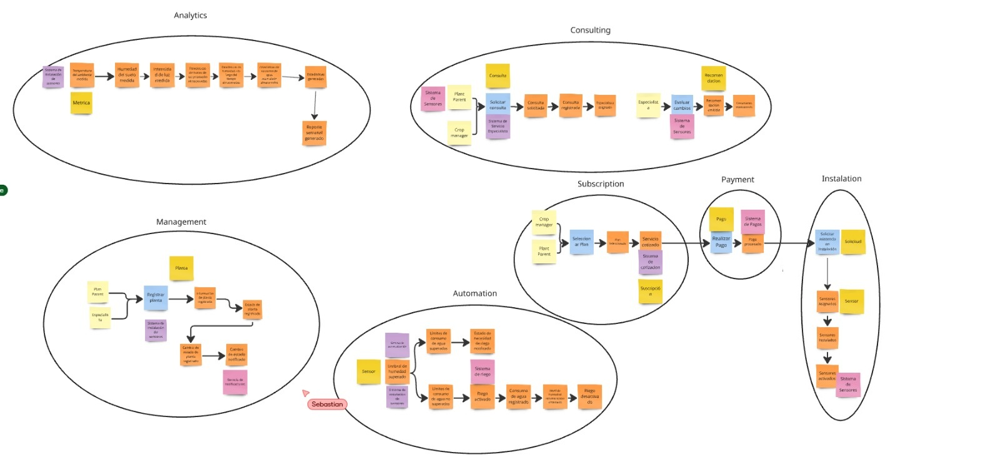
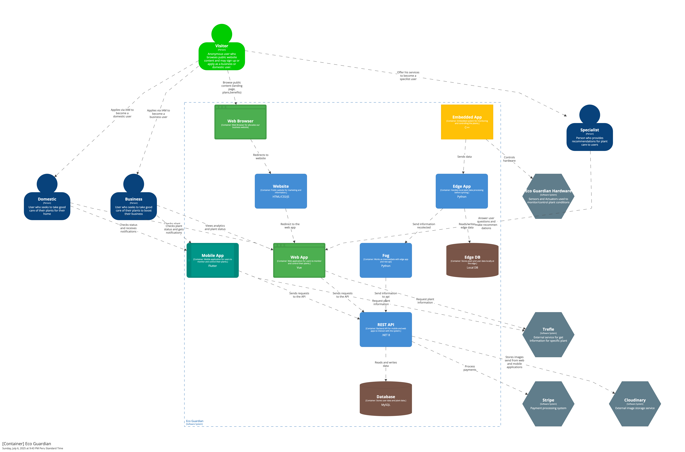

# <center>COURSE PROJECT</center>

<p align="center">
    <strong>Universidad Peruana de Ciencias Aplicadas</strong><br>
    <br>
    <strong>Ingeniería de Software</strong><br>
    <strong>Desarrollo de Soluciones IOT - 2971</strong><br>
    <strong>Profesor: Angel Augusto Velasquez Nuñez </strong><br>
    <br>INFORME
</p>


<center>

#### Startup: **WeMade**

#### Product: **EcoGuardian**

</center>
# Team Members:

<div align="center">

|             Member             |    Code    |
|:------------------------------:|:----------:|
| Nicolas Sebastian Esteban Garcia      |    u202217485     |
|   Sebastian Ramirez Hoffmann          |    U202211894     |
| Gustavo Huilca Chipana                | u202213983 |
|  Manuel Sebastian Peña Rivera         | u202210138 |
|    Mathias Alejandro Jave Diaz        | u202212721 |
|    Mathias Tsuneo Kunimoto Watanabe   |    u202210148     |
|    Italo D'alessandro Luna Capuñay    |    u202213375     |

</div>

# Registro de Versiones del Informe

<div align="center">


| Version |   Fecha    | Autor  | Descripcion de Modificacion |
|---------|------------|--------|-----------------------------|
| 0.0     | 24/03/2024 | Nombre |      Crea documento         |

</div>

# Project Report Collaboration Insights

Repositorios:

Proyecto: [https://github.com/wemade-IoT/Documents_Repository.com](https://github.com/wemade-IoT/Documents_Repository.com)


### TB1

Para la entrega del TB1 se han hecho ...

Se muestran evidencias de los commits realizados en la entrega de la TB1 en el informe

  

[Colaboraciones del repositorio]

  
[Registro de los commits donde se realizaron la mayor cantidad]

En ambos casos se puede observar el incremento de modificaciones y revisiones en la primera semana de abril.

---

# Contenido

[Registro de Versiones del Informe](#registro-de-versiones-del-informe)

[Project Report Collaboration Insights](#project-report-collaboration-insights)

[Student Outcome](#student-outcome)

[Capítulo I: Introducción](#capítulo-i-introducción)

[1.1 Startup Profile](#11-startup-profile)  
[1.1.1. Descripción de la Startup](#111-descripción-de-la-startup)  
[1.1.2. Perfiles de integrantes del equipo](#112-perfiles-de-integrantes-del-equipo)

[1.2. Solution Profile](#12-solution-profile)  
[1.2.1 Antecedentes y problemática](#121-antecedentes-y-problemática)  
[1.2.2 Lean UX Process.](#122-lean-ux-process)  
[1.2.2.1. Lean UX Problem Statements.](#1221-lean-ux-problem-statements)  
[1.2.2.2. Lean UX Assumptions.](#1222-lean-ux-assumptions)  
[1.2.2.3. Lean UX Hypothesis Statements.](#1223-lean-ux-hypothesis-statements)  
[1.2.2.4. Lean UX Canvas.](#1224-lean-ux-canvas)

[1.3. Segmentos objetivo.](#13-segmentos-objetivo)

[Capítulo II: Requirements Elicitation & Analysis](#capítulo-ii-requirements-elicitation--analysis)

[2.1. Competidores](#21-competidores)  
[2.1.1. Análisis competitivo](#211-análisis-competitivo)  
[2.1.2. Estrategias y tácticas frente a competidores](#212-estrategias-y-tácticas-frente-a-competidores)

[2.2. Entrevistas](#22-entrevistas)  
[2.2.1. Diseño de entrevistas](#221-diseño-de-entrevistas)    
[2.2.3. Análisis de entrevistas](#223-análisis-de-entrevistas)

[2.3. Needfinding](#23-needfinding)  
[2.3.1. User Personas](#231-user-personas)  
[2.3.2. User Task Matrix](#232-user-task-matrix)  
[2.3.3. User Journey Mapping](#233-user-journey-mapping)  
[2.3.4. Empathy Mapping](#234-empathy-mapping)  
[2.3.5. As-is Scenario Mapping](#235-as-is-scenario-mapping)

[2.4. Ubiquitous Language](#24-ubiquitous-language)

[Capítulo III: Requirements Specifications](#capítulo-iii-requirements-specification)

[3.1. To-Be Scenario Mapping](#31-to-be-scenario-mapping)

[3.2. User Stories](#32-user-stories)

[3.3. Impact Mapping](#33-impact-mapping)

[3.4. Product Backlog](#34-product-backlog)

[Capítulo IV: Solution Software Design](#capítulo-iv-solution-software-design)

[4.1. Strategic-Level Domain-Driven Design](#41-strategic-level-domain-driven-design)  
[4.1.1. Event Storming](#411-event-storming)  
[4.1.1.1 Candidate Context Discovery](#4111-candidate-context-discovery)
[4.1.1.2 Domain Message Flows Modeling](#4112-domain-message-flows-modeling)
[4.1.1.3 Bounded Context Canvases](#4113-bounded-context-canvases)
[4.1.2. Context Mapping](#412-context-mapping)
[4.1.3. Software Architecture](#413-software-architecture)
[4.1.3.1. Software Architecture System Landscape Diagram](#4131-software-architecture-system-landscape-diagram)
[4.1.3.2. Software Architecture Context Level Diagrams](#4132-software-architecture-container-level-diagrams)
[4.1.3.3. Software Architecture Deployment Diagrams](#4133-software-architecture-deployment-diagrams)
[4.2. Tactical-Level Domain-Driven Desig](#42-tactical-level-domain-driven-design)

[4.2.X. Bounded Context: <Bounded Context Name](#)
[4.2.X.1. Domain Layer](#)
[4.2.X.2. Interface Layer](#)
[4.2.X.3. Application Layer](#)
[4.2.X.4. Infrastructure Layer](#)
[4.2.X.5. Bounded Context Software Architecture Component Level Diagrams](#)
[4.2.X.6. Bounded Context Software Architecture Code Level Diagrams](#)
[4.2.X.6.1. Bounded Context Domain Layer Class Diagrams](#)
[4.2.X.6.2. Bounded Context Database Design Diagram](#)

[Conclusiones](#conclusiones)

[Conclusiones y recomendaciones](#conclusiones-y-recomendaciones)

[Video About-the-Team](#video-about-the-team)

[Bibliografía](#bibliografía)

[Anexos](#anexos)

# Student Outcome
El curso contribuye al cumplimiento del Student Outcome ABET:
ABET – EAC - Student Outcome 5
Criterio: La capacidad de funcionar efectivamente en un equipo cuyos miembros
juntos proporcionan liderazgo, crean un entorno de colaboración e inclusivo,
establecen objetivos, planifican tareas y cumplen objetivos.
En el siguiente cuadro se describe las acciones realizadas y enunciados de
conclusiones por parte del grupo, que permiten sustentar el haber alcanzado el logro
del ABET – EAC - Student Outcome 5.

| Criterio Especifico                                                                            | Acciones Realizadas | Conclusiones |
|------------------------------------------------------------------------------------------------|---------------------|--------------|
| Trabaja en equipo para proporcionar liderazgo en forma conjunta                                | ...                 | ...          |
| Crea un entorno colaborativo e inclusivo, establece metas, planifica tareas y cumpleobjetivos. | ...                 | ...          | 


# Capítulo I: Introducción

## 1.1. Startup Profile

### 1.1.1. Descripción de la Startup

EcoGuardian es una solución IoT que ayuda a cuidar plantas mediante sensores de humedad, temperatura, luz, entre otros. La solución multiplataforma envía alertas inmediatas y recopila información para generar recomendaciones personalizadas realizadas por un personal experimentado en el área. Ideal para hogares, oficinas, pequeños agricultores y empresas del sector agrícola cada uno con distintos planes de pago. Algunas de las funciones principales se enfocan en el monitorización,  estadísticas, recomendaciones y seguimiento de crecimiento.

#### 1.1.2. Perfiles de integrantes del equipo

|                                                                                                                                                  | Miembros del equipo         | Código Estudiante | Carrera                | Conocimientos / Habilidades                                                                                                                                                                                                                                                                                                                                                                                                                                                                       |
|--------------------------------------------------------------------------------------------------------------------------------------------------|-----------------------------|-------------------|------------------------|---------------------------------------------------------------------------------------------------------------------------------------------------------------------------------------------------------------------------------------------------------------------------------------------------------------------------------------------------------------------------------------------------------------------------------------------------------------------------------------------------|
|             | Gustavo Huilca Chipana      | u202213983        | Ingeniería de Software | Cuento con conocimientos en UI/UX design, trabajo colaborativo de desarrollos ágiles a través de SCRUM, desarrollo de aplicaciones web y móvil haciendo uso de los frameworks Vue, Angular, Astro, ASP.NET Core y Spring Boot; así como habilidades blandas que me permiten a mí y a mis compañeros trabajar de forma organizada y eficiente, priorizando la comunicación y la participación permanente.                                                                                          |
|                      | Mathias Alejandro Jave Diaz | u202212721        | Ingeniería de Software | Cuento con experiencia en el desarrollo web y móvil, trabajando con frameworks como ASP.NET Core, NestJS y Spring Boot en el backend, así como React, Vue y Angular en el frontend, y Flutter para aplicaciones móviles. Además, tengo conocimientos en Arquitectura de Software y en la implementación de marcos de trabajo ágiles, especialmente Scrum. Me destaco por mi capacidad de autoorganización y aprendizaje autónomo.                                                                 |
|                         | Mathias Kunimoto            | u202210148        | Ingeniería de Software | Tengo experiencia en el desarrollo frontend, trabajando con tecnologías como Tailwind CSS, React y JavaScript. Me considero una persona sociable, organizada y con gran capacidad de adaptación, lo que me permite integrarme fácilmente en equipos de trabajo y aportar al cumplimiento de los objetivos. Siempre busco sacar mi mayor potencial, aprendiendo constantemente y contribuyendo con una actitud proactiva y comprometida.                                                           |
|                             | Italo Luna                  | u202213375        | Ingeniería de Software | Soy estudiante de Ingeniería de Software con perfil Full Stack, y experiencia en desarrollo frontend y backend. Manejo tecnologías como Vue.js, Angular, Flutter, Tailwind CSS, y del lado del backend Node.js, Spring Boot, Ruby on Rails, Python y C++, además de bases de datos SQL y NoSQL. Tengo un buen manejo de Git para control de versiones y colaboración en equipo.                                                                                                                   |
|                            | Manuel Peña                 | u202210138        | Ingeniería de Software | Cuento con experiencia en programación en C++, así como en desarrollo frontend con Vue, Angular y backend con tecnologías como JavaScript, Java, Spring Boot, C# y .NET. Me considero una persona responsable, flexible e innovadora, siempre abierta a escuchar activamente y mejorar en cada proyecto. Me esfuerzo por aprender constantemente y aportar soluciones efectivas, trabajando de manera colaborativa y con una actitud proactiva para lograr los objetivos del equipo.              |
|                    | Nicolas Esteban             | u202217485        | Ingeniería de Software | Tengo experiencia en frameworks como Astro, Vue y React, y actualmente estoy aprendiendo Next.js y Express. Me apasiona el desarrollo frontend, siempre enfocado en ofrecer una experiencia de usuario fluida y cómoda. Me considero una persona sociable, responsable y proactiva, además, disfruto participar en proyectos multidisciplinarios y apoyar a comunidades que promueven el desarrollo web. Siempre busco dar lo mejor de mí para asegurar un rendimiento óptimo en cada aplicación. |
|  | Sebastian Ramirez Hoffmann  | U202211894        | Ingeniería de Software | Me dedico a realizar soluciones de software utilizando distintas tecnologías y frameworks de desarrollo como .NetCore, SpringBoot, Angular y Vue. Asimismo cuento con experiencia implementando tecnologías mas actuales como Large Learning Models asi como modelos de cyber seguridad. Personalmente me considero una persona proactiva con vision y dispuesto a trabajar eficientemente en proyectos colaborativos.                                                                            |

## 1.2. Solution Profile

### 1.2.1 Antecedentes y problemática

Para la elaboración de la descripción de la problemática y antecedentes de la solución, se ha utilizado el método de las 5 'W's y 2 'H's.

|                                             |                                                                                                                                                                                                         |
|---------------------------------------------|---------------------------------------------------------------------------------------------------------------------------------------------------------------------------------------------------------|
| ¿What? - ¿Cuál es el problema?              | Pérdida de plantas/cultivos debido a un monitoreo ineficiente de condiciones ambientales (humedad, luz, temperatura).                                                                                   |
| ¿Who? - ¿Quienes son los beneficiarios?     | Personas sin conocimientos técnicos o profesionales con necesidad de precisión, además de personas con conocimientos en el área que deseen asesorar y apoyar a otras personas en el cuidado de plantas. |
| ¿Cuando? - ¿Cuando se origina el problema?  | El problema ocurre en momentos críticos como cambios climáticos, durante ausencias del usuario o en etapas clave de crecimiento (floración, germinación).                                               |
| ¿Why? - ¿Por qué se origina el problema?    | Se origina por la falta de herramientas accesibles para controlar el crecimiento de las plantas o por recomendaciones erróneas o genéricas.                                                             |
| ¿Where? - ¿Dónde ocurre el problema?        | Espacios con plantas/cultivos: hogares, jardines, oficinas, invernaderos, campos abiertos.                                                                                                              |
| ¿How? - ¿Como se origina el problema?       | Las plantas muestran signos de deterioro (hojas amarillas, baja producción) de forma gradual, pero el usuario lo nota demasiado tarde.                                                                  |
| ¿How much? - ¿Cuánto dinero está implicado? | Costo emocional y monetario: entre 20-200 soles por mes para casos domésticos y entre 500-5000 soles por mes en casos de empresas agrícolas (FAO, 2023).                                                |

### 1.2.2 Lean UX Process.

#### 1.2.2.1. Lean UX Problem Statement.


En el estado actual de la industria Agricola y en la comunidad de horticultura se observan desafíos significativos en la continua monitorización del estado de las plantas especialmente cuando se tienen en cuenta otras tareas administrativas o no se cuenta con el tiempo necesario. La falta de un seguimiento continuo puede resultar en perdidas significativas o irreparables para las plantas bajo cuidado. Además, existe una falta de conocimiento a fondo del correcto cuidado de plantas y las formas de aprenderlos son poco accesibles para una persona corriente.

Otros productos han fallado en proveer recomendaciones hechas por expertos en agricultura y el debido cuidado de las plantas.

Nuestro producto se enfocará en proporcionar un seguimiento a los cultivos y plantas domésticas junto con recomendaciones de expertos, esto ofrece una mejor calidad de vida para la planta.

Nuestro enfoque principal se basa en el monitoreo de plantas y la recopilación de datos relevantes para asegurar su crecimiento saludable en el área doméstica.

Como resultado, nos enfrentamos al siguiente problema: ¿Cómo podemos proveer una plataforma de monitoreo de plantas aumentando su crecimiento y/o cosecha en un 40% en un lapso de 6 meses?

Nuestro producto se encargará de esta tarea al ofrecer un servicio de monitoreo que pueda recopilar, visualizar y optimizar el cuidado de las plantas en entornos empresariales y domésticos para ambos interesados en la afición del cuidado de plantas como las empresas agrícolas esto se lograra por medio del seguimiento de sensores y recomendaciones de expertos.

Sabremos que tuvimos éxito cuando podamos observar un 45% de satisfacción en las futuras encuestas de control donde las plantas hayan logrado un crecimiento y/o cosecha en un 40% en un lapso aproximado de 6 meses.


#### 1.2.2.2. Lean UX Assumptions

**Business Outcome**  
En esta sección vamos a usar las métricas de Montaña de Jeff Gothelf e implementaremos algunas de las Pirate Metrics para poder definir los niveles de la montaña, analizar los comportamientos de nuestros usuarios y evaluar qué parte del User Journey es relevante para nosotros, realizando un assumption de cómo actuarán nuestros usuarios en base al producto.

**Acquisition (Base): [1200 visitantes]**  
El usuario se percatará de nuestra solución por medio de redes sociales y otros medios de comunicación, además de promocionar nuestra landing page. De la misma manera, intentaremos ofrecer el servicio a usuarios más formales mediante métodos de comunicación directa, como por ejemplo presentarlo a empresas agrícolas.

**Activation (Plateau): [450 usuarios : 100% usuarios]**  
En esta sección el usuario crea su cuenta registrando su correo, ya sea personal o de la empresa, sus métodos de pago, las dimensiones del negocio, es decir, el tipo de uso que le dará a la solución, y finalmente un código de autenticación para los empleados que deban generar una cuenta.  
De los usuarios que se percatan del producto, esperamos que el 45% se anime a utilizarlo en un periodo de 6 meses.

**Retention (Plateau + 1 level): [60% usuarios]**  
De los usuarios que se animen a utilizarlo, esperamos que el 60% continúe utilizando nuestro producto diariamente para el monitoreo de plantas y/o cultivos. En esta sección el usuario observa la data recolectada por nuestra solución para optimizar el cuidado de las plantas, ya cuenta con registros previos y puede visualizar un cambio notorio en las variables de entorno.

**Revenue (Plateau + 2 levels): [10% usuarios]**  
Los usuarios que utilizan nuestro producto son estrictamente de paga, a base de planes. No obstante, si la cantidad de plantas individuales excede el límite proporcionado en su plan inicial, se les ofrecerá la opción de mejorar a un plan superior. De esta manera, se espera que un 10% de los usuarios retenidos que lleguen a este límite estén dispuestos a mejorar su plan, generando un mayor ingreso.

**Referral (Top): [5% usuarios]**  
Finalmente, de los usuarios que retuvimos, esperamos que un 5% nos referencien en sus comunidades o a nuevos emprendedores, proporcionándonos indirectamente un mayor flujo de usuarios potenciales.

---

**Users**  
En esta sección creamos un Proto-Persona como una suposición de cómo son nuestros usuarios, enfocándonos más en el aspecto de actitud.

| Demográfica                                          | Comportamiento                                                                                                                                                                                                                          | Necesidades / Obstáculos                                                                                                                                                                                                                                            |
|------------------------------------------------------|-----------------------------------------------------------------------------------------------------------------------------------------------------------------------------------------------------------------------------------------|---------------------------------------------------------------------------------------------------------------------------------------------------------------------------------------------------------------------------------------------------------------------|
| Alberto:<br>22 años<br>Entusiasta de botánica        | - Tiene trabajo regular que lo mantiene lejos de casa<br> - Gana lo suficiente<br> - Aficionado o interesado en la botánica<br> - Tiene un jardín o plantas que cuida                                                                   | - Quiere cuidar de sus plantas<br> - No cuenta con el tiempo para mantenerlas<br> - Busca saber si las está cuidando correctamente<br> - Quiere saber lo necesario para asegurar su crecimiento saludable                                                           |
| Valentina:<br>32 años<br>Ingeniera Agrícola          | - Gana lo esperado<br> - Trabaja en una empresa agrícola<br> - Busca optimizar la producción de su empresa                                                                                                                              | - Necesita saber el estado actual de una gran cantidad de plantaciones<br> - Requiere detectar cualquier problema en las plantaciones<br> - Requiere métricas cuantificables de la producción<br> - La gran cantidad de cultivos produce resultados poco homogéneos |
| Godofredo:<br>27 años<br>Especialista en Agricultura | - Gana lo esperado<br> - Tiene conocimientos de botánica y el cuidado de plantas<br> - Busca compartir sus conocimientos a personas que buscan aprender mas del tema -Cuenta con una pequeña comunidad aficionada al cuidado de plantas | - Necesita una manera de poder contactar a las personas que este interesadas<br> - Requiere métricas cuantificables y visuales si es posible de el estado de la planta                                                                                              |

Esta tabla refleja los dos principales usuarios que tenemos como suposición, junto con sus necesidades y comportamientos en el área laboral.

---

**User Outcomes & Benefits**

En esta sección se busca el lado más emocional y empatizar con el usuario para darles los outcomes correctos.

**¿Qué busca lograr el usuario?**  
Mantener sanas sus plantas con facilidad y sin depender de conocimientos avanzados en jardinería.

**¿Cómo se quiere sentir el usuario en este proceso?**  
Seguro y sin estrés, sabiendo que sus plantas están bien cuidadas con información clara y accesible.

**¿Cómo nuestro producto acerca al usuario a un logro personal?**  
La plataforma le permite ver visualmente el progreso de sus plantas, generando satisfacción y motivación para continuar con el cuidado.

**¿Por qué nuestro usuario buscaría nuestro producto?**  
Para evitar que sus plantas mueran por descuido o falta de información y sentirse más confiado en su habilidad para cuidarlas.

**¿Qué cambio de comportamiento podemos observar que nos cuente que lograron su objetivo?**  
El usuario revisa la app regularmente, ajusta su rutina de riego/cuidados según las recomendaciones y expresa satisfacción en encuestas.

---

**Continuamos con los assumptions para el segundo segmento:**

**¿Qué busca lograr el usuario?**  
Optimizar la producción de cultivos con información precisa y accesible para maximizar la cosecha.

**¿Cómo se quiere sentir el usuario en este proceso?**  
Confiado y en control, sabiendo que la plataforma le brinda información confiable sin necesidad de monitorización manual constante.

**¿Cómo nuestro producto acerca al usuario a un logro personal?**  
Al aumentar la eficiencia del cultivo, logra mejorar la producción y rentabilidad, generando un impacto positivo en su negocio.

**¿Por qué nuestro usuario buscaría nuestro producto?**  
Para reducir riesgos en la cosecha, evitar pérdidas económicas y mejorar su toma de decisiones basada en datos.

**¿Qué cambio de comportamiento podemos observar que nos cuente que lograron su objetivo?**  
El usuario consulta datos regularmente, ajusta riegos y fertilización según la plataforma y ve mejoras en producción.

**Continuamos con los assumptions para el tercer segmento:**

**¿Qué busca lograr el usuario?**  
Compartir sus conocimientos de botánica y el cuidado de las plantas con la comunidad.

**¿Cómo se quiere sentir el usuario en este proceso?**  
Sin estrés y preparado, sabe que la plataforma ofrece facilidades para encontrar consultas y responderlas sin necesidad de que se tenga que profundizar mucho.

**¿Cómo nuestro producto acerca al usuario a un logro personal?**  
Al aumentar la cantidad de personas que utilicen la plataforma se aumentará el número de personas a las que puede ayudar.
**¿Por qué nuestro usuario buscaría nuestro producto?**  
Nuestro producto ofrece una comisión para los especialistas que participen con nosotros bajo un contrato estipulado.

**¿Qué cambio de comportamiento podemos observar que nos cuente que lograron su objetivo?**  
El usuario utiliza la plataforma regularmente respondiendo consultas e incluso ayudando con la instalación y configuración de sensores.

Este análisis de *User Outcomes* sirve para los tres segmentos en ciertos casos, ya que tienen un objetivo similar y se puede comprender el contexto desde las distintas perspectivas.

---

**Solutions**

Si bien Jeff Gothelf menciona en su libro *Lean UX 3rd Edition* que debemos utilizar elementos físicos como post-its, para esta entrega realizamos una llamada para definir nuestras soluciones supuestas.

Tomando en cuenta las restricciones anteriormente seleccionadas, planteamos las siguientes soluciones:

Desarrollar una solución con tecnologías IoT (*Internet of Things*) orientada a realizar el monitoreo de plantas, con funciones principales como:

- **Monitoreo de acidez del suelo:**  
  *Problema:* Los usuarios no pueden evaluar fácilmente el pH del suelo, lo que afecta la salud de las plantas.  
  *Solución:* Sensores de acidez que recopilan datos en tiempo real y envían alertas si el nivel es subóptimo.  
  *Resultado:* El usuario puede ajustar el pH del suelo de manera informada, evitando daños en sus cultivos.

- **Sensores de humedad del suelo:**  
  *Problema:* Los usuarios no saben cuándo regar sus plantas correctamente, lo que genera exceso o falta de agua.  
  *Solución:* Sensores de humedad que notifican al usuario cuándo es el momento óptimo para regar.  
  *Resultado:* Reducción del desperdicio de agua y mejora en la salud de las plantas con menor esfuerzo.

- **Dashboard interactivo con visualización de datos:**  
  *Problema:* Los usuarios necesitan interpretar datos sobre el estado de sus plantas de forma rápida y sencilla.  
  *Solución:* Plataforma con gráficos y análisis en tiempo real sobre los niveles de humedad, pH y otros factores ambientales.  
  *Resultado:* El usuario puede tomar decisiones informadas sin necesidad de conocimientos técnicos avanzados.

- **Recomendaciones inteligentes basadas en los datos recolectados:**  
  *Problema:* Los usuarios no saben qué acciones tomar para mejorar el crecimiento de sus plantas.  
  *Solución:* Sistema que sugiere medidas correctivas basadas en datos históricos y condiciones actuales.  
  *Resultado:* Aumento en la tasa de éxito en el crecimiento de cultivos y reducción de errores en el cuidado de plantas.


#### 1.2.2.3. Lean UX Hypothesis Statements.

**Hipótesis**

Siguiendo el formato de las Hipótesis usaremos la tabla ya proporcionada.
Tomar en cuenta que cada hipótesis empieza con "Creemos que.." Estas hipótesis se basan en los 450 usuarios que proyectamos tener.

| Business Outcome                                                       | Persona                                                                            | User Outcome                                                                | Feature/Solution                                                               |
|------------------------------------------------------------------------|------------------------------------------------------------------------------------|-----------------------------------------------------------------------------|--------------------------------------------------------------------------------|
| Aumentar el tráfico a la landing page en un 1200 visitantes mensuales. | Dueños de plantas y empresas agrícolas.                                            | Descubrir la plataforma y entender su valor.                                | Campañas en redes sociales y contenido educativo sobre monitoreo de cultivos.  |
| Convertir al menos un 45% de visitantes en usuarios registrados.       | Usuarios interesados en optimizar el crecimiento de sus cultivos.                  | Registrarse en la plataforma y configurar su cuenta.                        | Proceso de onboarding simplificado con guía paso a paso y beneficios claros.   |
| Mantener al 60% de los usuarios activos diariamente en la plataforma.  | Usuarios que buscan mejorar la eficiencia del cuidado de sus cultivos.             | Consultar métricas y alertas en la plataforma para optimizar su producción. | Dashboard interactivo con reportes detallados sobre el estado de las plantas.  |
| Generar ingresos con un 10% de conversión a planes pagos.              | Usuarios que necesitan monitorear más plantas de las incluidas en el plan inicial. | Contratar un plan premium para acceder a funciones avanzadas.               | Modelo de precios escalable con límites flexibles y herramientas avanzadas.    |
| Lograr que al menos un 5% de los usuarios refieran la plataforma.      | Usuarios satisfechos con la solución.                                              | Compartir la plataforma con su red de contactos.                            | Programa de referidos con incentivos como descuentos o beneficios adicionales. |


**Que es lo más importante que debemos aprender**

Debemos de analizar que es lo que debemos aprender de nuestras Hipótesis, entonces llegamos a nuestra siguiente conclusion respecto a lo más importante que debemos aprender:

- Si los usuarios (domésticos y empresariales) realmente tienen problemas monitorizando el estado de sus plantas.
- Si están dispuestos a usar sensores o plataformas tecnológicas para solucionarlo.
- Si confiarían en las recomendaciones generadas por un sistema automatizado.
- Si pagarían por una versión avanzada del sistema cuando se supere cierto límite de plantas.
- Qué tan seguido están dispuestos a interactuar con una app de monitoreo.

De estos posibles riesgos escogemos el más crítico que sería averiguar si los usuarios están dispuestos a usar sensores o plataformas tecnológicas para solucionar sus problemas.

**Minimum viable product**

Los MVP nos sirven para aprender cosas a corto plazo. para realizar esto se hace la pregunta: 
What’s the most important thing we need to learn first?

Nuestro MVP debe estar orientado a demostrar lo que ofrece nuestra solución como concepto para validar que el usuario este interesado en nuestros features principales.
En este caso sería desarrollar un prototipo parcialmente funcional donde lo que debe observarse será la simulación de datos.

#### 1.2.2.4. Lean UX Canvas.

Finalmente, juntamos todo lo que hemos hecho en este proceso y lo agregamos en un Lean UX Canvas (V2) guiándonos del ejemplo que nos proporciona Jeff Gothelf [Anexo 1.1]

<image src ="../assets/lean-ux-canvas/lean-ux-canva.jpeg" alt ="LeanUX Canvas (V2) [implementando lean UX 3]">


## 1.3. Segmentos objetivo.

|             | Segmento 1                                                                            | Segmento 2                                                                                                                                                                                                                                                               | Segmento 3                                                                                                                                                     |
|-------------|---------------------------------------------------------------------------------------|--------------------------------------------------------------------------------------------------------------------------------------------------------------------------------------------------------------------------------------------------------------------------|----------------------------------------------------------------------------------------------------------------------------------------------------------------|
| Variables   | Doméstico                                                                             | Negocios                                                                                                                                                                                                                                                                 | Especialistas                                                                                                                                                  |
| Geográfica  | Depende de la ubicación del hogar del usuario                                         | Ubicación cercana al servicio y/o ubicados en áreas donde las industrias agrícolas, la agricultura urbana o sectores relacionados con las plantas están activos.                                                                                                         | Generalmente ubicados en centros de asesoría agrícola o jardines botánicos.                                                                                    |
| Demográfica | Diversidad en edad y género                                                           | Edad adulta, posiblemente con formación universitaria en áreas relacionadas con las industrias agrícolas y afines.                                                                                                                                                       | Edad adulta, profesionales con formación en agronomía o áreas relacionadas con el medio ambiente, generalmente con experiencia práctica en el sector agrícola. |
| Psicológica | Actitud hacia la adopción de herramientas tecnológicas para el cuidado de sus plantas | Una fuerte inclinación hacia la innovación y la eficiencia en el sector Agricola. Las empresas de este segmento son propensas a adoptar nuevas tecnologías, especialmente soluciones IoT que mejoren la eficiencia operativa, reduzcan costos y aseguren sostenibilidad. | Apasionados por la sostenibilidad, el uso de nuevas tecnologías y la innovación en el cuidado de plantas. Buscan soluciones prácticas basadas en datos.        |
---

# Capítulo II: Requirements Elicitation & Analysis

## 2.1. Competidores.

### 2.1.1. Análisis Competitivo

**Competitive Analysis Landscape**

| ¿Por qué llevar a cabo este análisis? |                                                                                                                           Nosotros                                                                                                                            |                                                                                                                                               Irritec                                                                                                                                                |                                                                                Xiaomi Mi Flora                                                                                 |                                                                                                                            Rachio                                                                                                                            |
|:-------------------------------------:|:-------------------------------------------------------------------------------------------------------------------------------------------------------------------------------------------------------------------------------------------------------------:|:----------------------------------------------------------------------------------------------------------------------------------------------------------------------------------------------------------------------------------------------------------------------------------------------------:|:------------------------------------------------------------------------------------------------------------------------------------------------------------------------------:|:------------------------------------------------------------------------------------------------------------------------------------------------------------------------------------------------------------------------------------------------------------:|
|             **Overview**              |              EcoGuardian es una solución IoT que ayuda a cuidar plantas mediante sensores de humedad, temperatura y luz. Envía alertas inmediatas y genera recomendaciones personalizadas. Se adapta tanto a hogares como a empresas agrícolas.               | Irritec ofrece un servicio de Automatizacion y control remoto en el regado industrial de cultivos, ofrecen un control de PH y conductividad eléctrica de manera remota. Adicionalmente tienen funcionalidades como recetas de "fertirrigacion" (Irrigacion con fertilizantes) que se pueden ajustar. | Xiaomi ofrece sensores para plantas que miden humedad del suelo, luz, fertilidad y temperatura. Se conectan vía Bluetooth a una app móvil para mostrar el estado de la planta. | Rachio es una empresa especializada en productos inteligentes para cultivos y jardinería, sus productos son controladores de riego y sensores de humedad, los cuales optimizan el uso del agua y mejoran el cuidado de las plantas a través de su app móvil. |
|        **Ventaja Competitiva**        |                        Plataforma multiplataforma (web y móvil), sistema de recomendaciones basadas en datos, enfoque en experiencia de usuario, escalabilidad por planes, y orientación tanto al hobby como a la agricultura técnica.                        |              Empresa internacional que cuenta con una aplicación móvil y pagina web y se han diversificado al sector minero y domestico, ofrecen el servicio de "fertirrigacion" y otros métodos de regado como goteo o inyección. Pueden monitorear el PH y conductividad electrónica.              |                 Producto de bajo costo, fácil de usar, respaldado por una marca reconocida globalmente. Buen diseño y app intuitiva para usuarios domésticos.                  |                             Empresa posicionada en el rubro, cuenta con diversos dispositivos enfocados en la tecnología de riego inteligente, integración solida con dispositivos smart home, y optimización del uso del agua.                              |
|         **Mercado Objetivo**          |                                               	Hogares, oficinas, pequeños agricultores y empresas del sector agrícola interesados en cuidar plantas, automatizar tareas y recibir sugerencias personalizadas.                                                |                                                                                   Ofrecen el sector de agricultura especificando: Campo abierto, invernadero y Huertos. Tambien el sector de Jardinería y Minería                                                                                    |                             Usuarios domésticos y aficionados al cuidado de plantas de interior que buscan un sensor simple para monitoreo básico.                             |                                                           Hogares, cultivos, parques, y jardines de usuarios interesados en la optimización del riego, control de humedad y estado de las plantas.                                                           |
|        **Perfil de Marketing**        |                                                      Contenido educativo en redes sociales, campañas de concienciación ambiental, y alianzas con viveros y comunidades de jardinería/agricultura urbana.                                                      |                                                                                                     Cuentan con una Landing Page y una pagina de Facebook donde hacen publicaciones regularmente                                                                                                     |                    	Promocionado a través de tiendas online (Amazon, AliExpress), y posicionamiento mediante influencers de tecnología y hogar inteligente.                    |                                                            Rachio utiliza marketing digital a través de redes sociales y participación en eventos de la industria para promocionar sus productos.                                                            |
|        **Perfil del Producto**        |                                                  	Sensores inteligentes que miden humedad, temperatura y luz, conectados a una plataforma que ofrece estadísticas, alertas y recomendaciones personalizadas.                                                  |                                                                                              Sensores de PH, diversos sistemas de irrigación incluyéndose cintas de irrigación, mangueras, goteros etc.                                                                                              |                         Sensor compacto que mide 4 variables y se conecta vía Bluetooth. No tiene alertas en tiempo real ni integración IoT avanzada.                          |                                                         Controladores de riego inteligentes, sensores de humedad, y sistemas para mejorar el cuidado de plantas en jardines, cultivos y exteriores.                                                          |
|              **Precios**              | Modelo de pago con planes accesibles por número de plantas/áreas monitoreadas, . Opciones económicas para el hogar y versiones premium para uso agrícola. En el uso agrícola se hace una cotización dependiendo de la cantidad de sensores cubriendo un area. |                                                    Si bien no se menciona mas allá de las cotizaciones se espera de que se haga un presupuesto en base a el servicio especifico que se implementa y el uso de dispositivos necesarios en el area                                                     |                                                                 Alta relación calidad-precio para el usuario.                                                                  |                                                                                 Precios competitivos, con productos accesibles para el hogar y más avanzados para empresas.                                                                                  |


| **Análisis SWOT** | EcoGuardian                                                                                                                                                                                                  | competidor1 | Xiaomi Mi Flora | Rachio |
|-------------------|--------------------------------------------------------------------------------------------------------------------------------------------------------------------------------------------------------------|-------------|-----------------|--------|
| **Fortalezas**    | - Aplicación multiplataforma (web + móvil).<br/> - Recomendaciones personalizadas basadas en datos.<br/>- Escalabilidad por planes (hobby/empresarial).<br/>- Enfoque en experiencia de usuario y educación. |             |                 |        |
| **Debilidades**   | - Marca menos reconocida vs. Xiaomi/Rachio.<br/> - Requiere mayor inversión inicial en sensores y suscripciones.<br/>- Dependencia de infraestructura IoT y una conectividad estable.<br/>                   |             |                 |        |
| **Oportunidades** | - Alianzas con viveros y agricultura urbana.<br/> - Expansión a mercados emergentes con agricultura tecnológica.<br/>  - Integración con smart home (ej: Alexa, Google Home).                                |             |                 |        |
| **Amenazas**      | ...                                                                                                                                                                                                          |             |                 |        |


### 2.1.2. Estrategias y Tácticas Frente a Competidores

Para competir con Xiaomi y Rachio, teniendo en cuenta sus fortalezas y debilidades, EcoGuardian puede realizar las siguientes estrategias y tácticas:

-**Hacer uso de recomendaciones de cuidado personalizadas**:  
  A diferencia de Xiaomi, que solo ofrece datos de monitoreo básico, EcoGuardian puede diferenciarse recomendando acciones 
específicas para el cuidado de las plantas, basadas en datos históricos y condiciones actuales, así como el tipo de planta.

-**Integración con dispositivos de smart home y APIs empresariales**:
    EcoGuardian puede ofrecer integración con dispositivos de smart home como Alexa y Google Home, permitiendo a los usuarios controlar sus plantas mediante comandos de voz. 
Además, se pueden implementar el soporte con APIs para empresas agrícolas que faciliten la integración con sistemas existentes.

-**Enfoque multiplataforma**:
    EcoGuardian ofrece una experiencia integrada en web, móvil y dispositivos IoT, permitiendo a los usuarios acceder a la información desde cualquier lugar y en cualquier momento, así como configurar automatizaciones en el sistema.

## 2.2. Entrevistas.

### 2.2.1. Diseño de entrevistas.

**Preguntas generales:**

1. ¿Cuál es su nombre?  
2. ¿Qué edad tiene? 
3. ¿A qué se dedica? 
4. ¿Qué navegador usa?
5. ¿Qué dispositivo usa con más frecuencia y de qué marca es?
6. ¿En qué distrito se encuentra?


**Entrevistas usuario segmento (Doméstico)**

1. ¿Qué dificultades encuentras al cuidar tus plantas? 
2. ¿Cuánto tiempo dedicas semanalmente al cuidado de tus plantas?
3. ¿Actualmente utilizas algún dispositivo o herramienta para cuidar tus plantas?
4. ¿Cómo gestionas las necesidades de riego, luz y temperatura de tus plantas?
5. ¿Alguna vez has perdido una planta debido a que no pudiste monitorearla correctamente?
6. ¿Qué tan interesado/a estarías en una solución tecnológica que te ayude a cuidar tus plantas?
7. ¿Te gustaría recibir alertas personalizadas sobre el cuidado de tus plantas? ¿Qué tipo de alertas?
8. ¿Qué características serían más útiles para ti en una plataforma que te ayude a monitorear tus plantas?

**Entrevistas usuario segmento (Negocios)**

1. ¿Qué herramientas utilizan actualmente para monitorear y gestionar tus cultivos?
2. ¿Cuáles son los principales desafíos que enfrentan en la gestión de tus cultivos?
3. ¿Qué importancia le dan a la adopción de nuevas tecnologías para mejorar la eficiencia en tu negocio agrícola?
4. ¿Les interesaría usar una plataforma que te ayude a monitorear y gestionar todos los aspectos de tus cultivos?
5. ¿Qué funcionalidades específicas te gustaría que tuviera una plataforma de monitoreo agrícola?
6. ¿Qué tipo de datos consideras más importantes para optimizar las operaciones de tus cultivos?
7. ¿Estarías dispuesto/a a invertir en una solución tecnológica para mejorar la eficiencia de tus cultivos?
8. ¿Qué mejoras específicas te gustaría lograr en tu negocio mediante la adopción de nuevas tecnologías en el cuidado de tus cultivos?

**Entrevistas usuario segmento Especialista**

1. Descríbe el proceso típico que sigues para diagnosticar un problema en una planta. ¿Qué información consideras imprescindible para hacer un análisis preciso?
2. Imagina que tienes acceso a un dashboard con datos históricos y en tiempo real de una planta (humedad, temperatura, luz). ¿Cómo usarías esta información para mejorar tus recomendaciones?
3. ¿Qué tipo de consultas de los clientes (domésticos o negocios) te toman más tiempo resolver y por qué? ¿Cómo podríamos simplificar ese proceso?
4. ¿Has trabajado antes con plataformas digitales para asesorar clientes? ¿Qué funcionalidades te gustaría que tuviera EcoGuardian para hacer tu trabajo más eficiente?
5. ¿Cómo estableces tu tarifa por consulta? ¿Prefieres un pago por hora, por consulta, o un modelo de suscripción donde atiendas X consultas al mes?
6. ¿Qué tipo de soporte o capacitación necesitarías para usar una plataforma como EcoGuardian?
7. ¿Qué te motivaría a recomendar EcoGuardian a otros colegas? ¿Un sistema de puntuación, beneficios económicos, o acceso a un gran número de clientes?


### 2.2.2. Registro de entrevistas.

Las entrevistas están en un video en el siguiente URL: [Entrevistas WeMade - EcoGuardian](https://upcedupe-my.sharepoint.com/:v:/g/personal/u202213983_upc_edu_pe/EU8ISuaX7QdBorhJEKF5wTYBlW-qrO4PV-jqP74TchsNxg?nav=eyJyZWZlcnJhbEluZm8iOnsicmVmZXJyYWxBcHAiOiJTdHJlYW1XZWJBcHAiLCJyZWZlcnJhbFZpZXciOiJTaGFyZURpYWxvZy1MaW5rIiwicmVmZXJyYWxBcHBQbGF0Zm9ybSI6IldlYiIsInJlZmVycmFsTW9kZSI6InZpZXcifX0%3D&e=psiWW8) [Anexo 2.2.1.1]


**Segmento Doméstico**  
Nombre:Andrea Milagros Cabanillas Gora
<br>
Edad: 20
<br>
Ocupación: Ingeniera de Software
<br>
Browser: Google Chrome
<br>
Device: Teléfono Samsung y Laptop Asus
<br>
Distrito: Santiago de Surco, Lima 
<br>
Timing: 0:00
<br>


Andrea es una ingeniera de software de profesión con 20 años de edad con pasión por el cuidado de sus plantas como hobby.
En su experiencia personal nos menciona que al enfocarse en sus actividades diarias en ocasiones descuida el cuidado de sus plantas. Aunque les dedica entre 2 y 3 horas a la semana, considera que este tiempo no siempre es suficiente, lo que en ocasiones provoca cierto descuido en su mantenimiento. También nos menciona que actualmente consulta a especialistas en el tema para saber como gestionar el mantenimiento de sus plantas. Asimismo, nos menciona que utiliza google calendario como herramienta para saber en qué ocasiones debe darles mantenimiento. Por otro lado, comentó el interés en una solución que le permita saber el estado de sus plantas mediante el uso de alertas personalizadas. Finalmente, menciona que le gustaría disponer de un calendario donde pueda gestionar las actividades que debe realizar en la semana para el correcto mantenimiento de sus plantas.

Nombre: Paquita Soto Camacho
<br>
Edad: 71
<br>
Ocupación: Jubilada
<br>
Browser: Google Chrome
<br>
Device: Teléfono Samsung
<br>
Distrito: Trujillo, La libertad
<br>
Timing: 4:31
<br>


La señora Paquita es jubilada y como hobby cuida de su helecho, cuenta con 71 años de edad y reside en la provincia de Trujillo.
En la entrevista se nos comenta como sus principales dificultades resultan ser el clima en el cuidado de sus plantas,
cuida de estas mismas de manera inter diaria y no cuenta con ningún dispositivo o herramienta para el cuidado de sus plantas, 
respecto a la frecuencia de riego de la planta comenta que lo hace dependiendo del clima y que actualmente lo hace de manera inter-diaria
menciona que cada planta cuenta con un cuidado distinto y que hay características visuales que sirven de indicador para saber que requiere su planta.
Menciona igualmente la importancia de saber las necesidades de la planta en especial el agua la tierra y el musgo de este.

Nombre: Sergio Aguirre Castillo
<br>
Edad: 19
<br>
Ocupación: Ingeniera de Software
<br>
Browser: Google Chrome y Safari
<br>
Device: Telefono IPhone
<br>
Distrito: Jesús María, Lima 
<br>
Timing: 8:49
<br>


Sergio es un estudiante de Ingeniería de Software con una pasión por el cuidado de sus plantas como hobby.
Nos comenta que a veces le resulta difícil coordinar los tiempos de riego y exposición a la luz. Semanalmente, le dedica entre 2 y 3 horas al monitoreo de sus plantas. Actualmente, utiliza dispositivos básicos como un termómetro y un medidor de humedad.
Reconoce que una solución tecnológica sería muy útil, ya que ha perdido algunas plantas por falta de seguimiento. Además, está interesado en una solución que sea fácil de usar y económicamente accesible.
Le gustaría recibir alertas relacionadas con el riego, niveles de luz, temperaturas óptimas, y recordatorios para fertilizar y podar.
Según Sergio, las características más útiles que debería tener esta solución son: monitoreo en tiempo real de la luz y humedad, alertas personalizadas, consejos para el cuidado de plantas, e integración con dispositivos tecnológicos diseñados para el cuidado de plantas.

---

**Segmento Negocios**  
Nombre: Julio Enrique Chipana Barrientos
<br>
Edad: 48 años
<br>
Ocupación: Docente, Ingeniero Agrónomo
<br>
Browser Preferido: Google Chrome
<br>
Dispositivos: Teléfono Samsung Galaxy A52 Y Laptop Lenovo
<br>
Distritos: Carmen Alto, Ayacucho
<br>
Timing: 12:13
<br>


El señor Julio Chipana Barrientos es un ingeniero agrónomo con 48 años de edad, actualmente trabaja como docente en la ciudad de Ayacucho. 
En su experiencia laboral nos menciona que las herramientas que utiliza para monitorear sus cultivos son principalmente aplicaciones móviles que les permiten
registrar datos de campo de sus cultivos como las condiciones en las que se desarrolla la etapa fenológica de la planta, así como sensores
que se usan en la producción de lechugas en la hidroponía, aunque considera que la aplicación resulta muy básica y a veces no le brinda la información correcta a tiempo, además de que la información 
de cada cultivo se debe colocar de manera manual. El principal desafío que enfrenta en su trabajo son las temperaturas extremas de la sierra que afectan el crecimiento de sus cultivos.
Sobre la importancia de la adopción de nuevas tecnologías en su trabajo, menciona que desde hace poco han implementado el uso de drones que les permiten manejar el control
de plagas. El uso de una plataforma que le ayude a monitorear y gestionar todos los aspectos de sus cultivos desde una aplicación web y móvil le parece una buena idea, ya que nos explica que les permitiría tener un manejo
más eficiente de los pocos recursos que tienen como el agua o la calidad del suelo.
Sobre las funcionalidades que le gustaría que tuviera una plataforma de monitoreo agrícola, menciona que es de suma importancia que la plataforma pueda avisarles de forma inmediata la presencia de plagas o la
falta de recursos. Además, dice que la calidad del suelo es un factor muy importante para el crecimiento de los cultivos y que siempre analizan la textura y las características biológicas del suelo.
Seguidamente, habla sobre que, para que pueda decidir invertir en una solución tecnológica para mejorar la eficiencia de sus cultivos, tendría que evaluar el costo de la inversión, así como la calidad de la información que le brinda la plataforma.
Finalmente, menciona que las mejoras que le gustaría lograr en su negocio son la mejora de la productividad y la reducción de costos y del tiempo que se invierte en el monitoreo de los cultivos, y complementa
diciendo que una plataforma completa ya implementada les permitiría reducir costos en personal y el tiempo que manejan en el monitoreo de aspectos que su actualmente son manuales.

Nombre: Alonso Renzo Chuctaya Leyva
<br>
Edad: 40 años
<br>
Ocupación: Productor Agrícola
<br>
Browser Preferido: Google Chrome
<br>
Dispositivos: Teléfono Samsung Galaxy Y Laptop Asus
<br>
Distritos: La Victoria, Chiclayo
<br>
Timing: 20:10
<br>


Alonso Chuctaya, productor agrícola de 40 años en Chiclayo, es gerente de una empresa familiar que cultiva papa nativa y quinua orgánica. Actualmente, monitorea sus cultivos con Excel, cuadernos de campo y sensores de humedad, aunque reconoce limitaciones en las apps que usa. Sus principales desafíos son el clima variable, el control de insumos y la falta de personal capacitado. Considera clave la adopción de nuevas tecnologías para mejorar la eficiencia. Le interesa una plataforma que centralice datos de clima, riego y plagas, con alertas automáticas y registro de insumos. Prioriza datos como estado del suelo, clima y rendimiento por cultivo. Estaría dispuesto a invertir en tecnología si es confiable, fácil de usar y ofrece ahorro de tiempo, recursos y mejor planificación.

**Nombre:** Alvaro Jimenez Agapito <br>
**Edad:** 28  <br>
**Ocupación:** Gestor del sector Agrario <br>
**Browser:** Google Chrome  <br>
**Device:** Laptop Toshiba  <br>
**Distrito:** Miraflores, Lima  <br>
**Timing:** 25:02  <br>


Alvaro Jimenez, Gestor del sector Agrario, se dedica al manejo y supervisión de cultivos, aunque actualmente utiliza herramientas manuales como hojas de cálculo y registros en papel para hacer el seguimiento de sus cultivos. No cuenta con una herramienta centralizada que le permita gestionar de manera eficiente el riego, la temperatura y la humedad de sus cultivos. Uno de los principales desafíos que enfrenta es la **gestión del riego**, ya que no siempre sabe cuándo se necesita agua en cada parte del campo, lo que causa problemas de sobre-riego o falta de riego. Además, enfrenta dificultades con la **prevención de plagas** y el **monitoreo del clima**, lo que afecta la calidad de los cultivos.

Alvaro considera que la **adopción de nuevas tecnologías** es crucial para optimizar los procesos, reducir costos y mejorar la calidad de los cultivos. A pesar de sus dudas sobre la inversión inicial y la adaptación a las nuevas tecnologías, está dispuesto a explorar plataformas que le ayuden a gestionar todos los aspectos de sus cultivos. Un sistema que le permita tener un **panorama completo** sobre el riego, las enfermedades, las plagas y el clima sería invaluable.

**Objetivos:**
- Mejorar la eficiencia en la **gestión del riego** y reducir el uso innecesario de **pesticidas**.
- Implementar **tecnologías de monitoreo de plagas** y mejorar la **predicción de cosechas**.
- Lograr un **aumento en los rendimientos de los cultivos** y una gestión eficiente de los recursos agrícolas.

**Intereses en Tecnología:**

Plataforma de monitoreo agrícola que incluya:
- **Monitoreo en tiempo real del clima** (temperatura, humedad).
- **Alertas sobre plagas** basadas en datos históricos y predicciones.
- **Control remoto del riego**.
- **Seguimiento de la calidad del suelo y nutrientes**.
- **Reportes automáticos** de rendimiento y estado de los cultivos.


---

**Segmento Especialista**

Nombre: Luis Eduardo Herrera
<br>
Edad: 20 años
<br>
Ocupación: Estudiante Universitario dedicado a la botanica
<br>
Browser Preferido: Safari
<br>
Dispositivos: Teléfono Iphone Y Mac Apple
<br>
Distritos: San Borja, Lima
<br>
Timing: 34:55
<br>


Luis nos comenta en la entrevista respecto a la importancia en la búsqueda de cambios en la planta, ya sean hongos, insectos o cambios en el color, ya que ayudan a saber qué puede estar sucediéndole a la planta. Se le plantea un dashboard con información le ayudaría a saber más de la planta y le facilitará a realizar diagnósticos en base a los cambios aunque en su opinion menciona que una visualización de la planta siempre mejora la efectividad. Él comenta que un diagnóstico empresarial tomaría más tiempo. Menciona que una tarifa por subscripción se ve más prometedora. Menciona que las capacitaciones que se deberían realizar para un perfil como el suyo es necesario que la interfaz sea intuitiva para entender bien, comenta que quisiera un inicio donde pueda ver sus plantas. Comenta que realizar una respuesta fácil es importante para él y sería una razón para compartir la solución propuesta.


Nombre: Esau Carretero Benites
<br>
Edad: 20 años
<br>
Ocupación: Estudiante Universitario dedicado a la botanica
<br>
Browser Preferido: Google Chrome
<br>
Dispositivos: Teléfono Iphone Apple
<br>
Distritos: Jesus Maria, Lima
<br>
Timing: 46:04
<br>


Esau nos comenta en su entrevista aspectos que nos corroboran la importancia de la informacion adicional para el diagnosito de plantas, principalmente mencionando como en un area hipoteticamente laboral siente que datos como la humedad, iluminacion e incluso la temperatura en el ambiente puede afectar significativamente en la efficiencia de recomendacion. Al ser un estudiante universitario no ha tenido la experiencia previa de laborar como un especialista en agricultura o el cuidado de plantas, pero cuenta con vastos años de experiencia diagnosticando las necesidades de distintas plantas. Menciona que como medio de pago preferiria un salario por hora mas que un modelo de subscripcion o por cantidad de consultas. Asimismo se rescata la frase de "Facilitar el trabajo" para hacer alusion a la esperanza de que con la data que ofrezcamos el diagnostico sea mas facil de realizar. Finalmente comenta que entre un contexto de usuarios domesticos y empresariales siente que tiene mas problema con el domestico al esperar que la mayoria tenga conocimientos escasos o basicos respecto a el cuidado de plantas lo que puede resultar en preguntas innecesarias.

### 2.2.3. Análisis de entrevistas.


**Segmento 1: (Domestico):**

Estadísticas y Aspectos comunes:
Todos los participantes de la encuesta cuentan con conocimientos basicos - intermedios del cuidado de plantas.
33% de los participantes comentan la necesidad de un calendario para saber de que momento es el adecuado para el regado de las plantas.
100% de los participantes concuerdan que una aplicacion que haga seguimiento de sus plantas resulta llamativo y util para el cuidado de sus plantas.
Necesidades comunes:

- Calendario personalizado para el cuidado de plantas.

- Alertas y recordatorios para riego, fertilización y poda.

- Monitoreo en tiempo real de condiciones como luz y humedad.

- Recomendaciones personalizadas para el cuidado de plantas.

Características Objetivas:
- Dispositivos utilizados: Teléfonos (Samsung, iPhone) y laptops (Asus).
- Aplicaciones utilizadas: Google Calendar para programar tareas de cuidado.
- Frecuencia de cuidado: Interdiaria o según condiciones climáticas.

Características Subjetivas:
- Motivaciones: Pasión por el cuidado de plantas como hobby.
- Desafíos: Dificultad para coordinar tiempos de cuidado debido a actividades diarias.
- Intereses: Soluciones tecnológicas que faciliten el monitoreo y cuidado de plantas.


**Segmento 2: (Negocios)**
Estadísticas y Aspectos comunes:
100% de los entrevistados mencionan dificultades con el clima.
33% comenta una dificultad con pestes.


Desafíos comunes:
- Clima variable que afecta los cultivos.
- Falta de personal capacitado.
- Necesidad de centralizar datos de clima, riego y plagas.
- Interés en tecnologías que mejoren la eficiencia y reduzcan costos

Características Objetivas:
- Dispositivos utilizados: Teléfonos (Samsung Galaxy) y laptops (Lenovo, Asus, Toshiba).
- Tecnologías adoptadas: Sensores de humedad, drones para control de plagas, aplicaciones móviles para registro de datos.

Características Subjetivas:
- Motivaciones: Mejorar la productividad y eficiencia en la gestión agrícola.
- Intereses: Plataformas que ofrezcan monitoreo en tiempo real, alertas sobre plagas y condiciones del suelo, y control remoto del riego.
- Barreras: Costo de inversión y calidad de la información proporcionada por las plataformas.

**Segmento 3: (Especialistas)**
Estadísticas y Aspectos comunes:
100% de los participantes piensan que la data adicional ayuda en la efficiencia de las recomendaciones.
Ambos entrevistados creen que una aplicacion que les de informacion puede ser una herramienta llamativa.
Ambos entrevistados comentan que los datos visuales de la planta ayuda mucho al diagnostico inicial.
50% piensa que una capacitacion basica ayudaria mucho.

Necesidades comunes:
- Dashboard con información detallada sobre las plantas.
- Visualización de datos como humedad, iluminación y temperatura.
- Interfaz intuitiva para facilitar el diagnóstico.

Características Objetivas:
- Dispositivos utilizados: Teléfonos iPhone y computadoras Mac.
- Preferencias de pago: Tarifa por suscripción o salario por hora, dependiendo del contexto.

Características Subjetivas:
- Motivaciones: Facilitar el diagnóstico y cuidado de plantas mediante el acceso a información detallada y visual.
- Intereses: Interfaz intuitiva que permita una fácil navegación y comprensión de los datos.
- Desafíos: Adaptar la solución tecnológica a usuarios con conocimientos básicos en el cuidado de plantas

## 2.3. Needfinding.

### 2.3.1. User Personas.

Los user personas nos sirven para poder identificar como serán los comportamientos y características de nuestros usuarios segmento. Para cada segmento se realiza un user persona para identificar las características técnicas y tener una idea general de lo que busca el usuario.

**Segmento 1:** ...


**Segmento 2:** 


**Segmento 3:** 


---

### 2.3.2. User Task Matrix.

El user task matrix nos sirve para identificar los procesos que realizan ambos segmentos donde se pueden observar las similitudes respecto a la importancia y frecuencias de estos procesos.

|                                             | Doméstico       | Doméstico      | Empresa         | Empresa        | Especialista    | Especialista   |
|---------------------------------------------|-----------------|----------------|-----------------|----------------|-----------------|----------------|
| **Necesidad / Función**                     | **Importancia** | **Frecuencia** | **Importancia** | **Frecuencia** | **Importancia** | **Frecuencia** |
| Ver estado actual de plantas/cultivos       | Alta            | Media          | Alta            | Alta           | Alta            | Alta           |
| Recibir alertas sobre humedad, luz o acidez | Alta            | Alta           | Alta            | Alta           | Media           | Media          |
| Acceder a recomendaciones de especialistas  | Alta            | Alta           | Media           | Media          | Alta            | Alta           |
| Consultar historial de datos                | Media           | Baja           | Alta            | Alta           | Alta            | Alta           |
| Optimizar riego según sensores              | Alta            | Alta           | Alta            | Alta           | Baja            | Baja           |
| Configurar múltiples sensores               | Baja            | Baja           | Alta            | Media          | Alta            | Media          |
| Medir impacto económico/productivo          | Baja            | Nula           | Alta            | Alta           | Media           | Media          |
| Compartir información o reportes            | Media           | Baja           | Alta            | Media          | Alta            | Alta           |
| Acceso desde app móvil                      | Alta            | Alta           | Media           | Media          | Media           | Media          |


Con este user task matrix entendemos las actividades que realizan nuestros usuarios segmento y la importancia que estas acciones tienen.

De las tareas principales que identificamos se observa.


### 2.3.3. User Journey Mapping.

En esta sección hacemos un journey mapping para comprender el camino que recorren nuestros segmentos en un escenario común en su área laboral

**Segmento Doméstico**


**Segmento Negocio**


**Segmento Especialista**


### 2.3.4. Empathy Mapping.

**Segmento 1:** 


**Segmento 2:** 

 

**Segmento 3:** 


### 2.3.5. As-is Scenario Mapping.

As Is representa las fases donde aún no se está implementando nuestra solución nos sirve para poder plantear escenarios de los cuales abarcaremos en el To Be donde utilizaremos la solución.

Link del Miro: https://miro.com/welcomeonboard/dGx3dm9LMGlsYkhBdmpWUzhFVkxrdGJHbkE2RzdrTk9iVEhXZXZjUlhYR3UyZFQ3LzJFQVlLeGdYM0RTclFzZFFubUQ2TmJPWCsrUThVRTJhRDhTL29uWG1rS3dVdW10WUhnSlBIQ2lNK3pNYnJmZU5zUnlLcHNSWXd5OXZwQXJBd044SHFHaVlWYWk0d3NxeHNmeG9BPT0hdjE=?share_link_id=64624328710

**Segmento Domestico**


**Segmento Negocio**


**Segmento Especialista**


## 2.4. Ubiquitous Language.

```
Plant Guardian:	dispositivo IoT con sensores que monitorea condiciones ambientales de plantas.
 
Care Threshold:	valor límite (ej: 30% humedad) que activa alertas cuando se supera o no se alcanza.

Growth Phase: etapa de la planta (ej: germinación, florecimiento) que determina recomendaciones.

Plant Parent: usuario doméstico que gestiona pocas plantas en hogar/oficina.

Crop Manager: usuario empresarial que supervisa múltiples plantas/cultivos.

Care Plan: suscripción con niveles de servicio (ej: Basic, Pro).

```

---

# Capítulo III: Requirements Specification

## 3.1. To-Be Scenario Mapping.

En la sección To-Be se utilizan los mismos escenarios, pero implementando la solución que proporciona nuestro proyecto.

Miro con el As-Is To-Be: https://miro.com/welcomeonboard/aTZVNVpRQU54SUJDelF3cUUza1ZiVnFCUHBiS2VkazEzdWZIakxoajBqSVN6dTkybUdNTkwzVWR5SjZkZzRlMXhMVDNOYTl4bkhrNEJtZkNITG9pTm9uWG1rS3dVdW10WUhnSlBIQ2lNK3doa2VVZklodndnNGQycCtxL3hwYWFnbHpza3F6REdEcmNpNEFOMmJXWXBBPT0hdjE=?share_link_id=512973809288

**Segmento Domestico**


**Segmento Negocio**


**Segmento Especialista**


## 3.2. User Stories.

La sección de User Stories sirve para saber las distintas situaciones y puntos clave que tiene el usuario al realizar operaciones en los distintos aspectos del proyecto, desde la landing page hasta los aspectos técnicos que realizan los desarrolladores. Es importante debido a que nos ayuda a poder realizar un product backlog y con los criterios de aceptación sabremos como verificar que estas historias de usuario están siendo satisfechas.

| HUX/EPX | Historia de Usuario / Épica                                                                                   | Descripción                                                                                                                                                                                                                                                           | Criterios de Aceptación                                                                                                                                                                                                                                                                                                                                                                                                                                                                                                                                                                                                                                                                                                                                                                                                                                | Relacionado con (Epic ID) |
|---------|---------------------------------------------------------------------------------------------------------------|-----------------------------------------------------------------------------------------------------------------------------------------------------------------------------------------------------------------------------------------------------------------------|--------------------------------------------------------------------------------------------------------------------------------------------------------------------------------------------------------------------------------------------------------------------------------------------------------------------------------------------------------------------------------------------------------------------------------------------------------------------------------------------------------------------------------------------------------------------------------------------------------------------------------------------------------------------------------------------------------------------------------------------------------------------------------------------------------------------------------------------------------|---------------------------|
| EP01    | Información del producto                                                                                      | Como visitante del sitio web, quiero obtener información relacionada al producto que se ofrece.                                                                                                                                                                       | Dado que el visitante se encuentra en el sitio web <br> Cuando observa la información del producto que se está ofreciendo <br> Entonces obtiene una mejor visión de qué ofrece la empresa. <br>Y se registra o considera registrarse como usuario.                                                                                                                                                                                                                                                                                                                                                                                                                                                                                                                                                                                                     |                           |
| EP02    | Registro y recolección de datos de las plantas                                                                | Como  usuario de negocios o doméstico quiero que la información registrada de mi planta recolecte datos a lo largo del tiempo para saber el avance sobre su cuidado .                                                                                                 | Dado que el usuario de negocios o doméstic  tiene plantas registradas en el sistema <br>Cuando accede al historial o perfil de una planta <br>Entonces el sistema debe mostrar los datos recolectados a lo largo del tiempo, como temperatura, humedad, estado de salud, entre otros. usuario.                                                                                                                                                                                                                                                                                                                                                                                                                                                                                                                                                         |                           |
| EP03    | Monitoreo de estados de clima a través de un dashboard                                                        | Como usuario de negocios  quiero visualizar a través de un dashboard la evolución de las condiciones climáticas de mis plantas, para dar seguimiento a los cambios a lo largo del tiempo.                                                                             | Dado que el usuario de de negocios se encuentra en la sección de analítica <br>Cuando visualiza información sobre la evolución de las condiciones climáticas <br> Entonces el sistema debe mostrar datos estadísticos que reflejen los cambios en dichas condiciones a lo largo del tiempo.                                                                                                                                                                                                                                                                                                                                                                                                                                                                                                                                                            |                           |
| EP04    | Recomendaciones personalizadas, notificaciones y consultas ante cambios climáticos para el cuidado de plantas | Como usuario doméstico o de negocios, quiero recibir notificaciones y recomendaciones personalizadas cuando se detecten cambios en las condiciones climáticas, así como poder realizar consultas a un especialista, para saber cómo cuidar adecuadamente mis plantas. | Escenario 1: El usuario recibe una notificación sobre un cambio en las condiciones climáticas <br>          Dado que el usuario, doméstico o de negocios, recibe una notificación en su celular,Cuando se detecta un cambio en las condiciones climáticas,Entonces el sistema debe notificar información sobre el cambio en las condiciones climáticas   <br/>Escenario 2: El usuario realiza consultas sobre recomendaciones en el cuidado de sus plantas <br/>Dado que el usuario tiene dudas sobre el cuidado de sus plantas, Cuando accede a la plataforma, Entonces debe poder realizar consultas directas a un especialista para recibir orientación adicional.                                                                                                                                                                                  |                           |
| EP05    | Adquirir servicios mediante planes de suscripción                                                             | Como usuario de negocios o doméstico, quiero poder adquirir servicios a través de planes de suscripción, para acceder a funcionalidades como la automatización del riego e instalación de sensores para el monitoreo de plantas.                                      | Escenario 1: Usuario visualiza planes de suscripción <br/> Dado que el usuario desea mejorar el cuidado de sus plantas,Cuando accede a la plataforma, Entonces debe visualizar los distintos planes de suscripción disponibles con sus características, beneficios y precios. <br/> Escenario 2: Usuario adquiere un plan de suscripción<br/> Dado que el usuario selecciona un plan de suscripción,Cuando completa el proceso de pago, Entonces el sistema debe activar los servicios contratados y mostrar una confirmación de suscripción. <br/> Escenario 3: Se programa el servicio de instalación <br/> Dado que el usuario ha adquirido un plan que incluye la automatización del riego, Cuando se confirma el pago y la dirección de instalación, Entonces se debe programar e instalar el sistema de automatización de riego en su ubicación. |
| EP06    | Automatización de riego                                                                                       | Como usuario doméstico o de negocios, quiero un sistema de riego automatizado que optimice el uso de agua basado en datos de sensores y del clima, para maximizar la salud de las plantas y reducir costos operativos.                                                | Dado que el usuario de negocios adquiere el servicio de automatización de riego  <br>Cuando requiere automatizar el proceso de riego en su negocio  <br> Entonces le instalamos el sistema de automatización de riego.                                                                                                                                                                                                                                                                                                                                                                                                                                                                                                                                                                                                                                 |                           |
| HU01    | Conseguir información de la empresa                                                                           | Como visitante del sitio web, quiero obtener más información sobre la empresa a cargo del producto.                                                                                                                                                                   | Dado que el visitante se encuentra en la sección de about us <br> Cuando observa la información relevante sobre la empresa <br> Entonces se interesa en saber más del producto <br>Y se registra como usuario.                                                                                                                                                                                                                                                                                                                                                                                                                                                                                                                                                                                                                                         | EP01                      |
| HU02    | Conocer los medios oficiales de la empresa                                                                    | Como visitante del sitio web, quiero conocer los medios oficiales de la empresa para mantenerme actualizado de las últimas noticias.                                                                                                                                  | Dado que el visitante se encuentra en la sección de footer <br> Cuando se encuentra interesado en conocer los medios oficiales <br> Entonces visita los medios oficiales de la empresa.                                                                                                                                                                                                                                                                                                                                                                                                                                                                                                                                                                                                                                                                | EP01                      |
| HU03    | Contactar a la empresa desde la sección Contáctanos                                                           | Como visitante del sitio web, quiero tener la posibilidad de contactar a la empresa para resolver dudas sobre la información del servicio.                                                                                                                            | Dado que el visitante se encuentra en la sección de "Contact Us" <br> Cuando se encuentra interesado en contactar a la empresa <br> Entonces envía la consulta mediante un formulario <br>Y la consulta es recibida por la empresa.                                                                                                                                                                                                                                                                                                                                                                                                                                                                                                                                                                                                                    | EP01                      |
| HU04    | Conocer la misión y visión de la empresa                                                                      | Como visitante del sitio web, quiero conocer la misión y visión de la empresa para comprender mejor sus valores y la proyección del producto.                                                                                                                         | Dado que el visitante se encuentra en la sección "About Us" <br> Cuando observa la información sobre la misión y visión de la empresa <br> Entonces obtiene una mejor perspectiva sobre los valores y la proyección del producto.                                                                                                                                                                                                                                                                                                                                                                                                                                                                                                                                                                                                                      | EP01                      | 
| HU05    | Ampliación de monitoreo de plantas                                                                            | Como usuario doméstico, quiero poder agregar más plantas a mi cuenta para poder monitorearlas de manera sencilla.                                                                                                                                                     | Dado que que el usuario tiene un número de plantas limitado en su plan, <br> Cuando decide agregar más plantas, <br> Entonces el sistema debe permitirle agregar plantas extra, cobrando un monto adicional por cada una.                                                                                                                                                                                                                                                                                                                                                                                                                                                                                                                                                                                                                              | EP07                      | 
| HU06    | Monitoreo de sensores adicionales                                                                             | Como usuario de negocio, quiero poder agregar más sensores a mi cuenta, dependiendo de la cantidad de área que debo cubrir.                                                                                                                                           | Dado que que el usuario tiene un número de sensores limitado en su plan, <br> Cuando el usuario decide agregar más sensores, <br> Entonces el sistema debe permitirle añadir sensores extra, cobrando un monto adicional por cada sensor.                                                                                                                                                                                                                                                                                                                                                                                                                                                                                                                                                                                                              | EP07                      | 
| HU07    | Descuento en el primer sensor                                                                                 | Como usuario doméstico, quiero recibir un descuento en el primer sensor, para que el costo inicial de monitoreo sea más accesible.                                                                                                                                    | Dado que que el usuario está comprando el primer sensor, <br> Cuando lo agrega a su carrito, <br> Entonces el sistema debe aplicar automáticamente un descuento al primer sensor.                                                                                                                                                                                                                                                                                                                                                                                                                                                                                                                                                                                                                                                                      | EP07                      | 
| HU08    | Instalación incluida en el plan                                                                               | Como usuario doméstico, quiero que la instalación de los sensores esté incluida en el precio del plan de suscripción para no tener costos adicionales.                                                                                                                | Dado que que el usuario selecciona el plan doméstico,   <br> Cuando completa su compra, <br> Entonces el sistema debe mostrar que la instalación de los sensores está incluida en el precio <br>Y no habrá cargos adicionales.                                                                                                                                                                                                                                                                                                                                                                                                                                                                                                                                                                                                                         | EP07                      | 
| HU09    | Instalación agregada al costo del servicio                                                                    | Como usuario de negocio, quiero que la instalación de los sensores esté incluida en el costo total del servicio, basado en la cantidad de sensores y área, para no tener que pagar un cargo separado por la instalación.                                              | Dado que que el usuario ha seleccionado el número de sensores <br>Y el área de las plantas, <br> Cuando el sistema calcula el precio total, <br> Entonces el costo de instalación debe ser agregado automáticamente al costo total del servicio, <br>Y debe ser visible en la factura.                                                                                                                                                                                                                                                                                                                                                                                                                                                                                                                                                                 | EP07                      | 
| HU10    | Integración de sensores IoT                                                                                   | Como developer, quiero integrar sensores especializados que recojan datos de temperatura, humedad, y luz para el monitoreo de plantas.                                                                                                                                | Dado que que los sensores están configurados, <br> Cuando se recibe la señal de los sensores, <br> Entonces los datos deben ser enviados correctamente a la plataforma para su visualización.                                                                                                                                                                                                                                                                                                                                                                                                                                                                                                                                                                                                                                                          | EP07                      | 
| HU11    | API para el monitoreo de plantas                                                                              | Como developer, quiero crear una API para que los datos de los sensores se puedan consultar y actualizar en tiempo real.                                                                                                                                              | Dado que que la API está configurada, <br> Cuando el usuario consulta el estado de sus plantas, <br> Entonces los datos deben ser enviados correctamente a la aplicación del usuario.                                                                                                                                                                                                                                                                                                                                                                                                                                                                                                                                                                                                                                                                  | EP07                      | 
| HU12    | API Autenticación JWT                                                                                         | Como developer, quiero implementar autenticación basada en JWT para garantizar que solo los usuarios autenticados accedan al sistema.                                                                                                                                 | Dado que que el usuario está en la página de inicio de sesión, <br> Cuando ingresa sus credenciales correctamente, <br> Entonces el sistema debe devolver un token JWT válido.                                                                                                                                                                                                                                                                                                                                                                                                                                                                                                                                                                                                                                                                         | EP07                      | 
| HU13    | Generación de reportes de consumo de recursos                                                                 | Como developer, quiero generar reportes sobre el consumo de recursos (agua, luz) basado en los datos recolectados.                                                                                                                                                    | Dado que que los datos de consumo están disponibles,<br> Cuando el usuario solicita un reporte de recursos, <br> Entonces el sistema debe mostrar el consumo por planta o área.                                                                                                                                                                                                                                                                                                                                                                                                                                                                                                                                                                                                                                                                        | EP07                      | 
| HU14    | Integración de pagos                                                                                          | Como developer, quiero integrar un sistema de pagos para procesar las transacciones de los usuarios de forma segura.                                                                                                                                                  | Dado que que el sistema de pagos está integrado, <br> Cuando el usuario introduce sus datos de pago, <br> Entonces el sistema debe procesar el pago de forma correcta y segura.                                                                                                                                                                                                                                                                                                                                                                                                                                                                                                                                                                                                                                                                        | EP07                      |
| HU15    | Registro de Planta                                                                                            | Como usuario doméstico o de negocios, quiero registrar mis plantas para monitorear información especifica de ellas.                                                                                                                                                                | Esenario 1: Usuario visualiza las opciones de instalación | Dado que el usuario se encuentra en la vista de registrar una nueva planta , <br> Cuando el usuario  desea registrar una nueva planta, <br> Entonces el sistema le da la opción de intalación manual de sensores o por servicio.     | 

Escenario 2: Usuario se redirige a un formulario para el envío de datos previos a la instalación por servicio |
Dado que el usuario  se encuentra interesado en la instalación de sensores por servicio, <br>
Cuando el usuario se encuentra interesado en registrar una nueva planta, <br>
Entonces el sistema debe redirigirlo a un formulario para completar datos previos a la instalación. <br>

| Escenario 3: Usuario elige el plan de instalación manual |
Dado que el usuario doméstico ha elegido la opción de instalación manual, <br>
Cuando el usuario se encuentra interesado en registrar una nueva planta, <br>
Entonces el sistema debe permitirle ingresar los datos de los sensores de forma manual. <br>

| Escenario 4: Usuario elige el plan de instalación manual |
Dado que el usuario  ha elegido la opción de instalación manual, <br>
Cuando se encuentra interesado en registrar una nueva planta, <br>
Entonces el sistema debe mostrar pasos para la instalación manual de sensores. <br> |                                                                                                                                                                                                                                                                                                                                                                                                                                                                                                                                               | EP05                      | 
| HU16    | Edición de Planta                                                                                             | Como usuario domestico, quiero editar la información de mis plantas para poder cambiar el nombre o algún dato ingresado erróneamente.                                                                                                                                 | Dado que me encuentro en la vista de "plantas" , <br> Cuando presiono el card de la planta, y presiono el icono del lápiz<br> Entonces aparecerá un textbox que permitirá re ingresar ciertos datos modificables.                                                                                                                                                                                                                                                                                                                                                                                                                                                                                                                                                                                                                                      | EP05                      | 
| HU17    | Eliminación de Planta                                                                                         | Como usuario domestico, quiero eliminar mi planta para poder liberar espacio para otra                                                                                                                                                                                | Dado que me encuentro en la vista de "plantas" , <br> Cuando presiono el card de la planta, y presiono el icono del basurero, <br> Entonces aparecerá un dialogo informando que se borraran los datos permanentemente, y al presionarlo se eliminan los datos.                                                                                                                                                                                                                                                                                                                                                                                                                                                                                                                                                                                         | EP05                      | 
| HU18    | Registro de plantaciones empresarial                                                                          | Como usuario Empresarial, quiero registrar las plantaciones para poder tener información del cultivo.                                                                                                                                                                 | Dado que me encuentro en la vista de "plantaciones" , <br> Cuando utilizo el botón de agregar plantación, y agrego la información del area que cubre la plantación e información adicional en un formulario, <br> Entonces al presionar aceptar se muestra un dialogo de confirmación y luego la nueva plantación en la vista.                                                                                                                                                                                                                                                                                                                                                                                                                                                                                                                         | EP05                      |
| HU19    | Recibir alertas sobre el estado de mis plantas                                                                | Como usuario doméstico, quiero recibir notificaciones automáticas ante cualquier cambio significativo en el estado de mis plantas, para poder monitorearlas y tomar acciones a tiempo que aseguren su buen cuidado.                                                   | Dado <br> que el usuario doméstico tiene activadas las notificaciones, Cuando <br> se detecte un cambio significativo en el estado de alguna de sus plantas (por ejemplo, falta de agua, exceso de sol, nivel bajo de nutrientes), Entonces <br> el usuario recibe una notificación con la información detallada del cambio y puede visualizar el nuevo estado de la planta afectada.                                                                                                                                                                                                                                                                                                                                                                                                                                                                  | EP05                      |
| HU20    | Activación de riego automático                                                                                | Como usuario empresarial, quiero que el sistema active el riego automáticamente cuando la humedad baje del umbral establecido, para optimizar el uso de agua y asegurar el crecimiento de las plantas.                                                                | Dado que los sensores reporten datos de humedad, <br> Cuando la humedad baje del umbral establecido, <br> Entonces el sistema debe activar el riego automáticamente y registrar el evento.                                                                                                                                                                                                                                                                                                                                                                                                                                                                                                                                                                                                                                                             | EP06                      |
| HU21    | Límites de riego configurables                                                                                | Como usuario empresarial, quiero establecer límites de riego configurables, para controlar el uso de agua y los costos operativos.                                                                                                                                    | Dado que el consumo de agua alcanza el límite establecido, <br> Cuando el sistema detecte que se ha alcanzado el límite, <br> Entonces envía una alerta y detiene el riego.                                                                                                                                                                                                                                                                                                                                                                                                                                                                                                                                                                                                                                                                            | EP06                      |
| HU22    | API para el control de válvulas de riego                                                                      | Como developer, quiero que el sistema controle las válvulas de riego mediante una API, para asegurar la activación y desactivación del riego en tiempo real.                                                                                                          | Dado un request a la API válido, <br> Cuando el sistema recibe la señal de activación/desactivación, <br> Entonces la válvula de riego se activa/desactiva y se devuelve el código de respuesta HTTP 200 OK.                                                                                                                                                                                                                                                                                                                                                                                                                                                                                                                                                                                                                                           | EP06                      |
| HU23    | Soporte offline para riego automático                                                                         | Como developer, quiero que el sistema almacene localmente comandos de riego si no hay conexión, para sincronizarlos posteriormente                                                                                                                                    | Dado que el sistema está offline, <br> Cuando el sensor detecta un nivel bajo de humedad, <br> Entonces guarda el evento de riego en local y lo ejecuta cuando se restablezca la conexión.                                                                                                                                                                                                                                                                                                                                                                                                                                                                                                                                                                                                                                                             | EP06                      |
| HU24    | Integración del sensor de humedad del suelo                                                                  | Como maker, quiero conectar y leer el sensor de humedad del suelo, para medir si la planta necesita agua.                                                                                  | Dado que el sensor está conectado al pin analógico A0, <br> Cuando se inicia el dispositivo, <br> Entonces se debe leer y mostrar por consola el valor de humedad cada 10 segundos. <br> Dado que el sensor está insertado en tierra seca, <br> Cuando la lectura es menor a 300, <br> Entonces se muestra "Suelo seco detectado".                              |                           |
| HU25    | Activación automática de riego mediante relé                                                                  | Como maker, quiero activar un relé según el valor del sensor de humedad, para automatizar el riego de plantas.                                                                             | Dado que el valor de humedad está por debajo del umbral (ej. 300), <br> Cuando se evalúa la lectura del sensor, <br> Entonces el sistema debe activar el relé por 5 segundos. <br> Dado que el valor de humedad se ha normalizado, <br> Cuando se supera el umbral, <br> Entonces el relé debe apagarse.
| HU26    | Visualización de datos en el monitor serial                                                                   | Como maker, quiero que el dispositivo muestre las lecturas en el Monitor Serial, para verificar su funcionamiento en tiempo real.                                                          | Dado que los sensores están conectados, <br> Cuando el sistema hace lecturas, <br> Entonces se debe imprimir: `Humedad: 45% - Temperatura: 23°C - Luz: 500lx`. <br> Dado que ocurre una condición crítica, <br> Cuando la temperatura es muy alta, <br> Entonces se imprime: "Advertencia: Temperatura elevada".                      |                    |         
| HU27    | Configuración de umbrales de humedad desde el firmware                                                        | Como maker, quiero establecer el umbral de humedad desde el código, para calibrar el sistema a distintos tipos de plantas.                                                                 | Dado que se define la constante `UMBRAL_HUMEDAD` en el sketch, <br> Cuando se cambia su valor y se carga el firmware, <br> Entonces el nuevo umbral es utilizado por el sistema.                                                                                                                                            |                           |
| HU28    | Alerta visual con LED en caso de condiciones críticas                                                         | Como maker, quiero encender un LED cuando se detecten condiciones críticas, para que el usuario reciba una alerta visual sin revisar la app.                                               | Dado que el valor de humedad está por debajo de 200, <br> Cuando el sistema detecta esta condición, <br> Entonces se enciende el LED rojo de alerta. <br> Dado que la condición mejora, <br> Cuando la humedad supera el valor mínimo, <br> Entonces el LED se apaga.                                                       |                           |
| HU29    | Simulación de datos vía UART (modo desarrollo)                                                                | Como maker, quiero simular datos a través de UART, para probar la integración sin tener sensores físicos.                                                                                  | Dado que se ejecuta el sistema en modo test, <br> Cuando se activa `modo_simulacion = true`, <br> Entonces se imprimen datos ficticios por UART como: `{ "sensor": "humedad", "valor": 280 }`.                                                                                                                          |                           |
| HU30    | Activación de modo test desde consola serial                                                                   | Como maker, quiero poder activar el modo test desde el monitor serial, para validar sensores sin ejecutar toda la lógica de riego.                                                         | Dado que el monitor serial está abierto, <br> Cuando el usuario escribe `test_humedad`, <br> Entonces el sistema responde con una lectura simulada de humedad y omite la lógica de riego real.                                                                                                                             |                           |
| HU31    | Mostrar mensaje de error si sensor no está conectado                                                           | Como maker, quiero recibir un mensaje de error en el Monitor Serial si el sensor de humedad no está conectado, para facilitar el diagnóstico del hardware.                                 | Dado que el sensor de humedad no está conectado, <br> Cuando el dispositivo intenta leer un valor, <br> Entonces se imprime en consola: "Error: Sensor de humedad no detectado".                                                                                                                                        |                           |

| HU32    | Solicitar recomendaciones a un especialista                                                         | Como usuario doméstico o de negocios, quiero tener la opción de solicitar recomendaciones a un especialista, para obtener orientación sobre el cuidado de mis plantas y asegurar su bienestar.                                 | Escenario 1:  Usuario doméstico o de negocios solicita una recomendación | Dado que el usuario doméstico o de negocios recibe una alerta acerca del estado de su planta, <br> Cuando el sistema detecte un cambio en las condiciones ambientales, <br> Entonces el usuario doméstico o de negocios solicita una recomendación a un especialista .                                                                                                                                        |                         |
| HU33    | Registrar recomendaciones                                                       | Como especialista quiero registrar las recomendaciones dadas a los usuarios de la aplicación para que tengan una orientación sobre el cuidado de sus plantas.                                 | Escenario 1: Especialista registra recomendación | Dado que un usuario doméstico o de negocios solicita una recomendación a un especialista, <br> Cuando un usuario doméstico o de negocios recibe una alerta sobre el estado de sus plantas, <br> Entonces un especialista registra la recomendación dada al usuario .                                                                                                                                        |                         |


## 3.3. Impact Mapping.


## 3.4. Product Backlog.

Link Trello:

| #Orden | User Story ID | Titulo                   | Descripción                                                                                     | Story Points (1/2/3/5/8) |
|--------|---------------|--------------------------|-------------------------------------------------------------------------------------------------|--------------------------|
| 1      | EP01          | Información del producto | Como visitante del sitio web, quiero obtener información relacionada al producto que se ofrece. | 3                        |
                                                                   | 3      |


# Capítulo IV:  Solution Software Design


## 4.1. Strategic-Level Domain-Driven Design.

### 4.1.1. Event Storming.
Con el objetivo de realizar una primera aproximación al modelado de nivel general del dominio, se realizó el proceso de Event Storming. A continuación se explican las 
actividades realizadas en equipo:

En primer lugar, se realizó la identificación de eventos del dominio, en esta actividad se realizó un brainstorming de eventos del dominio, donde cada miembro del equipo propuso eventos que consideraba relevantes para el dominio. Se utilizó un formato de tarjeta naranja para representar cada evento.

Posteriormente, se realizó una revisión de los eventos propuestos, donde se discutieron y refinaron los eventos para asegurar su relevancia y claridad. Se eliminaron eventos redundantes o poco claros, y se ordenaron los eventos en timelines.

  

Seguidamente, se agregaron las tarjetas de comandos (tarjetas azules), sistemas externos (tarjetas rosadas), actores (tarjetas amarillas) y procesos del negocio (tarjetas moradas) a la vista general del Event Storming. Esto permitió tener una visión más completa de cómo interactúan los diferentes componentes del dominio y cómo se relacionan entre sí.


#### 4.1.1.1 Candidate Context Discovery.

El proceso de Candidate Context Discovery se realizó con el objetivo de identificar un primer acercamiento a los diferentes bounded contexts que podrían existir en el dominio. Se utilizó la técnica de start-with-value, con el objetivo de identificar las partes core del dominio que tienen el mayor peso
para el negocio. Como resultado, se identificaron los siguientes bounded contexts:



- Management

   Gestiona la información almacenada de las plantas, incluyendo el registro de información, el manejo de estados y las notificaciones. Su enfoque principal es mantener la integridad de los datos registrados y notificar modificaciones relevantes.

- Automation

   Controla los sistemas de riego automatizado mediante sensores que monitorean humedad y consumo de agua. Detecta cuando se superan umbrales, activa o desactiva el riego según necesidades, registra el consumo de agua y notifica cuando es necesario intervenir.

- Subscription

   Administra las suscripciones y planes de servicio, permitiendo a los usuarios (como Crop Manager o Plant Parent) seleccionar, cotizar y contratar servicios. Este contexto se encarga de mantener actualizada la información de los planes disponibles y gestionar el proceso de suscripción.

- Payment

   Procesa transacciones financieras, incluyendo la realización y confirmación de pagos. Su función principal es garantizar que los pagos se completen correctamente y se registren en el sistema, integrando seguridad y trazabilidad en cada operación.

- Plan Service

   Mantiene y actualiza los planes de servicio, así como la creación y configuración de cuentas de usuario. Ajusta límites según las necesidades del cliente y centraliza la gestión de las reglas y restricciones asociadas a cada plan.

- Installation

   Coordina la instalación y activación de sensores, desde la solicitud de asistencia técnica hasta la asignación, instalación y puesta en marcha de los dispositivos. Gestiona todo el ciclo de vida de los sensores dentro del sistema.

- Analytics

  Proporciona análisis y reportes sobre el rendimiento de los cultivos, el consumo de recursos y la efectividad de los sistemas de riego. Su objetivo es ofrecer información valiosa para la toma de decisiones y la optimización de procesos.

- 
#### 4.1.1.2 Domain Message Flows Modeling.
Con el objetivo de comprender cómo interactúan los distintos bounded contexts identificados, se modelaron los flujos de mensajes del dominio (Domain Message Flows). Esta técnica permite visualizar los mensajes que se intercambian entre contextos, sistemas y actores, utilizando eventos, comandos y consultas.

Para ello, se definieron diferentes escenarios clave del sistema, y se representaron visualmente los mensajes que fluyen entre los componentes. Esto ayudó a asegurar la correcta separación de responsabilidades, detectar dependencias entre bounded contexts, y facilitar la futura implementación de integraciones entre servicios.

A continuación, se muestran dos de los flujos modelados:

**- Scenario 1: Paying the Subscription for the Installation**

Este escenario describe cómo el usuario solicita la suscripción al servicio, se procesa el pago y se confirma la suscripción. Luego, el sistema coordina la instalación de los sensores y el envío de los detalles correspondientes al usuario.


**- Scenario 2: Request for consultation with a specialist**

Este escenario representa cómo un usuario solicita ayuda especializada. La solicitud es procesada, un especialista es asignado, y ambos reciben confirmación mediante notificaciones.


### 4.1.1.3 Bounded Context Canvases. 


### 4.1.2. Context Mapping.

El Context Mapping es una técnica que permite visualizar las relaciones estructurales y de comunicación entre los diferentes bounded contexts identificados en el dominio. A través de esta técnica, se pueden identificar las interacciones, dependencias y posibles puntos de integración entre los contextos.
En el contexto de nuestro proyecto, se comenzó por identificar las relaciones entre los bounded contexts previamente definidos, ya sean de interdependencia, o de Upstream/Downstream, 
posteriormente se definieron los patrones de relaciones entre Bounded Contexts definidos en Domain-Driven Design, como Anticorruption Layer, Shared Kernel, Customer/Supplier, etc.

A continuación, se presenta el Context Map elegido que resume las relaciones entre los bounded contexts identificados:


### 4.1.3. Software Architecture.
-
#### 4.1.3.1. Software Architecture System Landscape Diagram.
-
#### 4.1.3.2. Software Architecture Context Level Diagrams.


-
#### 4.1.3.2. Software Architecture Container Level Diagrams.


-

#### 4.1.3.3. Software Architecture Deployment Diagrams.


## 4.2. Tactical-Level Domain-Driven Design
-
### 4.2.1. Bounded Context: Management

#### 4.2.1.1. Domain Layer

En esta capa se describen las clases que representan el núcleo del dominio del contexto de Management. Se incluyen las entidades, objetos de valor, agregados, servicios de dominio bajo el patrón CQRS (Command Query Responsibility Segregation), y las interfaces de repositorio.

---

#### Entities

**State**

Representa el estado actual de una planta o plantación (por ejemplo: Saludable, EnRiesgo, Crítica). Es una entidad ya que posee identidad propia y puede relacionarse con múltiples agregados.

| Atributo | Tipo   |
|----------|--------|
| Id       | Int    |
| Type     | String |

---

#### Value Objects

| Nombre     | Descripción                                              |
|------------|----------------------------------------------------------|
| State      | Representa el estado actual (`Id`, `Type`)               |
| Thresholds | Agrupación de los umbrales: Agua, Luz, Temperatura       |

---

#### Aggregates

**Plant**

Representa una planta individual gestionada por el usuario. Agrupa los umbrales de control ambiental y su estado asociado.

| Atributo              | Tipo     |
|-----------------------|----------|
| Id                    | Int      |
| Type                  | String   |
| UserId                | Int      |
| WaterThreshold        | Double   |
| LightThreshold        | Double   |
| TemperatureThreshold  | Double   |
| CreatedAt             | DateTime |
| UpdatedAt             | DateTime |
| StateId               | Int      |

| Método                | Descripción                                          |
|-----------------------|------------------------------------------------------|
| UpdateThresholds(...) | Actualiza los umbrales definidos por el usuario.    |
| ChangeState(state)    | Cambia el estado de la planta.                      |

---

**Plantation**

Representa una plantación mayor, con área de cobertura y control de condiciones ambientales.

| Atributo              | Tipo     |
|-----------------------|----------|
| Id                    | Int      |
| Type                  | String   |
| UserId                | Int      |
| WaterThreshold        | Double   |
| LightThreshold        | Double   |
| TemperatureThreshold  | Double   |
| AreaCoverage          | Double   |
| CreatedAt             | DateTime |
| UpdatedAt             | DateTime |
| StateId               | Int      |

| Método                   | Descripción                                        |
|--------------------------|----------------------------------------------------|
| UpdateCoverage(area)     | Actualiza el área cubierta por la plantación.     |
| ChangeState(state)       | Cambia el estado de la plantación.                |

---

#### Domain Services

**Command Services**

| Servicio                  | Método                                                                 |
|---------------------------|------------------------------------------------------------------------|
| IPlantCommandService      | Handle(command: CreatePlantCommand): Void<br>Handle(command: UpdatePlantCommand): Void |
| IPlantationCommandService | Handle(command: CreatePlantationCommand): Void<br>Handle(command: UpdatePlantationCommand): Void |

**Query Services**

| Servicio                  | Método                                                                 |
|---------------------------|------------------------------------------------------------------------|
| PlantQueryService         | Handle(query: GetPlantsByUserIdQuery): List<Plant><br>Handle(query: GetPlantsByStateIdQuery): List<Plant> |
| PlantationQueryService    | Handle(query: GetPlantationsByUserIdQuery): List<Plantation><br>Handle(query: GetPlantationsByStateIdQuery): List<Plantation> |

---

#### Repositories (Interfaces)

**IPlantRepository**

| Método                         | Descripción                            |
|--------------------------------|----------------------------------------|
| FindByUserIdAsync(userId)      | Lista todas las plantas de un usuario |
| FindByStateIdAsync(stateId)    | Lista todas las plantas por estado    |

**IPlantationRepository**

| Método                             | Descripción                                |
|------------------------------------|--------------------------------------------|
| FindByUserIdAsync(userId)          | Lista todas las plantaciones de un usuario |
| FindByStateIdAsync(stateId)        | Lista todas las plantaciones por estado    |


#### 4.2.1.2. Interface Layer.
- En esta capa se definen las clases que representan las solicitudes desde la web y las respuestas del servidor, también aquellas clases que se comunican a través de la web y reglas de negocio de la aplicación.

---

#### Resources

- Cada solicitud al servidor se representa mediante clases de recursos, que actúan como objetos de transferencia de datos. Estas clases permiten estructurar y controlar tanto las peticiones como las respuestas, asegurando una separación clara entre la capa de interface y la lógica del dominio.

| Clase            | Descripción                                      |
|---------------------|--------------------------------------------------|
| CreatePlantResource        | Recibe datos para la creación de una nueva planta.            |
| UpdatePlantResource  |  Recibe datos para la actualización de una planta existe.                |
| PlantResource        | Devuelve datos de una planta al usuario         |
| CreatePlantationResource      | Recibe datos para la creación de un nuevo plantation         |
| UpdatePlantationResource      | Recibe datos para la actualización de un plantation existente       |
| PlantationResource     | Devuelve datos de un plantation al usuario 


---


## Transforms/Assemblers
- Los transformadores se encargan de convertir los recursos de entrada en comandos y las entidades en recursos, utilizando el patrón Assembler para gestionar estas transformaciones de manera eficiente.


| Clase            | Descripción                                      |
|---------------------|--------------------------------------------------|
| CreatePlantCommandFromResourceAssembler       | Transforma un recurso de entrada en un comando de creación de planta.      |
| UpdatePlantCommandFromResourceAssembler  |  Transforma un recurso de entrada en un comando para actualizar una planta existente.              |
| PlantResourceFromEntityAssembler        | Transforma una entidad del dominio en un recurso que puede ser devuelto al cliente.       |
| CreatePlantationCommandFromResourceAssembler    | Transforma un recurso de entrada en un comando de creación de plantation.         |
| UpdatePlantationCommandFromResourceAssembler     | Transforma un recurso de entrada en un comando para actualizar un plantation existente.       |
| PlantationResourceFromEntityAssembler     | Transforma una entidad del dominio de plantation en un recurso de salida para el cliente.

---


## Facades

- Las fachadas definen un contrato que actúa como un puente de conexión hacia otro Bounded Context, protegiendo nuestro contexto de influencia externa mediante el principio de Anti Corruption Layer (ACL), evitando que conceptos o lógicas externas afecten nuestro dominio.

| Clase            | Descripción                                      |
|---------------------|--------------------------------------------------|
| IPlantServiceFacade        | Define un contrato para los servicios de dominio relacionados con plantas, que deben ser expuestos a servicios externos.            |
| PlantServiceFacade  |  	Implementación concreta del contrato, proporcionando la interacción entre los servicios de dominio y los servicios externos.  |


---

#### Controllers

- Cada aggregate root dentro de nuestro Bounded Context cuenta con un controlador REST que expone de forma pública las operaciones relacionadas, permitiendo la interacción externa con la aplicación a través de solicitudes http.

**PlantController**


| Ruta especifica             | Descripción                                      |
|---------------------|--------------------------------------------------|
| /api/v1/plant       | Gestiona la creación y consulta de plantas  |


**PlantationController**

| Ruta especifica             | Descripción                                      |
|---------------------|--------------------------------------------------|
| /api/v1/plantation       | Gestiona la creación y consulta de plantation  |


#### 4.2.1.3. Application Layer.
-
#### 4.2.1.4. Infrastructure Layer.
-
#### 4.2.1.5. Bounded Context Software Architecture Component Level Diagrams.
-
#### 4.2.1.6. Bounded Context Software Architecture Code Level Diagrams.
-
##### 4.2.1.6.1. Bounded Context Domain Layer Class Diagrams.
-
##### 4.2.1.6.2. Bounded Context Database Design Diagram.
-

### 4.2.2. Bounded Context: Analytics
-
#### 4.2.2.1. Domain Layer.
-
#### 4.2.2.2. Interface Layer.
- En esta capa se definen las clases que representan las solicitudes desde la web y las respuestas del servidor, también aquellas clases que se comunican a través de la web y reglas de negocio de la aplicación.

--- 
#### Resources
 
 - Cada solicitud al servidor se representa mediante clases de recursos, que actúan como objetos de transferencia de datos. Estas clases permiten estructurar y controlar tanto las peticiones como las respuestas, asegurando una separación clara entre la capa de interface y la lógica del dominio.
 
 | Clase            | Descripción                                      |
 |---------------------|--------------------------------------------------|
 | CreateMetricResource        | Recibe datos para la creación de una nueva métrica.            |
  | UpdateMetricResource        | Recibe datos para la actualización de una métrica existente.            |
 | MetricResource  |  Devuelve datos de una métrica al usuario
---

### Transforms/Assemblers
- Los transformadores se encargan de convertir los recursos de entrada en comandos y las entidades en recursos, utilizando el patrón Assembler para gestionar estas transformaciones de manera eficiente.

| Clase            | Descripción                                      |
 |---------------------|--------------------------------------------------|
 | CreateMetricCommandFromResourceAssembler       | Transforma un recurso de entrada en un comando de creación de métricas.      |
 | UpdateMetricCommandFromResourceAssembler  |  Transforma un recurso de entrada en un comando para actualizar una métrica existente.              |
 | MetricResourceFromEntityAssembler        | Transforma una entidad del dominio en un recurso que puede ser devuelto al cliente.       |

---

## Controllers
- Cada aggregate root dentro de nuestro Bounded Context cuenta con un controlador REST que expone de forma pública las operaciones relacionadas, permitiendo la interacción externa con la aplicación a través de solicitudes http.

**MetricController**
 
 
 | Ruta especifica             | Descripción                                      |
 |---------------------|--------------------------------------------------|
 | /api/v1/metric       | Gestiona la creación y consulta de métricas  |


#### 4.2.2.3. Application Layer.
-
#### 4.2.2.4. Infrastructure Layer.
-
#### 4.2.2.5. Bounded Context Software Architecture Component Level Diagrams.
-
#### 4.2.2.6. Bounded Context Software Architecture Code Level Diagrams.
-
##### 4.2.2.6.1. Bounded Context Domain Layer Class Diagrams.
-
##### 4.2.2.6.2. Bounded Context Database Design Diagram.


### 4.2.3. Bounded Context: Consulting
-
#### 4.2.3.1. Domain Layer.
-
#### 4.2.3.2. Interface Layer.
-
#### 4.2.3.3. Application Layer.
-
#### 4.2.3.4. Infrastructure Layer.
-
#### 4.2.3.5. Bounded Context Software Architecture Component Level Diagrams.
-
#### 4.2.3.6. Bounded Context Software Architecture Code Level Diagrams.
-
##### 4.2.3.6.1. Bounded Context Domain Layer Class Diagrams.
-
##### 4.2.3.6.2. Bounded Context Database Design Diagram.


### 4.2.4. Bounded Context: Subscription
-
#### 4.2.4.1. Domain Layer.
-
#### 4.2.4.2. Interface Layer.
-
#### 4.2.4.3. Application Layer.
-
#### 4.2.4.4. Infrastructure Layer.
-
#### 4.2.4.5. Bounded Context Software Architecture Component Level Diagrams.
-
#### 4.2.4.6. Bounded Context Software Architecture Code Level Diagrams.
-
##### 4.2.4.6.1. Bounded Context Domain Layer Class Diagrams.
-
##### 4.2.4.6.2. Bounded Context Database Design Diagram.


### 4.2.5. Bounded Context: Payment
-
#### 4.2.5.1. Domain Layer.
-
#### 4.2.5.2. Interface Layer.
-
#### 4.2.5.3. Application Layer.
-
#### 4.2.5.4. Infrastructure Layer.
-
#### 4.2.5.5. Bounded Context Software Architecture Component Level Diagrams.
-
#### 4.2.5.6. Bounded Context Software Architecture Code Level Diagrams.
-
##### 4.2.5.6.1. Bounded Context Domain Layer Class Diagrams.
-
##### 4.2.5.6.2. Bounded Context Database Design Diagram.


### 4.2.6. Bounded Context: Automation
Este bounded context se encarga de automatizar el funcionamiento de los actuadores (aspersores de agua) en respuesta a eventos que indican que los niveles de humedad han alcanzado ciertos umbrales. La automatización permite documentar y ejecutar de manera eficiente los procesos de riego a nivel empresarial, respondiendo en tiempo real a las condiciones del suelo.
#### 4.2.6.1. Domain Layer.
En esta sección el core de el bounded context de automation recae principalmente en la entidad de **Actuator** el cual deberá persistir en la base de datos para tener un registro de los actuadores de la organizacion.
A contiuacion se mencionan los integrantes del domain layer:

``` 
IActuatorRepository : Interface
Actuator: Aggregate
ValueObject: HumidtyThreshold (Este se recibe del bounded de Analytics)
```

#### 4.2.6.2. Interface Layer.
``` 
ActuatorController : Controller      
```

#### 4.2.6.3. Application Layer.

-

```
ActivateActuatorCommandHandler : Comandos para activar el actuador
CreateActuatorCommandHandler : Crea la instancia del actuador
UpdateActuatorCommandHandler : Actualiza el estado del Threshold y el Actuador
```

#### 4.2.6.4. Infrastructure Layer.
-

```
ActuatorRepository : Repository
```
#### 4.2.6.5. Bounded Context Software Architecture Component Level Diagrams.
-
#### 4.2.6.6. Bounded Context Software Architecture Code Level Diagrams.
-
##### 4.2.6.6.1. Bounded Context Domain Layer Class Diagrams.
-
##### 4.2.6.6.2. Bounded Context Database Design Diagram.


### 4.2.7. Bounded Context: Instalation
-
#### 4.2.7.1. Domain Layer.
-
#### 4.2.7.2. Interface Layer.
-
#### 4.2.7.3. Application Layer.
-
#### 4.2.7.4. Infrastructure Layer.
-
#### 4.2.7.5. Bounded Context Software Architecture Component Level Diagrams.
-
#### 4.2.7.6. Bounded Context Software Architecture Code Level Diagrams.
-
##### 4.2.7.6.1. Bounded Context Domain Layer Class Diagrams.
-
##### 4.2.7.6.2. Bounded Context Database Design Diagram.


### 4.2.8. Bounded Context: Identity and Access Management
-
#### 4.2.8.1. Domain Layer.
-
#### 4.2.8.2. Interface Layer.
-
#### 4.2.8.3. Application Layer.
-
#### 4.2.8.4. Infrastructure Layer.
-
#### 4.2.8.5. Bounded Context Software Architecture Component Level Diagrams.
-
#### 4.2.8.6. Bounded Context Software Architecture Code Level Diagrams.
-
##### 4.2.8.6.1. Bounded Context Domain Layer Class Diagrams.
-
##### 4.2.8.6.2. Bounded Context Database Design Diagram.


### 4.2.9. Bounded Context: Notifications
-
#### 4.2.9.1. Domain Layer.
-
#### 4.2.9.2. Interface Layer.
-
#### 4.2.9.3. Application Layer.
-
#### 4.2.9.4. Infrastructure Layer.
-
#### 4.2.9.5. Bounded Context Software Architecture Component Level Diagrams.
-
#### 4.2.9.6. Bounded Context Software Architecture Code Level Diagrams.
-
##### 4.2.9.6.1. Bounded Context Domain Layer Class Diagrams.
-
##### 4.2.9.6.2. Bounded Context Database Design Diagram.

# Conclusiones

<br>**TB1**: En esta TB1 realizamos un proceso preliminar al desarrollo de software concretando procesos importantes tales como las investigaciones y planteamiento de solución. Adicionalmente, se realiza el diseño de la arquitectura y una idea robusta del funcionamiento de la aplicación.

# Conclusiones y recomendaciones.

Como una conclusion general hemos realizado un primer avance aplicando un tabajo en equipo donde cada integrante proporciono liderazgo en forma proactiva y conjunta facilitando el desarrollo de nuestra solucion. Asimismo, como grupo hemos conseguido crear un entorno donde la colaboracion e inclusividad sean pilares importantes para establecer metas, planificar tareas y cumplir con los objetivos que nos proponemos.

Como recomendaciones creemos que una mejora iterativa es necesaria para realmente observar los cambios significantes junto con una manera de administrar nuestros tiempos de manera mas efectiva.

# Video About-the-Team.

# Bibliografía


``` 
Organización de las Naciones Unidas para la Alimentación y la Agricultura (FAO) (2023). Repercusiones de las Catástrofes en la Agricultura y la Seguridad Alimentaria.
        FAO. Recuperado el 2 de abril del 2025 de URL https://openknowledge.fao.org/server/api/core/bitstreams/3f35b839-87cb-442a-b264-1edb49c5da22/content

```

# Anexos

datos, gráficos, imágenes, esquemas, mapas de otros autores


<p>Lean UX Canvas hecho por Jeff Gothelf [Anexo 1.1]</p>

---

Link de entrevistas [Anexo 2.2.1.1] 
<a>https://upcedupe-my.sharepoint.com/:v:/g/personal/u202213983_upc_edu_pe/EU8ISuaX7QdBorhJEKF5wTYBlW-qrO4PV-jqP74TchsNxg?nav=eyJyZWZlcnJhbEluZm8iOnsicmVmZXJyYWxBcHAiOiJTdHJlYW1XZWJBcHAiLCJyZWZlcnJhbFZpZXciOiJTaGFyZURpYWxvZy1MaW5rIiwicmVmZXJyYWxBcHBQbGF0Zm9ybSI6IldlYiIsInJlZmVycmFsTW9kZSI6InZpZXcifX0%3D&e=psiWW8</a>


1
Importante! 

Hay links que tienen :v: para solucionar esto se debe de poner [": v :"] junto.
Esto sucede por un error en la conversion a pdf

---

